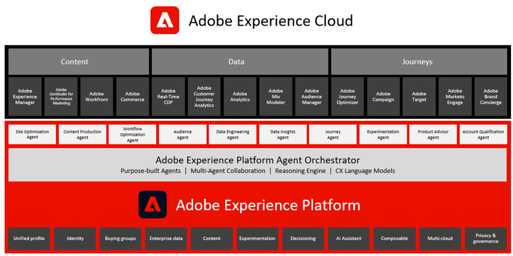
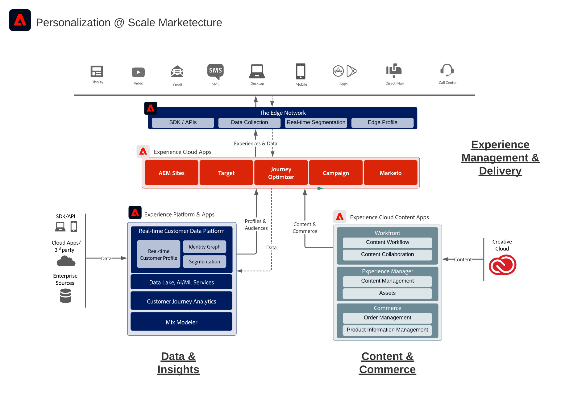
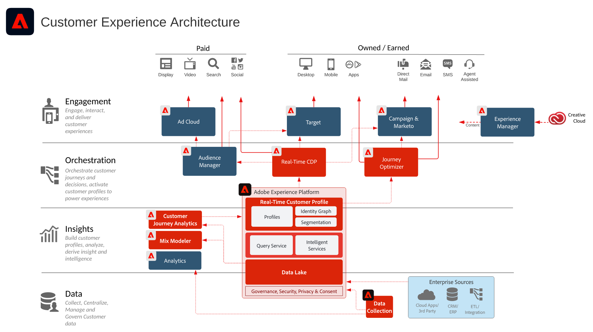

# Adobe Experience Cloud

Esses diagramas mostram como os aplicativos, os serviços de aplicativos e o Experience Platform da Experience Cloud se encaixam em uma arquitetura de marketing corporativa.

## Arquitetura de marketing da Adobe Experience Cloud

O diagrama a seguir ilustra os vários componentes da Adobe Experience Cloud em Públicos e insights de dados; Conteúdo e comércio, Jornadas do cliente; e Fluxo de trabalho de marketing, criados e integrados na base da Adobe Experience Platform.

{width="1000" zoomable="yes"}

## Arquitetura de integração de dados e insights, conteúdo e comércio e entrega de experiência

O diagrama de arquitetura abaixo ilustra como os vários componentes da Adobe Experience Cloud se conectam e integram para alcançar a personalização em escala na entrega de experiência, dados e conteúdo.

{width="1000" zoomable="yes"}

## Adobe Experience Cloud na Paisagem empresarial

O diagrama de arquitetura abaixo ilustra como os aplicativos da Adobe Experience Cloud e da Adobe Experience Platform se encaixam em uma arquitetura empresarial de experiência do cliente nas quatro categorias, de Dados, Insights, Orquestração e Engajamento.

{width="1000" zoomable="yes"}
