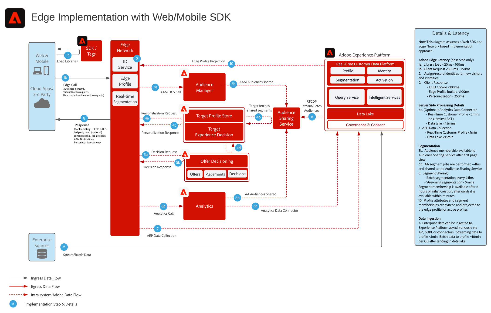
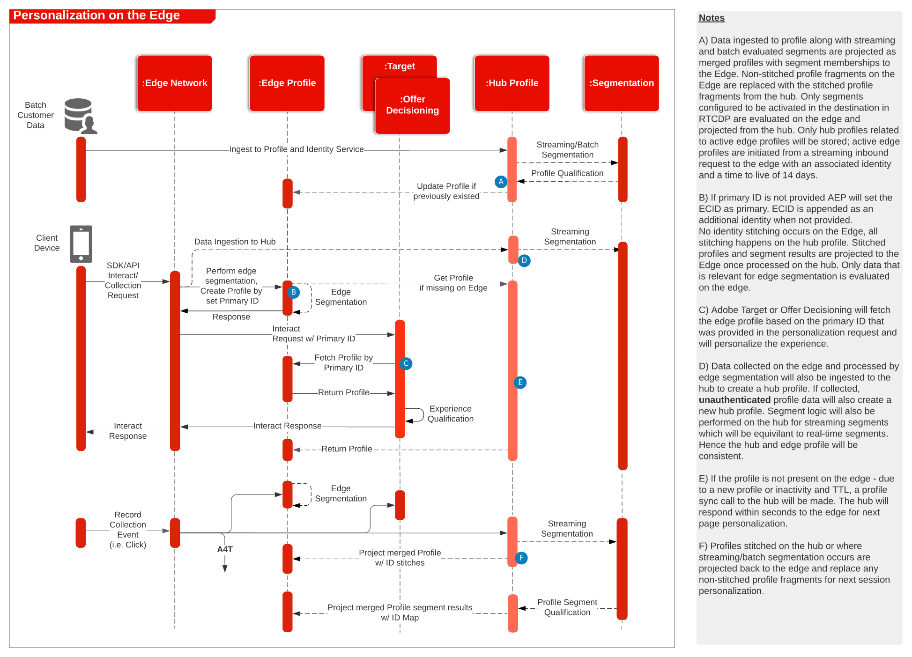

# Adobe Experience Platform Web SDK e [!DNL Edge Network]

Para obter uma visão geral e detalhes sobre a Web e o Mobile SDK, e a API do Servidor [!DNL Edge Network], consulte o seguinte.

* [Visão geral do Web SDK](https://experienceleague.adobe.com/pt-br/docs/experience-platform/web-sdk/home)
* [Visão geral do Mobile SDK](https://developer.adobe.com/client-sdks/documentation/)
* [API do servidor [!DNL Edge Network]](https://experienceleague.adobe.com/docs/experience-platform/edge-network-server-api/overview.html?lang=pt-BR)

Para obter uma descrição detalhada de qual funcionalidade de aplicativo é compatível com o SDK da Web, consulte a seguinte documentação:

* [Suporte à funcionalidade do aplicativo Web SDK](https://github.com/orgs/adobe/projects/18/views/1)

Para obter detalhes relacionados à migração de SDKs específicos do aplicativo para SDKs da Web e móveis, consulte a seguinte documentação:

* [Serviços de identidade](https://experienceleague.adobe.com/docs/experience-platform/edge/identity/overview.html?lang=pt-BR)
* [Analytics](https://experienceleague.adobe.com/docs/experience-platform/edge/data-collection/adobe-analytics/analytics-overview.html?lang=pt-BR)
* [Target](https://experienceleague.adobe.com/docs/experience-platform/edge/personalization/adobe-target/target-overview.html?lang=pt-BR)
* [Analytics for Target](https://experienceleague.adobe.com/docs/experience-platform/edge/personalization/adobe-target/a4t/overview.html?lang=pt-BR)

## Implantação do Experience Platform Web/Mobile SDK ou da API do [!DNL Edge Network] Server

O diagrama de arquitetura abaixo ilustra a implantação e a coleção de dados utilizando o SDK da Web da Experience Platform.

{width="1000" zoomable="yes"}

Diagrama de sequência da Experience Edge, Serviços da Experience Platform e aplicativos

{width="1000" zoomable="yes"}

## Documentação de referência

* [Implementar a Adobe Experience Cloud com o tutorial do SDK da web](https://experienceleague.adobe.com/docs/platform-learn/implement-web-sdk/overview.html?lang=pt-BR)
* [Tutorial Implementar a Adobe Experience Cloud em aplicativos para dispositivos móveis](https://experienceleague.adobe.com/docs/platform-learn/implement-mobile-sdk/overview.html?lang=pt-BR)
