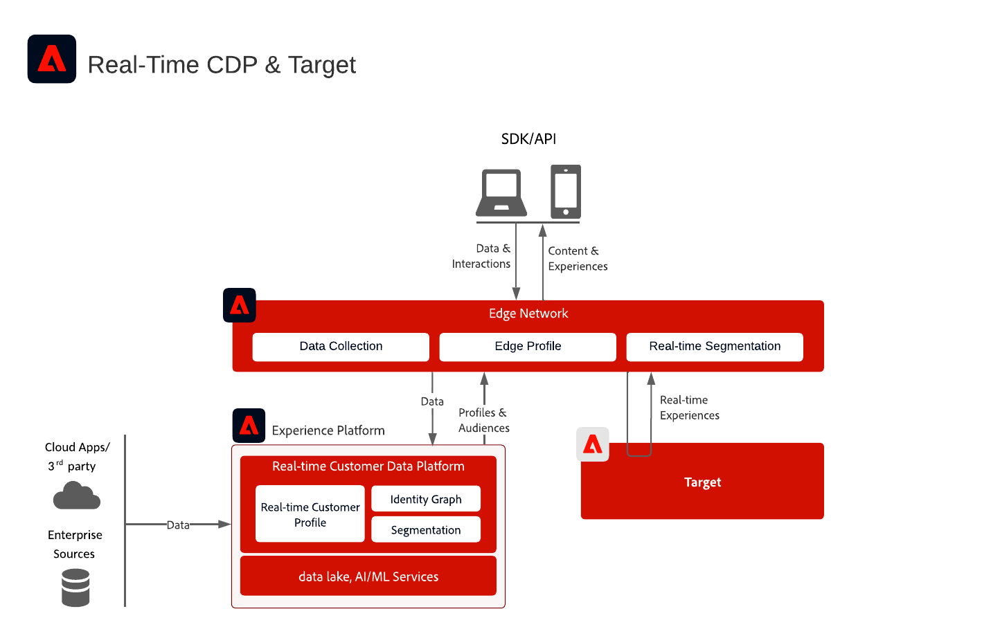

# Integração do Adobe Real-Time CDP e do Adobe Target

Esta arquitetura mostra como o [!DNL Real-Time Customer Data Platform] e o [!DNL Adobe Target] se integram por meio da Edge Network. Ele ajuda a selecionar entre a avaliação de público-alvo em tempo real na borda e o compartilhamento de streaming ou públicos em lote com o Target.

## Aplicativos

* [!DNL Real-Time Customer Data Platform]
* [!DNL Adobe Target]
* Edge Network [!DNL Experience Platform]
* API do Experience Platform Web SDK ou do Edge Network Server

## Escolha uma abordagem de integração

### Avaliação de público-alvo em tempo real na borda

Use esta abordagem quando [!DNL Adobe Target] precisar de públicos avaliados de borda e atributos de perfil para personalização de mesma página ou próxima página. Implemente o Web SDK ou a API do Edge Network Server e configure uma sequência de dados com os serviços [!DNL Adobe Target] e [!DNL Experience Platform] habilitados.

### Compartilhamento de público em lote e streaming no Target

Use esta abordagem quando os públicos avaliados em [!DNL Real-Time Customer Data Platform] precisarem estar disponíveis em [!DNL Adobe Target] sem a avaliação de borda em tempo real. Configure o destino [!DNL Adobe Target] na sandbox de produção padrão. A implementação da API do Web SDK ou do Edge Network Server é necessária somente para pesquisas de avaliação de borda em tempo real ou de namespace de identidade personalizado.

## Diagrama de arquitetura

Este diagrama mostra os principais pontos de integração entre a coleta de dados, o Edge Network, [!DNL Real-Time Customer Data Platform] e [!DNL Adobe Target].

{zoomable="yes"}

## Diagrama de fluxo de dados

Esta sequência mostra como uma solicitação de cliente chega à Edge Network, avalia públicos-alvo e contexto de perfil, envia uma solicitação de personalização para [!DNL Adobe Target] e retorna a experiência resultante para o cliente.

{zoomable="yes"}

## Considerações de implantação

* [!DNL Adobe Target] e [!DNL Real-Time Customer Data Platform] devem usar a mesma organização IMS.
* O destino [!DNL Adobe Target] dá suporte à sandbox de produção padrão em [!DNL Real-Time Customer Data Platform].
* Para pesquisas de namespace de identidade personalizada na borda, use o Web SDK ou a API do Edge Network Server e inclua cada identidade no mapa de identidade.
* Se estiver usando at.js, a integração de perfil oferecerá suporte somente ao namespace de identidade da ECID.

## Documentação relacionada

### Configurar a integração

* [Conexão Adobe Target para a Real-time Customer Data Platform](https://experienceleague.adobe.com/docs/experience-platform/destinations/catalog/personalization/adobe-target-connection.html?lang=pt-BR)
* [Configuração da sequência de dados do Edge](https://experienceleague.adobe.com/docs/experience-platform/edge/fundamentals/datastreams.html?lang=pt-BR)

### Implementar na borda

* [Documentação do Experience Platform Web SDK](https://experienceleague.adobe.com/docs/experience-platform/edge/home.html?lang=pt-BR)
* [Documentação de tags do Experience Platform](https://experienceleague.adobe.com/docs/experience-platform/tags/home.html?lang=pt-BR)
* [Documentação do Experience Cloud ID Service](https://experienceleague.adobe.com/docs/id-service/using/home.html?lang=pt-BR)

### Avaliar públicos-alvo

* [Visão geral da segmentação do Experience Platform](https://experienceleague.adobe.com/docs/experience-platform/segmentation/home.html?lang=pt-BR)
* [Segmentação em tempo real](https://experienceleague.adobe.com/docs/experience-platform/segmentation/ui/edge-segmentation.html?lang=pt-BR)
* [Segmentação de transmissão](https://experienceleague.adobe.com/docs/experience-platform/segmentation/api/streaming-segmentation.html?lang=pt-BR)
* [Configuração da política de mesclagem](https://experienceleague.adobe.com/docs/experience-platform/profile/merge-policies/ui-guide.html?lang=pt-BR#create-a-merge-policy)
