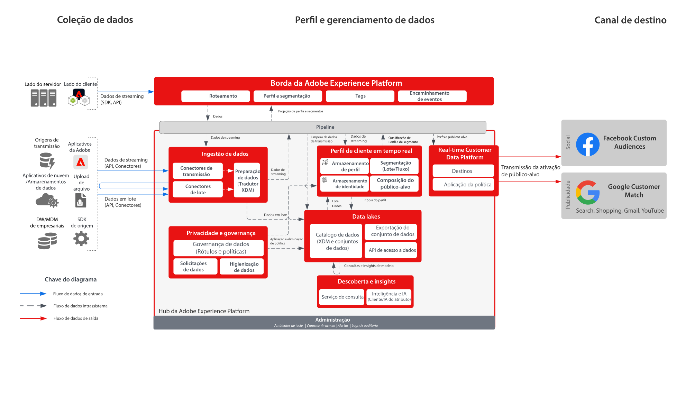

# Audience Activation para destinos sociais e Advertising

>[!TIP]
>Este blueprint também está disponível como um [padrão de caso de uso](/help/blueprints/use-case-patterns/audience-building-activation/audience-activation-to-destinations.md) em Criação e ativação de público-alvo.

Assimile dados do cliente de várias fontes para criar uma única visualização de perfil do cliente. Você pode segmentar esses perfis para públicos-alvo criados para marketing e personalização, compartilhar esses públicos-alvo em redes de anúncios, como Facebook e Google, para direcionar e personalizar campanhas em relação a esses públicos-alvo.

## Casos de uso

* Direcionamento de públicos-alvo para públicos-alvo conhecidos em destinos sociais e de publicidade.
* Personalização online com atributos online e offline.

## Aplicativos

* Real-time Customer Data Platform

## Arquitetura

## Medidas de proteção

[Proteções de perfil e segmentação](https://experienceleague.adobe.com/docs/experience-platform/profile/guardrails.html?lang=pt-BR)

## Documentação relacionada

Ativação para o Facebook Custom Audiences - [Configuração de destino](https://experienceleague.adobe.com/docs/experience-platform/destinations/catalog/social/facebook.html?lang=pt-BR)

Ativação para o Google Customer Match - [Configuração de destino](https://experienceleague.adobe.com/docs/experience-platform/destinations/catalog/advertising/google-customer-match.html?lang=pt-BR)