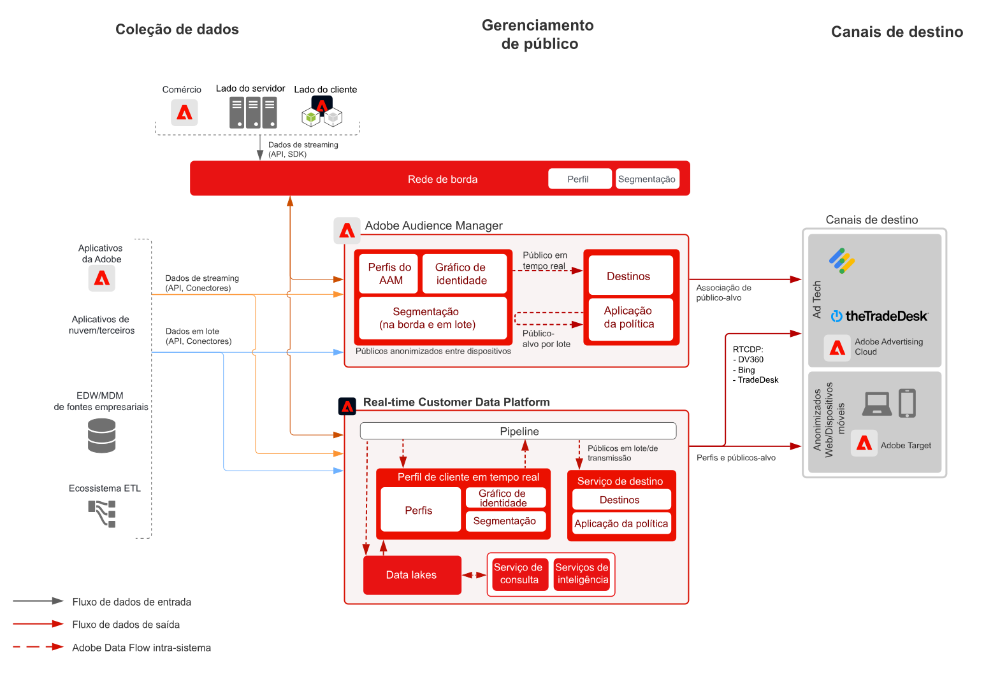

# Blueprint de ativação de público-alvo anônima

A ativação de público-alvo anônimo é a capacidade de direcionar e personalizar públicos-alvo em canais da Web, móveis e de anúncios com base em dispositivos anônimos e dados comportamentais.

## Casos de uso

* Execute o direcionamento e a personalização de público-alvo digital anônimo no site, no aplicativo móvel ou nos canais de publicidade compatíveis.
* Otimize a landing page e as experiências antes da autenticação com base em características conhecidas do dispositivo e do comportamento.
* Aproveite a rede de dados de terceiros do Audience Manager para melhorar e expandir seus públicos-alvo para direcionamento.

## Aplicativos

* Audience Manager
* Real-time Customer Data Platform

O Audience Manager e a Real-time Customer Data Platform podem ser usados para potencializar a Ativação de público anônimo para destinos no site e de publicidade. Observe que a Real-time Customer Data Platform é compatível apenas com um subconjunto de destinos de publicidade com identificadores de dispositivos anônimos, conforme catalogado na variável [documentação de destinos](https://experienceleague.adobe.com/docs/experience-platform/destinations/catalog/advertising/overview.html?lang=pt-BR).

O Microsoft Bing, o Google DV360 e o TradeDesk são os principais destinos de publicidade da Real-time Customer Data Platform compatíveis com o direcionamento com base em dispositivos anônimos. Além disso, a Real-time Customer Data Platform é compatível com vários destinos conhecidos com base no cliente, conforme catalogado na [documentação de destinos](https://experienceleague.adobe.com/docs/experience-platform/destinations/catalog/advertising/overview.html?lang=en) e descrito no [blueprint de ativação de cliente conhecido](https://experienceleague.adobe.com/docs/blueprints-learn/architecture/audience-activation/known-customer-audience-activation/known.html?lang=pt-BR).

## Arquitetura

 

## Etapas de implementação para Audience Manager

* Para obter detalhes sobre a implementação do Audience Manager, consulte a seguinte [documentação](https://experienceleague.adobe.com/docs/audience-manager/user-guide/implementation-integration-guides/implement-audience-manager.html?lang=pt-BR).

## Etapas de implementação para Real-time Customer Data Platform

* Para obter as etapas de implementação do Real-time Customer Data Platform, consulte o seguinte [documentação](https://experienceleague.adobe.com/docs/blueprints-learn/architecture/audience-activation/known-customer-audience-activation/known.html).

## Documentação relacionada

* [Audience Manager](https://experienceleague.adobe.com/docs/audience-manager.html?lang=pt-BR)
* [[!UICONTROL Públicos] da Experience Cloud](https://experienceleague.adobe.com/docs/core-services/interface/audiences/audience-library.html?lang=pt-BR)
* [Integração do Audience Manager com o Target](https://experienceleague.adobe.com/docs/audience-manager/user-guide/implementation-integration-guides/integration-other-solutions/aam-target-integration.html?lang=pt-BR)
* [Compartilhamento de segmentos do Adobe Analytics por meio do Audience Manager](https://experienceleague.adobe.com/docs/analytics/components/segmentation/segmentation-workflow/seg-publish.html?lang=pt-BR)
* [Blueprint de ativação de cliente conhecido](https://experienceleague.adobe.com/docs/blueprints-learn/architecture/audience-activation/known-customer-audience-activation/known.html).
* [Real-time Customer Data Platform](https://experienceleague.adobe.com/docs/experience-platform/rtcdp/overview.html?lang=pt-BR)
