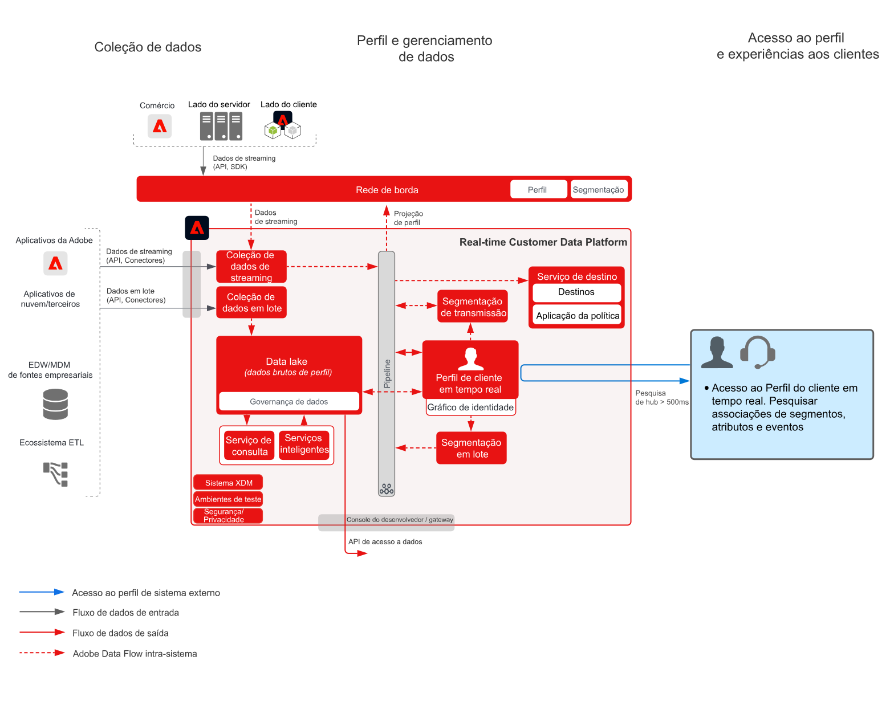

# Blueprint do Hub de atividades do cliente

O Blueprint do Hub de atividades do cliente apresenta como aplicativos externos podem acessar o [!UICONTROL Perfil de cliente em tempo real] da Adobe Experience Platform.

Aplicativos externos podem acessar Perfis de clientes com uma solicitação GET da API. Atributos, eventos, associações de segmentos e funcionalidades orientadas por modelos armazenadas no perfil podem depois ser usados nesses aplicativos externos que não são da Adobe.

Com essa funcionalidade, é possível acessar conteúdo avançado durante chamadas de clientes à central de atendimento. Agentes de suporte teriam visibilidade do valor vitalício do cliente, da propensão à rotatividade ou exposição a campanhas de marketing, por exemplo. Os agentes de vendas também podem se beneficiar de conteúdos extras ou insights sobre os clientes.

>[!NOTE]
>
>A latência atual suportada pela API de pesquisa de perfil é de aproximadamente 500 milissegundos. Isso torna essa abordagem inadequada para a integração do perfil com mecanismos de decisão em tempo real, como Web de mesma página ou personalização de publicação de conteúdo para dispositivos móveis.

## Casos de uso

* Forneça contexto aprofundado do consumidor nas interações com agentes, como suporte e experiências de vendas. Ao usar a pesquisa de perfil na Experience Platform, os agentes podem receber mais contexto sobre o consumidor, como compras recentes, interações com campanhas, propensões, associações do público e outros atributos e insights que são armazenados no perfil do cliente em tempo real.

## Arquitetura

## Medidas de proteção

* [Medidas de proteção para dados de [!UICONTROL perfis de cliente em tempo real]](https://experienceleague.adobe.com/docs/experience-platform/profile/guardrails.html?lang=pt-BR)

## Etapas de implementação

1. [Crie esquemas](https://experienceleague.adobe.com/?recommended=ExperiencePlatform-D-1-2021.1.xdm) para que os dados sejam assimilados.
1. [Crie conjuntos de dados](https://experienceleague.adobe.com/docs/platform-learn/tutorials/data-ingestion/create-datasets-and-ingest-data.html?lang=pt-BR) para que os dados sejam assimilados.
1. [Configure as identidades corretas e os namespaces de identidade](https://experienceleague.adobe.com/docs/platform-learn/tutorials/identities/label-ingest-and-verify-identity-data.html?lang=pt-BR) no esquema para assegurar que os dados assimilados possam aderir a um perfil unificado.
1. [Habilite os esquemas e conjuntos de dados para o perfil](https://experienceleague.adobe.com/docs/platform-learn/tutorials/profiles/bring-data-into-the-real-time-customer-profile.html?lang=pt-BR).
1. [Assimile dados](https://experienceleague.adobe.com/?recommended=ExperiencePlatform-D-1-2020.1.dataingestion&amp;lang=pt-BR) na Experience Platform.
1. [Configure políticas de mesclagem](https://experienceleague.adobe.com/docs/platform-learn/tutorials/profiles/create-merge-policies.html?lang=pt-BR).
1. Use a [API de entidades para pesquisar um atributo de perfil](https://experienceleague.adobe.com/docs/experience-platform/profile/api/entities.html?lang=pt-BR), seja da entidade de registro ou da entidade do evento da experiência.

## Documentação relacionada

* [Descrição do produto Adobe Experience Platform Activation](https://helpx.adobe.com/br/legal/product-descriptions/adobe-experience-platform0.html)
* Documentação do [[!UICONTROL Perfil de cliente em tempo real]](https://experienceleague.adobe.com/docs/experience-platform/profile/home.html?lang=pt-BR)
* [Medidas de proteção de perfis](https://experienceleague.adobe.com/docs/experience-platform/profile/guardrails.html)
* [API de pesquisa de perfil](https://www.adobe.io/apis/experienceplatform/home/api-reference.html)
