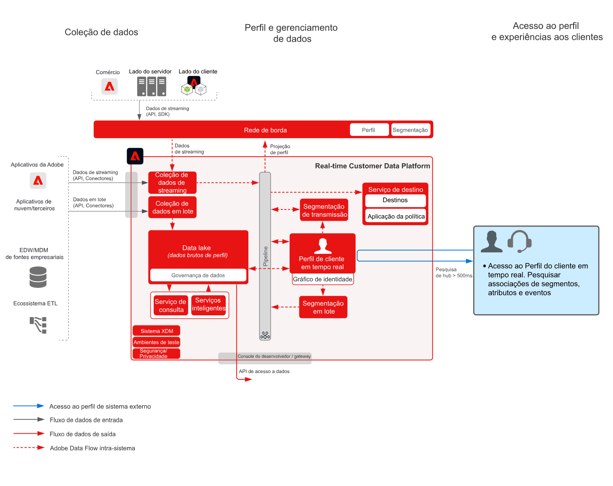

# Acesso ao perfil em tempo real para cenários de suporte e vendas

>[!TIP]
>Este blueprint também está disponível como um [padrão de caso de uso](/help/blueprints/use-case-patterns/audience-building-activation/real-time-profile-lookup.md) em Criação e ativação de público-alvo.

O blueprint Real-time Profile Access for Support and Sales Scenarios (Acesso a perfil em tempo real para suporte e cenários de vendas) mostra como os aplicativos externos podem acessar o [!UICONTROL Perfil do cliente em tempo real] da Adobe Experience Platform.

Aplicativos externos podem acessar Perfis de clientes com uma solicitação GET da API. Atributos, eventos, associações de segmentos e funcionalidades orientadas por modelos armazenadas no perfil podem depois ser usados nesses aplicativos externos que não são da Adobe.

Com essa funcionalidade, é possível acessar conteúdo avançado durante chamadas de clientes à central de atendimento. Agentes de suporte teriam visibilidade do valor vitalício do cliente, da propensão à rotatividade ou exposição a campanhas de marketing, por exemplo. Os agentes de vendas também podem se beneficiar de conteúdos extras ou insights sobre os clientes.

>[!NOTE]
>
>A pesquisa de perfil no hub não se destina a casos de uso de alta taxa de transferência e baixa latência, como personalização de entrada da web/dispositivos móveis. A pesquisa de perfil no hub destina-se a cenários de latência mais baixa, como suporte assistido por agente ou interações de vendas. Para cenários de baixa latência e alta taxa de transferência, como personalização da Web/móvel ou o Offer Decisioning em tempo real, o perfil do Edge deve ser aproveitado. O perfil do Edge habilita o acesso em tempo real por meio da [Conexão personalizada do Personalization](https://experienceleague.adobe.com/pt-br/docs/experience-platform/destinations/catalog/personalization/custom-personalization) da Real-time Customer Data Platform.

## Casos de uso

* Forneça contexto aprofundado do consumidor nas interações com agentes, como suporte e experiências de vendas. Ao usar a pesquisa de perfil na Experience Platform, os agentes podem receber mais contexto sobre o consumidor, como compras recentes, interações com campanhas, propensões, associações do público e outros atributos e insights que são armazenados no perfil do cliente em tempo real.

## Arquitetura

## Medidas de proteção

* [Medidas de proteção para dados do [!UICONTROL Perfil de cliente em tempo real]](https://experienceleague.adobe.com/docs/experience-platform/profile/guardrails.html?lang=pt-BR)

## Documentação relacionada

* [Descrição do produto Adobe Experience Platform Ativation](https://helpx.adobe.com/br/legal/product-descriptions/adobe-experience-platform0.html)
* [Documentação de [!UICONTROL Perfil de cliente em tempo real]](https://experienceleague.adobe.com/docs/experience-platform/profile/home.html?lang=pt-BR)
* [Proteções de perfil](https://experienceleague.adobe.com/docs/experience-platform/profile/guardrails.html?lang=pt-BR)
* [API de pesquisa de perfil](https://www.adobe.io/apis/experienceplatform/home/api-reference.html)
