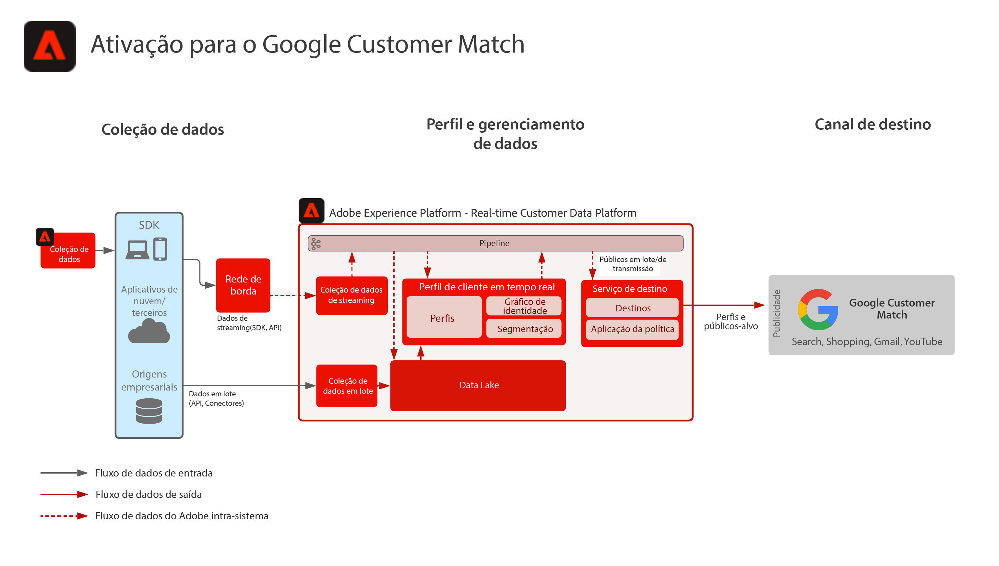

# Ativação para Correspondência de Cliente do FGoogle

Assimile dados de clientes de várias fontes para criar uma única visualização de perfil do cliente, segmente esses perfis para criar públicos-alvo para marketing e personalização, compartilhe-os em redes de anúncios sociais, como a Correspondência de clientes do Google, para direcionar e personalizar campanhas contra esses públicos-alvo. A Correspondência de clientes do Google permite que você use seus dados online e offline para acessar e reengajar seus clientes em todas as propriedades próprias e operadas da Google, como: Pesquisar, Comprar, Gmail e YouTube.

## Casos de uso

* Direcionamento de públicos para públicos conhecidos em destinos sociais e de publicidade.
* Personalização online com atributos online e offline.

## Aplicativos

* Real-time Customer Data Platform

## Arquitetura

## Etapas de implementação

1. Configure Namespaces de identidade a serem usados nas fontes de dados do perfil.
   * Use namespaces prontos como Email, Email SHA256 Hash, quando disponível.
   * A Correspondência de clientes do Google tem uma lista de identidades suportadas. Para ativar a Correspondência de clientes do Google, uma das identidades suportadas deve estar presente nos perfis a serem ativados.
   * Atualmente, as seguintes identidades são suportadas pela Correspondência de clientes do Google: GAID, IDFA, phone_sha256_e.164, email_lc_sha256, user_id.
   * Para obter mais detalhes, consulte a [Guia de destino de correspondência do cliente do Google](https://experienceleague.adobe.com/docs/experience-platform/destinations/catalog/advertising/google-customer-match.html).
   * Crie namespaces personalizados onde os namespaces prontos não estão disponíveis para as identidades aplicáveis.
1. Configurar esquemas e conjuntos de dados da fonte de dados do perfil.
   * Crie esquemas de registro de perfil para todos os dados de origem do registro de perfil.
      * Especifique a identidade primária e as identidades secundárias para cada esquema.
      * Ative o esquema para assimilação de perfil.
   * Crie conjuntos de dados de registro de perfil para todos os dados de origem do registro de perfil, atribuindo o esquema associado.
      * Ative o conjunto de dados para assimilação de perfil.
   * Crie esquemas de evento de experiência de perfil para todos os dados de origem baseados em séries de tempo de perfil.
      * Especifique a identidade primária e as identidades secundárias do esquema.
   * Ative o esquema para assimilação de perfil.
   * Crie conjuntos de dados de eventos de experiência de perfil para todos os dados de origem do evento de experiência de perfil, atribuindo o esquema associado.
      * Ative o conjunto de dados para assimilação de perfil.
1. Assimilar os dados de origem usando um conector de origem no conjunto de dados associado configurado acima.
   * Configure a conta do conector de origem com credenciais.
   * Configure um fluxo de dados para assimilar os dados do local do arquivo de origem ou da pasta em um agendamento especificado para o conjunto de dados especificado.
   * Mapeie qualquer campo a partir dos dados de origem para o schema de destino.
   * Transforme todos os campos no formato correto para assimilação em Experience Platform.
      * Transformações de data
      * Transformar em minúsculas, quando apropriado - como endereço de email
      * Transformações de padrão (número de telefone, por exemplo)
      * Adicione IDs de registros exclusivos para registros de eventos de experiência, se não estiverem presentes nos dados de origem.
      * Transforme matrizes e campos do tipo de mapa para garantir o mapeamento e a modelagem corretos de matrizes e mapas para segmentação no Experience Platform.
1. Configure a Política de mesclagem de perfis para garantir a configuração correta do gráfico de identidade e quais conjuntos de dados devem ser incluídos na mesclagem de perfis.
1. Após a execução dos fluxos de dados, verifique se a assimilação de dados do perfil foi bem-sucedida, sem erros.
   * Inspect o gráfico de identidade de vários perfis para garantir o processamento correto dos relacionamentos de identidade.
   * Inspect os atributos e eventos de vários perfis para garantir a assimilação correta de atributos e eventos nos perfis.
1. Crie segmentos para criar públicos-alvo de perfil
   * Construa segmentos no construtor de segmentos usando regras em relação a atributos e eventos.
   * Salve o segmento para avaliação. Os segmentos serão avaliados no agendamento especificado uma vez por dia.
      * Se as regras de segmento estiverem qualificadas para a segmentação de transmissão, o segmento será avaliado conforme novos dados de transmissão são assimilados para os perfis. Segmentos de fluxo também serão avaliados uma vez por dia durante a segmentação de lote agendada.
1. Certifique-se de que os resultados do segmento sejam os esperados.
   * Revise a contagem de resultados do segmento para os segmentos em questão.
   * Investigue o perfil que deve ser incluído no segmento para verificar se a associação de segmento está incluída na parte de associação de segmento do perfil.
1. Configure o delivery do público-alvo para o destino na configuração Destino .
   * Consulte a [Guia de destino de correspondência do cliente do Google](https://experienceleague.adobe.com/docs/experience-platform/destinations/catalog/advertising/google-customer-match.html) para obter mais detalhes sobre como configurar o Destino do Facebook.
   * Ao configurar um destino, selecione qual público-alvo deseja ativar para o destino.
   * Determine a data de início agendada para a qual deseja que o fluxo de dados de destino comece a entregar o público-alvo ao destino.
   * Cada destino tem atributos obrigatórios e opcionais que serão enviados.
      * Para a Correspondência de clientes do Google, uma das identidades necessárias deve ser incluída e é usada para corresponder os perfis nos públicos no Experience Platform a um perfil direcionável pela Correspondência de clientes do Google.
   * Cada destino também tem um tipo de delivery especificado, seja streaming ou lote, arquivo baseado em arquivo ou carga JSON.
      * Para a Correspondência de clientes da Google, as associações de público-alvo são fornecidas de forma contínua a um terminal de Correspondência de clientes da Google no formato JSON.
      * As associações de público-alvo serão fornecidas de forma contínua, após a avaliação da segmentação por streaming ou lote no Experience Platform.
1. Verifique se o fluxo de destino entregou o público-alvo ao destino conforme esperado.
   * Verifique a interface de monitoramento para confirmar que o público-alvo foi entregue com o número de perfis esperado. O tamanho do público-alvo deve refletir o número esperado de perfis ativados, observando que um destino específico, como a Correspondência de clientes do Google, exigirá determinados campos, como uma identidade de hash de email, e se não estiver presente no perfil que é membro do público-alvo, ele não será ativado no destino.
   * Verifique se há perfis ignorados para identidades de perfil ausentes ou atributos ausentes que eram obrigatórios.
   * Verifique se há outros erros que possam precisar ser resolvidos.
1. Verifique se o público-alvo foi ativado para o destino final com o número esperado de associações de público-alvo.
   * Após concluir o fluxo de ativação, alterne para sua conta do Google Ads. Os segmentos ativados são mostrados em sua conta do Google como listas de clientes. Observe que, dependendo do tamanho do seu segmento, alguns públicos-alvo não são preenchidos a menos que haja mais de 100 usuários ativos para serem atendidos.

## Medidas de proteção

[Proteção de perfil e segmentação](https://experienceleague.adobe.com/docs/experience-platform/profile/guardrails.html?lang=pt-BR)

## Documentação relacionada

Ativação para a correspondência do cliente da Google - [Configuração de destino](https://experienceleague.adobe.com/docs/experience-platform/destinations/catalog/advertising/google-customer-match.html)