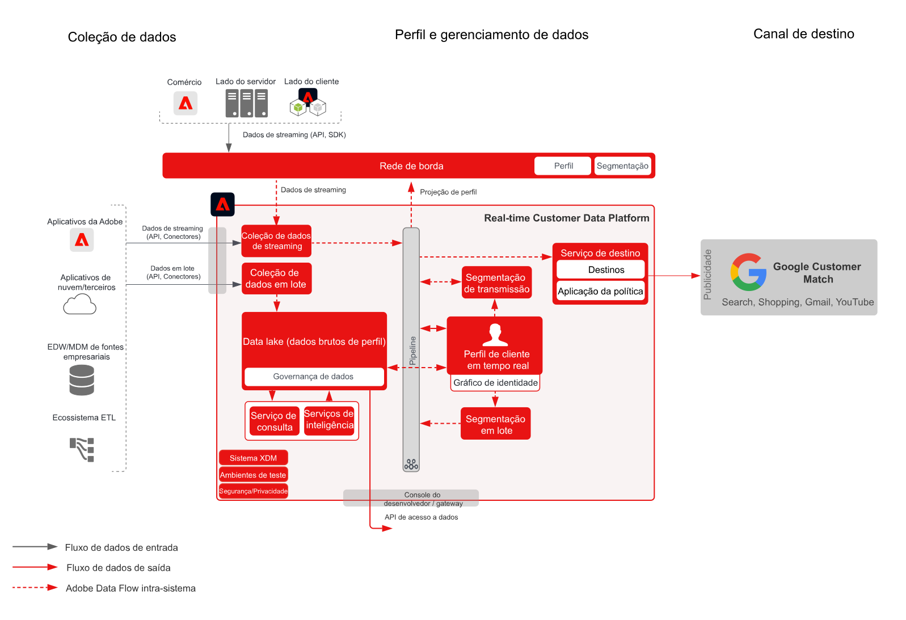

# Ativação para o Google Customer Match

Assimile dados de clientes de várias fontes para criar uma única visualização de perfil do cliente, segmente esses perfis para criar públicos para iniciativas de marketing e personalização e compartilhe esses públicos com redes de anúncios sociais, como o Google Customer Match, para promover campanhas direcionadas e de personalização voltadas para eles. O Google Customer Match permite que você use dados online e offline para atingir e voltar a se engajar com clientes em todas as propriedades detidas ou operadas pelo Google, tais como Search, Shopping, Gmail e YouTube.

## Casos de uso

* Direcionamento de públicos para públicos conhecidos em destinos sociais e de publicidade.
* Personalização online com atributos online e offline.

## Aplicativos

* Real-time Customer Data Platform

## Arquitetura

## Etapas de implementação

1. Configure os Namespaces de identidade a serem usados nas fontes de dados do Perfil.
   * Use namespaces prontos, como os de Email ou hash de Email SHA256, quando disponíveis.
   * O Google Customer Match tem uma lista de identidades compatíveis. Para fazer a ativação para o Google Customer Match, os perfis a serem ativados devem apresentar uma das identidades compatíveis.
   * Atualmente, as seguintes identidades são compatíveis com o Google Customer Match: GAID, IDFA, phone_sha256_e.164, email_lc_sha256 e user_id.
   * Para mais detalhes, consulte o [Manual de destino do Google Customer Match](https://experienceleague.adobe.com/docs/experience-platform/destinations/catalog/advertising/google-customer-match.html?lang=pt-BR).
   * Crie namespaces personalizados quando não houver namespaces prontos disponíveis para as identidades aplicáveis.
1. Configure esquemas e conjuntos de dados da fonte de dados do Perfil.
   * Crie esquemas de registro de Perfil para todos os dados de origem do registro de perfil.
      * Especifique a identidade principal e as identidades secundárias de cada esquema.
      * Habilite o esquema para assimilação de perfil.
   * Crie conjuntos de dados de registro de Perfil para todos os dados de origem do registro de perfil, atribuindo o esquema associado.
      * Habilite o conjunto de dados para assimilação de perfil.
   * Crie esquemas do Experience Event do Perfil para todos os dados de origem de perfil baseados em série temporal.
      * Especifique a identidade principal e as identidades secundárias do esquema.
   * Habilite o esquema para assimilação de perfil.
   * Crie conjuntos de dados do Experience Event de Perfil para todos os dados de origem de evento de experiência de perfil, atribuindo o esquema associado.
      * Habilite o conjunto de dados para assimilação de perfil.
1. Assimile os dados de origem usando um conector de origem no conjunto de dados associado configurado acima.
   * Configure a conta do conector de origem com credenciais.
   * Configure um fluxo de dados para assimilar os dados do local do arquivo ou pasta de origem com um cronograma especificado para o conjunto de dados.
   * Mapeie os campos a partir dos dados de origem para o esquema de destino.
   * Transforme os eventuais campos, passando-os para o formato correto de assimilação na Experience Platform.
      * Transformações de data
      * Transforme em minúsculas quando apropriado - como em endereços de email
      * Transformações de padrão (de número de telefone, por exemplo)
      * Adicione IDs de registro exclusivos aos registros de eventos de experiência se não os houver nos dados de origem.
      * Transforme os campos do tipo de mapa e matrizes para garantir o mapeamento e a modelagem de matrizes e mapas corretos para a segmentação na Experience Platform.
1. Configure a Política de mesclagem de perfis de modo que garanta a configuração correta do gráfico de identidade e os conjuntos de dados que devem ser incluídos na mesclagem de perfis.
1. Após a execução dos fluxos de dados, verifique se a assimilação de dados do perfil foi concluída com sucesso e sem erros.
   * Examine o gráfico de identidade de vários perfis para garantir o processamento correto dos relacionamentos de identidade.
   * Examine os atributos e eventos de vários perfis para garantir a assimilação correta de atributos e eventos aos perfis.
1. Desenvolva segmentos para criar públicos de perfil
   * Crie segmentos no construtor de segmentos usando regras para atributos e eventos.
   * Salve o segmento para avaliação. Os segmentos serão avaliados de acordo com o cronograma especificado uma vez por dia.
      * Se as regras de segmento estiverem qualificadas para a segmentação de transmissão, o segmento será avaliado conforme novos dados de transmissão sejam assimilados aos perfis. Os segmentos de transmissão também são avaliados uma vez por dia durante a segmentação em lote programada.
1. Certifique-se de que os resultados do segmento sejam os esperados.
   * Analise a contagem de resultados do segmento para os segmentos em questão.
   * Apure o perfil que deve ser incluído no segmento para verificar se a associação de segmento está incluída na parte de associação de segmento do perfil.
1. Configure a entrega do público ao destino na configuração de Destino.
   * Consulte o [Manual de destino do Google Customer Match](https://experienceleague.adobe.com/docs/experience-platform/destinations/catalog/advertising/google-customer-match.html?lang=pt-BR) para obter mais detalhes sobre como configurar o Destino do Google Customer Match.
   * Ao configurar um destino, selecione o público que deseja ativar para o destino.
   * Defina a data inicial programada na qual deseja que o fluxo de dados do destino comece a entregar o público ao destino.
   * Para cada destino são enviados atributos obrigatórios e opcionais.
      * Para o Google Customer Match, deve ser incluída uma das identidades obrigatórias, a qual é usada para combinar os perfis nos públicos da Experience Platform com um perfil que possa ser direcionado pelo Google Customer Match.
   * Também é especificado para cada destino um tipo de entrega, que pode ser tanto de transmissão como em lote, baseado em arquivo ou de carga JSON.
      * As associações de público para Google Customer Match são fornecidas de forma contínua a um endpoint do Google Customer Match no formato JSON.
      * As associações de público são entregues de forma contínua após a avaliação por segmentação de transmissão ou em lote na Experience Platform.
1. Verifique se o fluxo de destino entregou o público ao destino conforme esperado.
   * Verifique a interface de monitoramento para confirmar se o público foi entregue com o número de perfis esperado. O tamanho do público deve refletir o número esperado de perfis ativados. Observe que destinos específicos, como o Google Customer Match, exigem determinados campos, tais como uma identidade de hash de email; e, se esses campos não estiverem presentes em um perfil que é membro do público, o perfil não é ativado no destino.
   * Verifique se foram ignorados perfis referentes a identidades de perfil ou atributos obrigatórios que estejam faltando.
   * Verifique se há outros erros que precisem ser resolvidos.
1. Verifique se o público foi ativado para o destino final com o número esperado de membros.
   * Após concluir o fluxo de ativação, alterne para sua conta do Google Ads. Os segmentos ativados são mostrados em sua conta do Google como listas de clientes. Observe que, dependendo do tamanho do seu segmento, alguns públicos não são preenchidos a menos que haja mais de 100 usuários ativos a serem atendidos.

## Medidas de proteção

[Medidas de proteção de perfil e de segmentação](https://experienceleague.adobe.com/docs/experience-platform/profile/guardrails.html?lang=pt-BR)

## Documentação relacionada

Ativação para o Google Customer Match - [Configuração de destino](https://experienceleague.adobe.com/docs/experience-platform/destinations/catalog/advertising/google-customer-match.html?lang=pt-BR)
