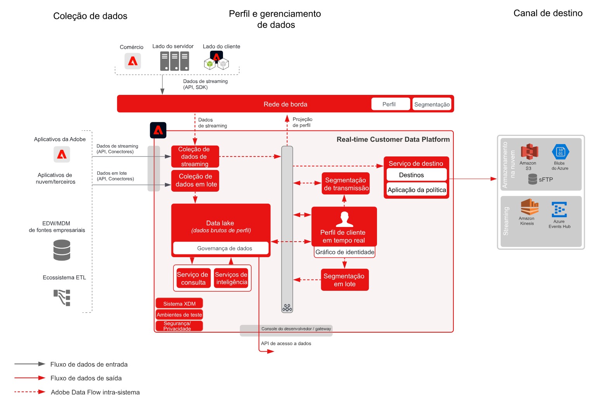

# Audience and Profile Ativation to Enterprise Destinations Blueprint

Compartilhe alterações de perfil e público-alvo e eventos em streaming ou lote da [!UICONTROL Plataforma de dados do cliente em tempo real] para armazenamentos e aplicativos de dados corporativos. Esses eventos de perfil e público-alvo podem ser usados para iniciar uma ação de vendas ou suporte ao cliente, como acompanhar um processo de aplicativo abandonado ou registro de webinar ou atualizar aplicativos corporativos com os atributos e informações mais recentes do cliente da [!UICONTROL Plataforma de dados do cliente em tempo real].

## Casos de uso

* Ativação de perfil e público-alvo para destinos de armazenamento em nuvem ou destinos de fluxo para rastreamento, armazenamento, análise e ativação de dados e insights do cliente em empresas.

## Aplicativos

* Adobe Experience Platform Ativation

## Arquitetura

## Medidas de proteção

Consulte as grades de proteção conforme descrito na página Visão geral de público-alvo e ativação de perfil - [LINK](overview.md)

## Etapas de implementação

1. Crie esquemas para os dados que serão assimilados.
1. Crie conjuntos de dados para que os dados sejam assimilados.
1. Configure as identidades certas e os namespaces de identidade no esquema para assegurar que os dados assimilados possam aderir a um perfil unificado.
1. Ative os esquemas e conjuntos de dados para processamento de perfis.
1. Configure quaisquer fontes para assimilação de dados.
1. Crie segmentos no Experience Platform, que serão avaliados em lote ou streaming. O sistema decide automaticamente se o segmento é avaliado em lote ou por streaming.
1. Configure destinos para compartilhar atributos de perfil e associações de públicos com destinos desejados.

## Documentos relacionados

* [Documentação de destinos](https://experienceleague.adobe.com/docs/experience-platform/destinations/catalog/overview.html?lang=pt-BR)
* [Visão geral dos destinos de armazenamento na nuvem](https://experienceleague.adobe.com/docs/experience-platform/destinations/catalog/cloud-storage/overview.html?lang=en#catalog)
* [Destino HTTP](https://experienceleague.adobe.com/docs/experience-platform/destinations/catalog/http-destination.html?lang=en#overview)
* [Descrição do produto Plataforma de dados do cliente em tempo real](https://helpx.adobe.com/br/legal/product-descriptions/real-time-customer-data-platform.html)
* [Diretrizes de perfil e segmentação](https://experienceleague.adobe.com/docs/experience-platform/profile/guardrails.html?lang=pt-BR)
* [Documentação de segmentação](https://experienceleague.adobe.com/docs/experience-platform/segmentation/api/streaming-segmentation.html?lang=pt-BR)

## Vídeos e tutoriais relacionados

* [Visão geral da Plataforma de dados do cliente em tempo real](https://experienceleague.adobe.com/docs/platform-learn/tutorials/application-services/rtcdp/understanding-the-real-time-customer-data-platform.html?lang=pt-BR)
* [[!UICONTROL Demonstração da Plataforma de dados do cliente em tempo real]](https://experienceleague.adobe.com/docs/platform-learn/tutorials/application-services/rtcdp/demo.html?lang=pt-BR)
* [Criação de segmentos](https://experienceleague.adobe.com/docs/platform-learn/tutorials/segments/create-segments.html?lang=pt-BR)
