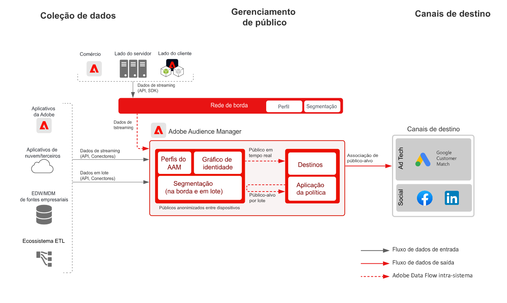

# Blueprint de Ativação do Cliente Conhecido

Use atributos e eventos offline, como pedidos, transações, CRM ou dados de fidelização offline, com comportamentos online para direcionamento e personalização online.

Identificadores expandidos com controles de governança integrados fornecem mais oportunidades para se comunicar com clientes conhecidos. Ative públicos para destinos conhecidos com base no perfil, como provedores de email, redes sociais e destinos de publicidade.

Detalhes adicionais são fornecidos no [Blueprint de ativação de público e perfil com aplicativos da Experience Cloud](platform-and-applications.md), específico para integrações entre a Experience Platform e os aplicativos da Experience Cloud.

## Casos de uso

* Direcionamento de públicos para públicos conhecidos em destinos sociais e de publicidade.
* Personalização online com atributos online e offline.
* Ative públicos para canais conhecidos, como email e SMS.

## Aplicativos

* Adobe Experience Platform 
* [!UICONTROL Real-time Customer Data Platform]
* Os destinos com base em pessoas do Audience Manager também podem ser usados para ativação baseada em pessoas no Facebook, LinkedIn e Correspondência de clientes do Google.

## Arquitetura

### Ativação conhecida do cliente via Real-time Customer Data Platform

 

### Ativação de cliente conhecida via Destinos baseados em pessoas do Audience Manager

 

## Medidas de proteção

[Consulte as medidas de proteção descritas na página de Visão geral de ativação de público e perfil](overview.md).

## Etapas de implementação para Real-time Customer Data Platform

1. [Crie esquemas](https://experienceleague.adobe.com/?recommended=ExperiencePlatform-D-1-2021.1.xdm) para que os dados sejam assimilados.
1. [Crie conjuntos de dados](https://experienceleague.adobe.com/docs/platform-learn/tutorials/data-ingestion/create-datasets-and-ingest-data.html?lang=pt-BR) para que os dados sejam assimilados.
1. [Configure as identidades corretas e os namespaces de identidade](https://experienceleague.adobe.com/docs/platform-learn/tutorials/identities/label-ingest-and-verify-identity-data.html?lang=pt-BR) no esquema para assegurar que os dados assimilados possam aderir a um perfil unificado.
1. [Habilite os esquemas e conjuntos de dados para o perfil](https://experienceleague.adobe.com/docs/platform-learn/tutorials/profiles/bring-data-into-the-real-time-customer-profile.html?lang=pt-BR).
1. [Assimile dados](https://experienceleague.adobe.com/?recommended=ExperiencePlatform-D-1-2020.1.dataingestion&amp;lang=pt-BR) na Experience Platform.
1. [Forneça compartilhamento de segmentos da [!UICONTROL Real-time Customer Data Platform]](https://www.adobe.com/go/audiences) entre a Experience Platform e o Audience Manager. Assim, os públicos definidos na Experience Platform podem ser compartilhados com o Audience Manager.
1. [Crie segmentos](https://experienceleague.adobe.com/docs/platform-learn/tutorials/segments/create-segments.html?lang=pt-BR) na Experience Platform. O sistema decide automaticamente se o segmento é avaliado em lote ou por transmissão.
1. [Configure destinos](https://experienceleague.adobe.com/docs/platform-learn/tutorials/destinations/create-destinations-and-activate-data.html?lang=pt-BR) para compartilhar atributos de perfil e associações de públicos com destinos desejados.

## Considerações de implementação

* Compartilhar dados de perfil com destinos exige a inclusão de valor específico de identidade, usado pelo destino na carga de destino. Qualquer identidade necessária para um destino de público-alvo deve ser assimilada na Platform e configurada como uma identidade para o [!UICONTROL Perfil de cliente em tempo real].

* Consulte a [Ativação de público-alvo e perfil com o blueprint de aplicativos do Experience Cloud](platform-and-applications.md) para obter detalhes adicionais sobre o compartilhamento de públicos-alvo do Real-time Customer Data Platform para o Audience Manager, Analytics, Target, Campaign e Journey Optimizer.

## Etapas de implementação para destinos com base em Audience Manager People

* Para obter detalhes sobre a implementação do Audience Manager, consulte o seguinte [documentação](https://experienceleague.adobe.com/docs/audience-manager/user-guide/implementation-integration-guides/implement-audience-manager.html?lang=pt-BR).

* Para obter detalhes sobre a implementação de destinos com base em pessoas no Audience Manager, consulte o seguinte [documentação](https://experienceleague.adobe.com/docs/audience-manager/user-guide/faqs/faq-people-based-destinations.html).

## Documentação relacionada

* Descrição do produto [[!UICONTROL Real-time Customer Data Platform]](https://helpx.adobe.com/br/legal/product-descriptions/real-time-customer-data-platform.html)
* [Guias de perfil e segmentação](https://experienceleague.adobe.com/docs/experience-platform/profile/guardrails.html?lang=pt-BR)
* [Documentação de segmentação](https://experienceleague.adobe.com/docs/experience-platform/segmentation/api/streaming-segmentation.html?lang=pt-BR)
* [Documentação de destinos](https://experienceleague.adobe.com/docs/experience-platform/destinations/catalog/overview.html?lang=pt-BR)

## Vídeos e tutoriais relacionados

* Visão geral da [[!UICONTROL Real-time Customer Data Platform]](https://experienceleague.adobe.com/docs/platform-learn/tutorials/application-services/rtcdp/understanding-the-real-time-customer-data-platform.html?lang=pt-BR)
* [Demonstração da [!UICONTROL Real-time Customer Data Platform]](https://experienceleague.adobe.com/docs/platform-learn/tutorials/application-services/rtcdp/demo.html?lang=pt-BR)
* [Criação de segmentos](https://experienceleague.adobe.com/docs/platform-learn/tutorials/segments/create-segments.html)
