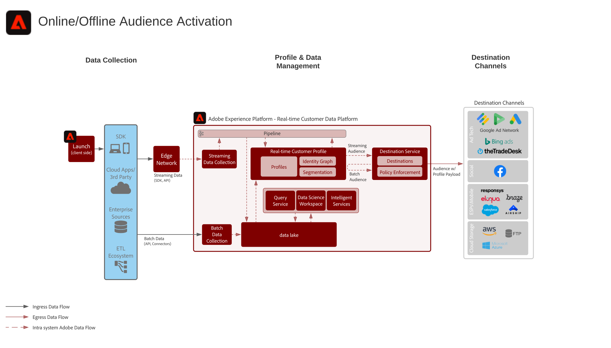

# Audience Activation Blueprint online/offline

Use atributos e eventos offline, como pedidos offline, transações, CRM ou dados de fidelidade, juntamente com o comportamento online para direcionamento e personalização online.

Ative públicos-alvo para destinos conhecidos com base em perfis, como provedores de email, redes sociais e destinos de anúncios.

## Casos de uso

* Direcionamento de público-alvo para públicos-alvo conhecidos em destinos sociais e publicitários.
* Personalização online com atributos online e offline.
* Ative públicos-alvo para canais conhecidos, como email e SMS.

## Aplicativos

* Adobe Experience Platform
* [!UICONTROL Plataforma de dados do cliente em tempo real]

## Arquitetura

## Medidas de proteção

* [Diretrizes de perfil e segmentação](https://experienceleague.adobe.com/docs/experience-platform/profile/guardrails.html?lang=en)
* Os trabalhos de segmento em lote são executados uma vez por dia com base no agendamento predeterminado. As tarefas de exportação de segmento são executadas antes do delivery de destino agendado. Observe que os trabalhos de segmento de lote e de delivery de destino são executados separadamente. Os trabalhos de segmento em lote e o desempenho do trabalho de exportação dependem do número de perfis, do tamanho dos perfis e do número de segmentos que estão sendo avaliados.
* Os trabalhos de segmento de transmissão são avaliados em minutos de dados de transmissão chegando ao perfil, e grava imediatamente a associação de segmento no perfil e envia um evento para os aplicativos assinarem.
* A associação do segmento de transmissão é agida imediatamente para destinos de transmissão e é entregue em eventos de associação de segmento único ou em um microlote de vários eventos de perfil dependentes dos padrões de assimilação do destino. Os destinos agendados iniciarão um trabalho de exportação de segmentos do perfil antes da entrega, para quaisquer segmentos avaliados em streaming que são entregues por meio da entrega agendada de segmentos em lote.
* Para compartilhar [!UICONTROL Associação de segmento da Plataforma de dados do cliente em tempo real] no Audience Manager, isso acontece em minutos para segmentos de transmissão e em minutos após a conclusão da avaliação do segmento de lote para segmentação de lote.
* Os segmentos compartilhados de Experience Platform para Audience Manager são compartilhados em minutos de realização do segmento, seja por meio do streaming ou método de avaliação em lote. Há uma sincronização de configuração de segmento inicial entre o Experience Platform e o Audience Manager depois que o segmento é criado inicialmente, após ~4 horas, as associações de segmento do Experience Platform podem começar a ser realizadas em perfis do Audience Manager. A associação de público-alvo realizada antes da configuração do compartilhamento de público-alvo do Experience Platform e do Audience Manager ou antes da sincronização dos metadados do público-alvo do Experience Platform para o Audience Manager não será realizada no Audience Manager até que o trabalho do segmento a seguir, onde as associações de segmento &quot;existentes&quot; são compartilhadas.
* Trabalhos de destino em lote ou em fluxo contínuo de trabalhos de segmentos em lote podem compartilhar atualizações de atributos de perfil, bem como associações de segmentos.
* Os trabalhos de segmentação de streaming para destinos de streaming compartilham somente atualizações de associação de segmento.

## Etapas da implementação

1. Configure schemas e conjuntos de dados no Experience Platform.
1. Configure as identidades e os namespaces de identidade corretos no esquema para garantir que os dados assimilados possam se unir a um perfil unificado.
1. Habilite o esquema e os conjuntos de dados para o Perfil.
1. Assimilar dados na plataforma.
1. Provisione [!UICONTROL Plataforma de dados do cliente em tempo real] o compartilhamento de segmentos entre o Experience Platform e o Audience Manager para que os públicos-alvo definidos no Experience Platform sejam compartilhados com o Audience Manager.
1. Crie segmentos no Experience Platform, que serão avaliados em lote ou streaming. O sistema determina automaticamente se o segmento é avaliado como lote ou streaming.
1. Configure destinos para compartilhar atributos de perfil e associações de público-alvo com os destinos desejados.

## Considerações sobre a implementação

* O compartilhamento de dados de perfil em destinos exige que você inclua o valor de identidade específico usado pelo destino na carga útil do destino. Qualquer identidade necessária para um destino deve ser assimilada na Platform e configurada como uma identidade para o [!UICONTROL Perfil do cliente em tempo real].

* Para cenários de ativação em que os públicos-alvo são compartilhados de Experience Platform para Audience Manager, todas as identidades incluídas no [!UICONTROL Real-time Customer Profile] são compartilhadas com o Audience Manager. Os públicos-alvo do Experience Platform podem ser compartilhados por meio de destinos do Audience Manager quando as identidades de destino necessárias estão incluídas no [!UICONTROL Perfil do cliente em tempo real], ou quando as identidades no [!UICONTROL Perfil do cliente em tempo real] podem ser relacionadas às identidades de destino necessárias vinculadas no Audience Manager.

## Documentação relacionada

* [[!UICONTROL Descrição do produto da ] Plataforma de dados do cliente em tempo real](https://helpx.adobe.com/legal/product-descriptions/real-time-customer-data-platform.html)
* [Diretrizes de perfil e segmentação](https://experienceleague.adobe.com/docs/experience-platform/profile/guardrails.html?lang=en)
* [Documentação de segmentação](https://experienceleague.adobe.com/docs/experience-platform/segmentation/api/streaming-segmentation.html)
* [Documentação de destinos](https://experienceleague.adobe.com/docs/experience-platform/destinations/catalog/overview.html)

## Vídeos e Tutorials relacionados

* [[!UICONTROL Visão geral da ] plataforma de dados do cliente em tempo real](https://experienceleague.adobe.com/docs/platform-learn/tutorials/application-services/rtcdp/understanding-the-real-time-customer-data-platform.html)
* [Demonstração da plataforma de dados do cliente em tempo  [!UICONTROL real]](https://experienceleague.adobe.com/docs/platform-learn/tutorials/application-services/rtcdp/demo.html)
* [Criar segmentos](https://experienceleague.adobe.com/docs/platform-learn/tutorials/segments/create-segments.html)
