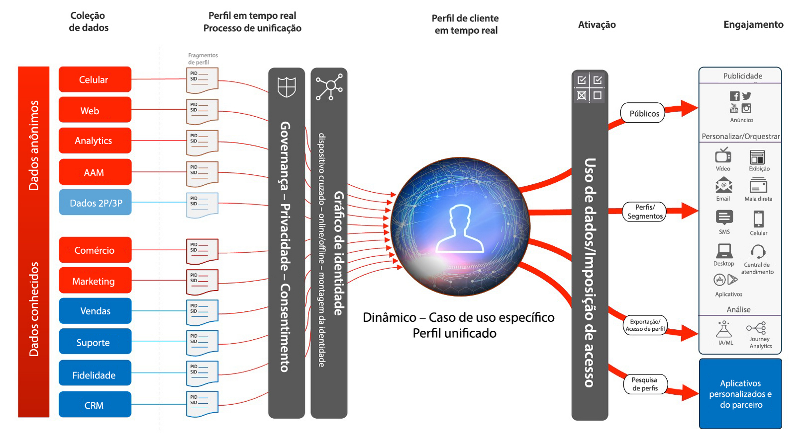
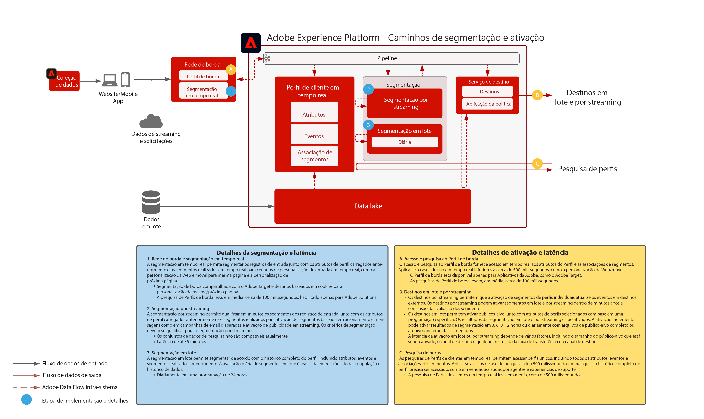

# Ativação de público-alvo e perfil

A ativação de público-alvo e perfil é a chave para o sucesso no marketing orientado por dados. Contudo, muitas marcas ainda concentram seus esforços na ativação inicial pelo canal, que por vezes fornece alcance e personalização inconsistentes.

Com uma abordagem que prioriza os canais, cada canal age como um silo, no qual os esforços de personalização se concentram somente na interação do cliente com a marca naquele canal. Esta abordagem não reflete a realidade com que os clientes interagem com as marcas nos vários pontos de contato diferentes. Com a ativação de público-alvo e perfil, as marcas conectam as interações do cliente em vários canais, para fornecer público-alvo e perfil centralizados que podem ser ativados em todos os canais.

| Blueprint | Descrição | Aplicativos da Experience Cloud |
|---|---|---|
| **[Ativação de público-alvo anônima](anonymous.md)** | <ul><li>Direcione públicos-alvos na Web e nos canais de publicidade para dados de clientes anônimos e comportamentais.</li><li>Integre a dados de público de terceiros para personalização aprimorada.</li></ul> | <ul><li>Adobe Audience Manager</li></ul> |
| **[Ativação com dados online e offline](online-offline.md)** | <ul><li>Ativação para destinos conhecidos com base no perfil, como provedores de email, redes sociais e destinos de publicidade. </li><li>Use atributos e eventos offline, como pedidos, transações, dados de CRM ou de fidelização, com comportamentos online para direcionamento e personalização online.</li></ul> | <ul><li>Adobe Experience Platform</li><li> [!UICONTROL Plataforma de dados do cliente em tempo real]</li><li>Adobe Audience Manager (opcional)</li></ul> |
| **[Ativação para destinos por streaming de arquivos e empresas](enterprise-destinations.md)** | <ul><li>Ativação e acesso ao perfil do cliente em tempo real em sistemas e aplicativos empresariais para possibilitar experiências de cliente contextuais e sofisticadas. </li></ul><ul><li>Inicie uma experiência de venda ou suporte utilizando insights e eventos do perfil do cliente em tempo real.</li></ul> | <ul><li>Adobe Experience Platform</li><li>[!UICONTROL Plataforma de dados do cliente em tempo real]</li><li>Experience Platform Activation</li><li>Adobe Audience Manager (opcional)</li></ul> |
| **[Ativação de público-alvo e perfil com aplicativos da Experience Cloud](platform-and-applications.md)** | <ul><li>Gerencie perfis e públicos-alvos na Experience Platform e compartilhe-os com aplicativos da Experience Cloud</li><li>Crie e compartilhe segmentos e insights avançados de clientes na Experience Platform e compartilhe-os com aplicativos da Experience Cloud</li></ul> | <ul><li>Adobe Experience Platform</li><li>[!UICONTROL Plataforma de dados do cliente em tempo real]</li><li>Ativação de Experience Platform</li><li>Aplicativos da Experience Cloud</li></ul> |
| **[Hub de atividades do cliente](customer-activity.md)** | <ul><li>Forneça contexto aprofundado do consumidor nas interações com agentes, como suporte e experiências de vendas. Ao usar a pesquisa de perfil na Experience Platform, os agentes podem receber mais contexto sobre o consumidor, como compras recentes, interações com campanhas, propensões, associações do público e outros atributos e insights que são armazenados no perfil do cliente em tempo real.</li></ul> | <ul><li>Adobe Experience Platform</li></ul> |

## Arquitetura do Perfil do cliente em tempo real

A ilustração abaixo descreve os componentes principais do Perfil do cliente em tempo real da Experience Platform.

As primeiras fontes de dados são assimiladas na Experience Platform. Se a fonte de dados estiver configurada para processamento de perfil, ela será alimentada no Perfil do cliente em tempo real. Um único fragmento de perfil ou documento é criado para cada fonte de dados e cada registro de ID primária configurado para cada fonte de dados. Além disso, conforme os dados são assimilados ao perfil, eles também são processados pelo serviço de identidade. Qualquer registro oriundo de fontes de dados que tenham mais de uma identidade marcada no esquema e com valores correspondentes preenchidos no registro será processado como um relacionamento de identidade dentro do serviço de identidade.

Observe que os registros com apenas uma identidade não são processados pelo serviço de identidade, pois esses registros não têm links de identidade para preencher ainda mais o gráfico. Observe também que o serviço de identidade não distingue identidades primárias de identidades secundárias. Ele simplesmente processa as relações de identidades em todas elas.

A mesclagem de fragmentos de perfil ocorre quando o gráfico de identidade fornece as relações nos vários fragmentos de perfil de origem que foram relacionados. A política de mesclagem determina que fragmentos de origem e que gráfico de identidade serão usados conforme os fragmentos forem mesclados. Sempre que o perfil for acessado, a mesclagem dos fragmentos de perfil ocorre para garantir a exibição combinada mais atualizada do perfil. As regras de governança e política asseguram que somente os segmentos e atributos autorizados possam ser ativados para os destinos especificados.

## Visão geral de segmentação e destino

A ilustração abaixo descreve os diferentes métodos de segmentação e os diferentes padrões de ativação de perfil e público-alvo.

## Medidas de proteção para Blueprints de ativação de público-alvo e perfil

* [Guias de perfil e segmentação](https://experienceleague.adobe.com/docs/experience-platform/profile/guardrails.html?lang=pt-BR)

### Ativação de atributos e identidades

* A [!UICONTROL Plataforma de dados do cliente em tempo real] pode ativar associações de público-alvo, bem como alterações de atributos e identidades que ocorrem em perfis que são membros dos segmentos selecionados para ativação. Se o objetivo for ativar atributos ou identidades, deve-se definir um segmento global que inclua todos os perfis para os quais as atualizações de atributos e identidades são enviadas. A essa altura, é possível selecionar o segmento e os atributos que deseja ativar como parte da configuração de destino.
* Observe que os destinos em lote não são compatíveis com a ativação de eventos de alteração somente de atributos. As associações de público-alvo completas ou incrementais podem ser enviadas junto com os atributos selecionados para ativação.

### Ativação de segmentos em lote para destinos por streaming

* Há suporte à ativação de segmentos em lote para destinos por streaming. Como os perfis se qualificam para a associação de público-alvo a partir de trabalhos de segmentos em lote, essas realizações podem ser ativadas por streaming.

### Ativação de segmentos por streaming para destinos em lote

* Há suporte para a ativação de segmentos por streaming para destinos em lote. As associações de segmentos de perfil são exportadas com base na programação de destinos em lote. Isso inclui associações de segmentos determinadas por meio de métodos em lote e por streaming.

### Ativação de eventos de experiência

* Não há suporte à ativação de eventos de experiência brutos. Para ativar eventos de experiência, deve ser criado um segmento com as regras necessárias que incluem ou excluem a lógica do evento de experiência. Isso cria um segmento definido em relação aos eventos de experiência, e a associação de segmentos pode ser ativada como um proxy para ativar eventos de experiência brutos. Além disso, considere usar o [!UICONTROL Servidor do Launch] para ativar os eventos de experiência brutos coletados pelo SDK.

## Publicações do blog relacionadas

* [[!DNL Blueprints for Audience Activation in Adobe Experience Platform]](https://medium.com/adobetech/a-blueprint-for-audience-activation-in-adobe-experience-platform-b2b30fae90fd)
* [[!DNL How Adobe Experience Platform Predictive Audiences improves Personalized Experiences]](https://medium.com/adobetech/how-adobe-experience-platform-predictive-audiences-improves-personalized-experiences-1f75a60cb7a3)
* [[!DNL Adobe Experience Platform Web SDK for Audience Management]](https://medium.com/adobetech/adobe-experience-platform-web-sdk-for-audience-management-751fa6d063bc)
