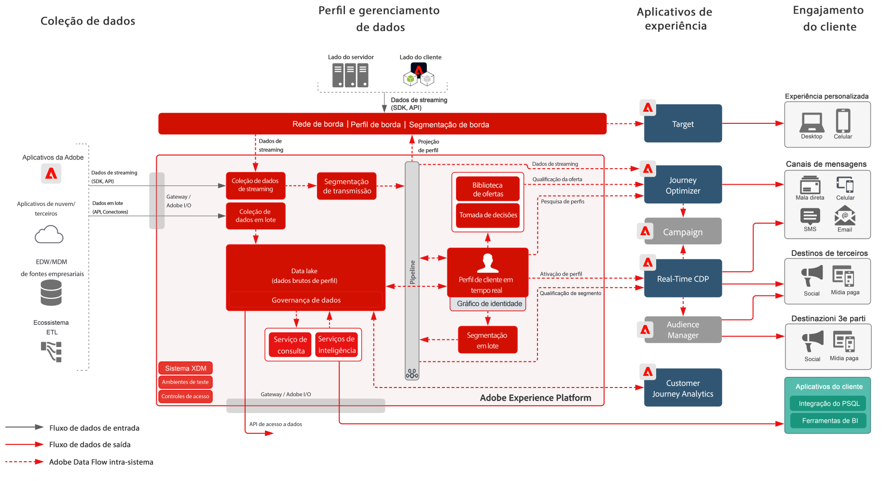

# Blueprint de ativação de público-alvo e perfil com aplicativos da Experience Cloud

Gerencie perfis e públicos-alvos na Experience Platform e compartilhe-os com aplicativos da Experience Cloud. Crie e compartilhe segmentos e insights avançados de clientes na Experience Platform e compartilhe-os com aplicativos da Experience Cloud.

A ativação com aplicativos da Experience Cloud está em sintonia com o [Blueprint de ativação de público-alvo online/offline](online-offline.md).

## Casos de uso

* Personalize e direcione em canais de interação com o cliente impulsionados pela Experience Cloud.
* Compartilhe dados de públicos-alvos e perfis entre a Experience Platform e os aplicativos da Experience Cloud.

## Aplicativos

* Adobe Experience Platform
* [!UICONTROL Plataforma de dados do cliente em tempo real]
* Experience Platform Activation
* Aplicativos da Experience Cloud
   * Adobe Audience Manager
   * Adobe Target
   * Adobe Campaign
   * Journey Optimizer

## Arquitetura

[Consulte a seção Experience Platform e Arquitetura de aplicativos para obter diagramas de arquitetura adicionais relacionados a integrações da Experience Platform com aplicativos da Experience Cloud.](https://experienceleague.adobe.com/docs/blueprints-learn/architecture/architecture-overview/platform-applications.html?lang=pt-BR)

### Ativação de público-alvo e perfil com aplicativos da Experience Cloud

 

## Medidas de proteção

Consulte as [medidas de proteção na página de Visão geral de ativação de público-alvo e perfil](overview.md)

## Documentação relacionada

* Descrição do produto [[!UICONTROL Plataforma de dados do cliente em tempo real]](https://helpx.adobe.com/br/legal/product-descriptions/real-time-customer-data-platform.html)
* [Guias de perfil e segmentação](https://experienceleague.adobe.com/docs/experience-platform/profile/guardrails.html?lang=pt-BR)
* [Documentação de segmentação](https://experienceleague.adobe.com/docs/experience-platform/segmentation/api/streaming-segmentation.html?lang=pt-BR)
* [Documentação de destinos](https://experienceleague.adobe.com/docs/experience-platform/destinations/catalog/overview.html?lang=pt-BR)

## Vídeos e tutoriais relacionados

* Visão geral da [[!UICONTROL Plataforma de dados do cliente em tempo real]](https://experienceleague.adobe.com/docs/platform-learn/tutorials/application-services/rtcdp/understanding-the-real-time-customer-data-platform.html?lang=pt-BR)
* [Demonstração da [!UICONTROL Plataforma de dados do cliente em tempo real]](https://experienceleague.adobe.com/docs/platform-learn/tutorials/application-services/rtcdp/demo.html?lang=pt-BR)
* [Criação de segmentos](https://experienceleague.adobe.com/docs/platform-learn/tutorials/segments/create-segments.html?lang=pt-BR)
