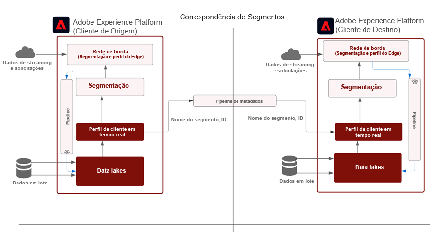
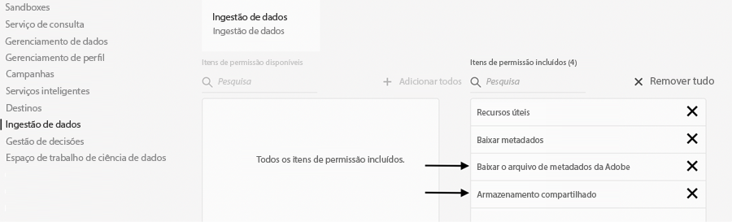
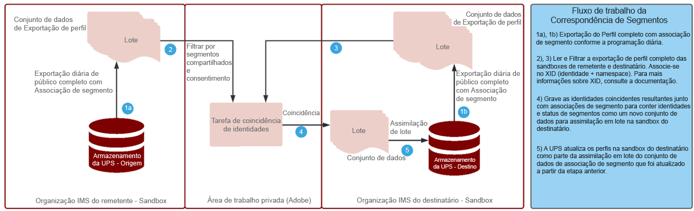

# Correspondência de segmentos

A correspondência de segmentos permite que marcas de parceiros compartilhem públicos-alvo em seus respectivos ambientes de Experience Platform. A chave para as marcas é se conectar com os clientes com base nos dados coletados de seus relacionamentos diretos com os consumidores. Com melhor governança, permissões e sistemas de gerenciamento de preferências, os profissionais de marketing podem aprimorar ainda mais seus públicos autenticados primários com parceiros principais.

[!UICONTROL Correspondência de segmentos] é um serviço de colaboração de dados para permitir clientes do Experience Platform (AEP) (referido como _parceiros_) para trocar dados do segmento com base em identificadores comuns do setor de maneira segura, regida e compatível com a privacidade.

O serviço permite que os clientes identifiquem com segurança as IDs correspondentes de uma maneira segura e neutra sem precisar revelar todo o banco de dados. Os parceiros recebem apenas atributos designados (nome do segmento) para IDs sobrepostas, permitindo o compartilhamento mais rápido e fácil de uma maneira controlável e controlada por consentimento.

[!UICONTROL Correspondência de segmentos] O usa a estrutura de consentimento e governança de dados da AEP como sua espinha dorsal. Ele está disponível para todos os clientes B2C e B2P da Real-time Customer Data Platform. Principais recursos da [!UICONTROL [!UICONTROL Correspondência de segmentos]] incluem:

* Compartilhamento de segmentos para clientes que consentiram com sobreposição
* Relatórios de sobreposição de pré-compartilhamento para insights sobre o volume estimado de correspondência
* Política de DULE totalmente integrada e aplicação da permissão
* Backbone da estrutura de consentimento de compartilhamento de dados
* Feeds de dados para organizar segmentos e parceiros

## Aplicativos

Marca para Editor:

O &quot;caso de uso do editor&quot; é o mais impactado pela desativação de cookies de terceiros e dados de id de anúncio móvel. Esse caso de uso tem um grande impacto no setor de mídia e entretenimento, que tem como foco a venda de anúncios como modelo de negócios. [!UICONTROL Correspondência de segmentos] é um caminho para editores com públicos primários grandes que buscam colaborar diretamente com seus anunciantes. Os anunciantes podem trabalhar diretamente com os editores para anunciar públicos correspondentes nas propriedades do editor para campanhas granulares de direcionamento ou prospecção.

### Marca para Marca

As jornadas do consumidor nunca são lineares. Por exemplo, um cliente pode ser fiel a uma companhia aérea e à sua empresa de cartões de crédito. Ao usar [!UICONTROL Correspondência de segmentos], a companhia aérea e a empresa de cartões de crédito podem criar uma parceria de dados para compreender públicos sobrepostos e, em seguida, adaptar ofertas para personalizar experiências para consumidores fiéis de cada uma das empresas.

### BU para BU

As multinacionais globais têm desafios com a colaboração de dados entre unidades de negócios que operam independentemente. A combinação de dados em uma única sandbox pode não ser possível devido à variação da política de privacidade, às aquisições ou ao gerenciamento de permissões entre BUs.

[!UICONTROL Correspondência de segmentos] ajuda equipes de marketing diferentes em organizações de grande porte a colaborarem de forma mais eficiente, além de continuar a operar de forma independente

## Arquitetura



[!UICONTROL Correspondência de segmentos] não é um Data Marketplace onde os dados podem ser comprados. Em vez disso, é um recurso da AEP que funciona com dados primários com parceiros selecionados, usando controles de privacidade e consentimento para ajudar a colaborar. [!UICONTROL Correspondência de segmentos] ajuda a concentrar esforços na melhoria dos relacionamentos com o cliente e no crescimento da marca. É benéfico quando existem marcas ou relações de parceiros pré-existentes. [!UICONTROL Correspondência de segmentos] a experiência é fácil de gerenciar, dimensionar e permite que os administradores compartilhem segmentos de maneira opcional e controlável.

[!UICONTROL Correspondência de segmentos] habilita:

* Dados de associação de segmento a serem portados com segurança em organizações que usam identificadores padrão de nível de pessoas, como email com hash ou número de telefone
* Uma interface do usuário de compartilhamento de público-alvo e fluxos de trabalho com notificações
* Estimativas de sobreposição pré-compartilhada
* Configuração do parceiro de autoatendimento
* Sobreposições em namespaces padronizados selecionados (email com hash, telefone com hash, ECID, IDFA, GAID)
* Aplicação do consentimento de compartilhamento de dados
* Gerenciamento do ciclo de vida do público-alvo compartilhado
* Aplicação de DULE no fluxo de trabalho de compartilhamento
* Atualizações diárias em lote

[!UICONTROL Correspondência de segmentos] O permite criar experiência de cliente interconectada. Os identificadores duráveis compatíveis são emails com hash, números de telefone com hash e identificadores como ECID, IDFA e GAID. Os clientes podem criar feeds que correspondem e movem os dados do público-alvo entre as sandboxes da marca, com forte governança, transparência e recursos de revogação para uso em ativações de publicidade e marketing

## Pré-requisitos

Os pré-requisitos para [!UICONTROL Correspondência de segmentos] são:

* RT-CDP ativo licenciado
* Os identificadores com hash padrão suportados são email com hash SHA256, telefone com hash, ECID, Apple IDFA e GAID
* Estrutura de privacidade e estratégia de consentimento
* Acordos de partilha de dados entre clientes

## Segurança

### RBAC

O [!UICONTROL Correspondência de segmentos] o fluxo para gerenciar parceiros é garantido pelo RBAC. Somente indivíduos com a permissão correta podem iniciar, aceitar ou gerenciar parceiros. Isso pode ser feito na seção Assimilação de dados do Perfil do produto. As seguintes permissões são necessárias:



| Permissão | Descrição |
|---|---|
| **Gerenciar conexões de compartilhamento de público-alvo** | Essa permissão permite concluir o processo de handshake do parceiro, que conecta duas Organizações IMS para ativar [!UICONTROL Correspondência de segmentos] fluxos. |
| **Gerenciar compartilhamentos de público-alvo** | Essa permissão permite criar, editar e publicar feeds (o pacote de dados usado para [!UICONTROL Correspondência de segmentos]) com parceiros ativos (parceiros que foram conectados pelo usuário administrador com **Conexões de compartilhamento de público** acesso). |

Consulte a [documentação oficial](https://experienceleague.adobe.com/docs/experience-platform/segmentation/ui/segment-match/overview.html?lang=en#understanding-segment-match-permissions) para saber mais sobre as permissões do .

### Conectar ID

O processo de conexão do parceiro é gerenciado pela **[!UICONTROL Conectar ID],** que é um identificador gerado aleatoriamente que mapeia para uma sandbox AEP específica. Esta Connect ID é necessária para iniciar e gerenciar sandboxes de parceiros. Também há a capacidade de gerar novamente a ID do Connect para reconfigurar uma conexão do parceiro, se necessário.

### Governança

Qualquer conjunto de dados ou atributo de dados com *C11* o rótulo do contrato é restrito para [!UICONTROL Correspondência de segmentos] serviço. Segmentos que usam esses atributos não podem ser usados para [!UICONTROL Correspondência de segmentos]. Isso fornece o controle para o qual os segmentos podem ou não ser usados [!UICONTROL Correspondência de segmentos]. Além disso, políticas personalizadas e ações de marketing criadas também são aplicadas. Por padrão, as políticas são desativadas e precisam ser ativadas para aplicação. Restrições como marketing por email e publicidade no site que são escolhidas enquanto compartilham segmentos também são propagadas e compartilhadas com os parceiros.

### Consentimento

As configurações de consentimento para [!UICONTROL Correspondência de segmentos] O pode ser gerenciado das seguintes maneiras:

* No nível da organização, durante a integração, usando a configuração de recusa ou aceitação para verificações de consentimento.

   Essa configuração determina se os dados do usuário podem ser compartilhados ou não. O padrão é definido para rejeitar, indicando que os dados do usuário podem ser compartilhados com a hipótese de que o cliente da AEP já tenha o consentimento necessário para o uso do compartilhamento de dados. Essa configuração pode ser alterada para aceitar, entrando em contato com o Gerente de conta do Adobe, colocando uma verificação extra para forçar os clientes da AEP a rastrearem explicitamente o consentimento.

* Definir o atributo de compartilhamento específico às identidades (idSpecific) usando o [Grupo de campos Consentimentos e Preferências](https://experienceleague.adobe.com/docs/experience-platform/xdm/field-groups/profile/consents.html?lang=en).

   Esse grupo de campos fornece um único campo do tipo de objeto, consentimentos, para capturar informações de consentimento e preferência. [!UICONTROL Correspondência de segmentos], por padrão, incluirá todas as identidades que não foram explicitamente rejeitadas, por exemplo:

   ```
   "share": {
   `                `"val": "n"
   `     `}
   ```

   Essa configuração pode ser alterada ao entrar em contato com o Gerente de conta do Adobe para incluir somente identidades com aceitação explícita, por exemplo:

   ```
   "share": {
   `                `"val": "y"
   `     `}
   ```

### Alertas

Os alertas são gerados quando uma conexão de parceiro é iniciada ou quando os feeds de segmento são compartilhados com parceiros.

## Configurar fluxo de trabalho

O fluxo de trabalho para configurar a conexão do parceiro é gerenciado com o RBAC, como mencionado acima. Com as permissões certas em vigor, a conexão com uma sandbox de parceiro requer que a ID de conexão dessa sandbox/instância na organização do parceiro seja compartilhada.

Depois que uma conexão é solicitada ao parceiro de envio, ela deve ser aprovada no lado do destinatário para garantir uma configuração de parceiro segura. O handshake de conexão do parceiro garante que o contrato exista entre as duas organizações e permite que o Adobe facilite o [!UICONTROL Correspondência de segmentos] em nome da organização. Com a conexão aprovada e no estado ativo, o processo de compartilhamento de segmentos pode ser iniciado de ambos os lados.

### Compartilhamento de segmentos

O compartilhamento de segmentos com o parceiro ocorre somente quando há uma correspondência no identificador selecionado. Pode haver uma relação de parceiro um para muitos, o que significa que os segmentos podem ser compartilhados com vários parceiros.

Para iniciar o compartilhamento de segmentos depois que a conexão do parceiro é configurada, o parceiro de envio deve criar um feed. Em seguida, selecione os casos de uso de marketing ou as ações dos quais os dados do segmento devem ser excluídos, juntamente com os identificadores duráveis. Segmentos relevantes podem ser adicionados ao feed para compartilhamento.

Como parte desse fluxo de trabalho de compartilhamento de segmentos, o parceiro de envio pode descobrir possíveis segmentos de alto valor por meio de sobreposições estimadas antes que qualquer dado seja movido.

O fluxo geral do processo é:


Essas estimativas de sobreposição oferecem informações importantes, descoberta de parceiros e dados para alimentar os acordos de colaboração de dados. Nenhum dado de cliente ou segmento é movido entre sandboxes para obter essas métricas de estimativa de sobreposição. As identidades aplicáveis pré-hash selecionadas pelo cliente em qualquer sandbox são adicionadas a uma estrutura de dados probabilística que permite que o Adobe execute operações de união e interseção entre elas. Estas operações ajudam [!UICONTROL Correspondência de segmentos] obter a interseção estimada de duas estruturas de dados composta por identidades de duas sandboxes diferentes sem ter que comparar os valores reais

O processo de sobreposição de identidade depende do **exportação diária de perfil completo** conjunto de dados das sandboxes de remetente e destinatário para identificar os perfis comuns que pertencem aos segmentos compartilhados. O fluxo detalhado do processo de sobreposição é mostrado abaixo:



Depois que o compartilhamento de segmentos é concluído a partir do parceiro de envio, o destinatário recebe uma notificação sobre o feed de segmento compartilhado. Este feed de segmento deve estar habilitado para o perfil no receptor para iniciar o fluxo de dados de associação de segmento. Somente a associação de segmento é assimilada nos fragmentos de perfil sobrepostos da Organização IMS do receptor e nenhuma identidade adicional é transferida do remetente para o destinatário.

O segmento compartilhado está disponível na variável `AEPSegmentMatch` da seção **[!UICONTROL Públicos-alvo]** na guia no **[!UICONTROL Construtor de segmentos]** e podem ser usados para inclusão ou supressão de públicos-alvo ao criar segmentos na sandbox do receptor.

O processo de sobreposição diária mantém a associação do segmento sincronizada entre o remetente e o destinatário. O receptor pode desativar o perfil para o feed de segmento recebido para pausar o processo de compartilhamento de segmentos.

#### Saída/entrada do segmento

Como parte da exportação de perfil completo, o status das IDs de segmento compartilhado na associação de segmento para perfis tem um dos valores correspondentes: _realizado_, _encerrado_ ou _existente_ para refletir o estado atual.

Durante o processo diário de sobreposição de identidade, se a identidade correspondente existir na sandbox do receptor, esses status de associação de segmento para segmentos compartilhados são enviados ao receptor para assimilação.

#### Revogação do segmento

A revogação/exclusão de segmentos do remetente é um processo sob demanda no qual a lista de todos os perfis com as IDs de segmento revogadas é obtida do destinatário. As IDs de segmento são removidas da associação de segmento dessas identidades e assimiladas no receptor. Essa ação substitui o fragmento de associação de segmento existente, que exclui a associação para esse segmento.

## Mais informações

* [Correspondência de segmentos](https://experienceleague.adobe.com/docs/experience-platform/segmentation/ui/segment-match/overview.html?lang=en#)
* [Permissões](https://experienceleague.adobe.com/docs/experience-platform/access-control/home.html?lang=en)
* [Resolução de problemas do](https://experienceleague.adobe.com/docs/experience-platform/segmentation/ui/segment-match/troubleshooting.html?lang=en)
* [XID](https://experienceleague.adobe.com/docs/experience-platform/identity/api/list-native-id.html?lang=en)
