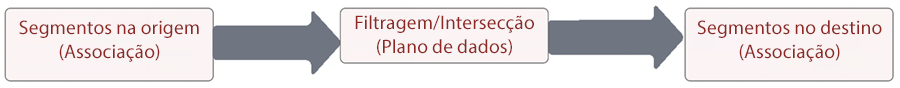

# Correspondência de Segmentos

A correspondência de segmentos permite que marcas de parceiros compartilhem públicos-alvo em seus respectivos ambientes da Experience Platform. É fundamental para as marcas se basear nos dados coletados de seus relacionamentos diretos com os consumidores para se conectar com os clientes. Com sistemas de gerenciamento de governança, permissões e preferências melhores, os profissionais de marketing podem aprimorar ainda mais seus públicos autenticados primários com seus principais parceiros.

[!UICONTROL Correspondência de Segmentos] é um serviço de colaboração de dados que visa a permitir que os clientes da Experience Platform (AEP) (referidos como _parceiros_) troquem dados de segmentos com base em identificadores comuns do setor de uma maneira segura, controlada e comprometida com a privacidade.

O serviço permite aos clientes identificarem com segurança as IDs correspondentes de uma maneira segura e neutra sem precisar revelar todo o banco de dados. Os parceiros recebem apenas atributos designados (nome do segmento) de IDs coincidentes, permitindo o compartilhamento mais rápido e fácil de uma maneira controlável e regida pelo consentimento.

A [!UICONTROL Correspondência de Segmentos] usa como suporte principal a estrutura de consentimento e governança de dados da AEP. Ela está disponível para todos os clientes B2C e B2P da Real-time Customer Data Platform. Os recursos principais da [!UICONTROL [!UICONTROL Correspondência de Segmentos]] incluem:

* Compartilhamento de segmentos de clientes coincidentes que deram consentimento
* Relatórios de coincidência anterior ao compartilhamento para gerar insights sobre o volume estimado de correspondência
* Aplicação totalmente integrada da permissão e política DULE
* Suporte principal da estrutura de consentimento de compartilhamento de dados
* Feeds de dados para organizar segmentos e parceiros

## Aplicativos

Marca para editor:

O “caso de uso de editor” é o mais impactado pela rejeição de dados de identificação de publicidade para dispositivos móveis e cookies de terceiros. Esse caso de uso tem um grande impacto no setor de mídia e entretenimento, que tem como foco a venda de anúncios como modelo de negócios. A [!UICONTROL Correspondência de Segmentos] é um caminho para editores com públicos primários grandes que buscam a colaboração direta com seus anunciantes. Os anunciantes podem trabalhar diretamente com editores para anunciar para públicos coincidentes nas propriedades do editor para campanhas de prospecção ou direcionamento granulares.

### Marca para marca

As jornadas do consumidor nunca são lineares. Por exemplo, um cliente pode ser fiel a uma companhia aérea e à sua empresa de cartões de crédito. Ao usar a [!UICONTROL Correspondência de Segmentos], a companhia aérea e a empresa de cartões de crédito podem criar uma parceria de dados para compreender os públicos coincidentes e, em seguida, adaptar ofertas para personalizar as experiências de consumidores fiéis de cada uma das empresas.

### Unidade de negócios para unidade de Negócios

As multinacionais globais enfrentam desafios relacionados à colaboração de dados entre unidades de negócios que operam de forma independente. Pode não ser possível combinar os dados em uma única sandbox, devido à diversidade de política de privacidade, aquisições ou permissões de gerenciamento entre as unidades de negócios.

A [!UICONTROL Correspondência de Segmentos] ajuda diferentes equipes de marketing em organizações de grande porte a colaborarem de forma mais eficiente, além de continuarem a operar de forma independente

## Arquitetura


A [!UICONTROL Correspondência de Segmentos] não é um mercado onde dados podem ser comprados. Em vez disso, trata-se de um recurso da AEP que trabalha com dados primários com parceiros selecionados, usando controles de privacidade e consentimento para ajudar na colaboração. A [!UICONTROL Correspondência de Segmentos] ajuda a concentrar esforços na melhoria de relacionamentos com o cliente e no crescimento da marca. É útil quando há marcas ou relações de parceiros pré-existentes. A experiência da [!UICONTROL Correspondência de Segmentos] é fácil de gerenciar e dimensionar e permite aos administradores compartilhar segmentos de forma opcional e controlável.

A [!UICONTROL Correspondência de segmentos] possibilita:

* A transferência segura de dados de associação de segmentos em organizações que usam identificadores pessoais padrão, como número de telefone ou email criptografado
* Uma interface do usuário de compartilhamento de públicos e fluxos de trabalho com notificações
* Estimativas de coincidência pré-compartilhadas
* A configuração de parceiro por conta própria
* A coincidência de namespaces padronizados selecionados (email criptografado, telefone criptografado, ECID, IDFA, GAID)
* A aplicação do consentimento para o compartilhamento de dados
* O gerenciamento do ciclo de vida do público compartilhado
* A aplicação de DULE no fluxo de trabalho de compartilhamento
* Atualizações em lote diárias

A [!UICONTROL Correspondência de Segmentos] permite criar uma experiência do cliente interconectada. Os identificadores duráveis compatíveis são emails criptografados, números de telefone criptografados e identificadores como ECID, IDFA e GAID. Os clientes podem criar feeds que façam a correlação e movam dados do público entre as sandboxes da marca, com recursos sólidos de governança, transparência e revogação para uso em ativações de publicidade e marketing

## Pré-requisitos

Os pré-requisitos para a [!UICONTROL Correspondência de Segmentos] são:

* Licença ativa da RT-CDP
* Os identificadores criptografados padrão compatíveis são email com criptografia SHA256, telefone criptografado, ECID, IDFA da Apple e GAID
* Estratégia de consentimento e estrutura de privacidade
* Acordos de compartilhamento de dados entre clientes

## Segurança

### RBAC

O fluxo da [!UICONTROL Correspondência de Segmentos] para gerenciar parceiros é garantido por RBAC (controle de acesso baseado em função). Somente pessoas físicas com a permissão adequada podem iniciar, aceitar ou gerenciar parcerias. Isso pode ser feito na seção Assimilação de dados do Perfil do produto. São necessárias as seguintes permissões:


| Permissão | Descrição |
|---|---|
| **Gerenciar conexões de compartilhamento de público** | Essa permissão autoriza concluir o processo de handshake do parceiro, que conecta duas Organizações IMS para ativar fluxos de [!UICONTROL Correspondência de Segmentos]. |
| **Gerenciar compartilhamentos de público** | Essa permissão autoriza criar, editar e publicar feeds (o pacote de dados usado na [!UICONTROL Correspondência de Segmentos]) com parceiros ativos (parceiros que foram conectados pelo usuário administrador com acesso a **Conexões de compartilhamento de público**). |

Consulte a [documentação oficial](https://experienceleague.adobe.com/docs/experience-platform/segmentation/ui/segment-match/overview.html?lang=pt-BR#understanding-segment-match-permissions) para saber mais sobre as permissões.

### ID de conexão

O processo de conexão de parceiro é gerenciado pela **[!UICONTROL ID de conexão],** que é um identificador gerado aleatoriamente que faz a associação com uma sandbox específica da AEP. Esta ID de conexão é necessária para iniciar e gerenciar sandboxes de parceiros. Caso seja necessário, também há meios para regenerar a ID de conexão e reconfigurar uma conexão de parceiro.

### Governança

O serviço [!UICONTROL Correspondência de Segmentos] não é permitido para conjuntos ou atributos de dados com o rótulo de contrato *C11*. Segmentos que usam esses atributos não podem ser usados para a [!UICONTROL Correspondência de Segmentos]. Isso fornece o controle sobre quais segmentos podem ou não ser usados para a [!UICONTROL Correspondência de Segmentos]. Além disso, as políticas personalizadas e ações de marketing criadas também são aplicadas. Por padrão, as políticas são desativadas, e é necessário ativá-las para possibilitar sua aplicação. Restrições como marketing por email e publicidade no site que são escolhidas ao compartilhar segmentos também são propagadas e compartilhadas com os parceiros.

### Consentimento

As configurações de consentimento da [!UICONTROL Correspondência de Segmentos] podem ser gerenciadas das seguintes maneiras:

* No nível da organização, durante a integração, usando a configuração de recusa ou aceitação de verificações de consentimento.

   Essa configuração determina se os dados do usuário podem ou não ser compartilhados. O padrão é definido para “recusar”, indicando que os dados do usuário podem ser compartilhados com a hipótese de que o cliente da AEP já tenha o acordo de consentimento necessário para o uso de compartilhamento de dados. É possível alterar essa configuração para “aceitar”, entrando em contato com o Gerente de conta da Adobe, colocando uma verificação adicional para forçar os clientes da AEP a rastrearem o consentimento de forma explícita.

* Definir o atributo de compartilhamento específico às identidades (idSpecific) usando o [Grupo de campos de consentimentos e preferências](https://experienceleague.adobe.com/docs/experience-platform/xdm/field-groups/profile/consents.html?lang=pt-BR).

   Esse grupo de campos oferece um único campo do tipo de objeto, consentimentos, para capturar informações de preferências e consentimento. A [!UICONTROL Correspondência de Segmentos], por padrão, inclui todas as identidades que não foram explicitamente recusadas. Por exemplo:

   ```
   "share": {
   `                `"val": "n"
   `     `}
   ```

   É possível entrar em contato com o Gerente de conta da Adobe para alterar essas configuração e incluir somente identidades com aceitação explícita, por exemplo:

   ```
   "share": {
   `                `"val": "y"
   `     `}
   ```

### Alertas

Os alertas são gerados quando uma conexão de parceiro é iniciada ou quando os feeds de segmento são compartilhados com parceiros.

## Fluxo de trabalho de configuração

O fluxo de trabalho para configurar a conexão de parceiro é gerenciado com o RBAC, conforme mencionado acima. Com as permissões adequadas em vigor, a conexão com uma sandbox de parceiro exige o compartilhamento da ID de conexão dessa sandbox/instância na organização do parceiro.

Depois de serem solicitadas pelo parceiro de envio, as conexões devem ser aprovadas no lado do destinatário para garantir uma configuração de parceiro segura. O handshake de conexão do parceiro garante que existe um acordo entre as duas organizações e permite que a Adobe facilite o processo da [!UICONTROL Correspondência de Segmentos] em nome da organização. Com a conexão aprovada e no estado ativo, o processo de compartilhamento de segmentos pode ser iniciado a partir de ambos os lados.

### Compartilhamento de segmentos

O compartilhamento de segmentos com o parceiro ocorre somente quando há correspondência no identificador selecionado. Pode haver uma relação de parceiro um para muitos, o que significa que os segmentos podem ser compartilhados com vários parceiros.

Para iniciar o compartilhamento de segmentos depois que a conexão do parceiro é configurada, o parceiro de envio deve criar um feed. Em seguida, selecione as ações ou casos de uso de marketing dos quais os dados do segmento devem ser excluídos, juntamente com os identificadores duráveis. Segmentos relevantes podem então ser adicionados ao feed para compartilhamento.

Como parte desse fluxo de trabalho de compartilhamento de segmentos, o parceiro de envio pode descobrir possíveis segmentos de alto valor por meio de coincidências estimadas antes de mover dados.

O fluxo geral do processo é:



Essas estimativas de coincidências oferecem insights importantes, a descoberta de parceiros e dados para alimentar os acordos de colaboração de dados. Nenhum dado de cliente ou segmento é movido entre as sandboxes para obter essas métricas de estimativa de coincidências. As identidades aplicáveis pré-criptografadas selecionadas pelo cliente em qualquer sandbox são adicionadas a uma estrutura de dados probabilística que permite à Adobe realizar operações de união e intersecção entre elas. Essas operações ajudam a [!UICONTROL Correspondência de Segmentos] a obter uma estimativa da intersecção de duas estruturas de dados composta por identidades de duas sandboxes diferentes sem a necessidade de comparar os valores reais

O processo de coincidência de identidades depende do conjunto de dados de **exportação diária de perfil completo** das sandboxes tanto de remetente como de destinatário para identificar os perfis comuns que pertencem aos segmentos compartilhados. O fluxo detalhado do processo de coincidência é mostrado abaixo:


Depois que o compartilhamento de segmentos é concluído a partir do parceiro de envio, o destinatário recebe uma notificação sobre o feed de segmento compartilhado. Este feed de segmento deve estar ativado para o perfil no receptor para iniciar o fluxo de dados de associação de segmento. Somente a associação de segmento é assimilada nos fragmentos de perfil coincidentes da Organização IMS do destinatário e nenhuma identidade adicional é transferida do remetente para o destinatário.

O segmento compartilhado fica disponível na seção `AEPSegmentMatch` da guia **[!UICONTROL Públicos]** no **[!UICONTROL Construtor de Segmentos]** e pode ser usado para a inclusão ou supressão de públicos ao criar segmentos na sandbox do destinatário.

O processo de coincidência diário mantém a associação de segmentos sincronizada entre o remetente e o destinatário. O destinatário pode desativar o perfil para o feed de segmento recebido para pausar o processo de compartilhamento de segmentos.

#### Saída/entrada de segmentos

Como parte da exportação de perfil completo, o status das IDs de segmento compartilhadas na associação de segmento para perfis tem um dos valores correspondentes: _realizado_, _encerrado_ ou _existente_ para refletir o estado atual.

Durante o processo diário de coincidência de identidade, se a identidade correspondente existir na sandbox do destinatário, esses status de associação de segmento dos segmentos compartilhados são enviados ao destinatário para assimilação.

#### Revogação de segmentos

A revogação/exclusão de segmentos a partir do remetente é um processo sob demanda no qual a lista de todos os perfis com as IDs de segmento revogadas é obtida com o destinatário. As IDs de segmento são removidas da associação de segmento dessas identidades e assimiladas no destinatário. Essa ação substitui o fragmento de associação de segmento existente, que exclui a associação para esse segmento.

## Mais informações

* [Correspondência de Segmentos](https://experienceleague.adobe.com/docs/experience-platform/segmentation/ui/segment-match/overview.html?lang=pt-BR#)
* [Permissões](https://experienceleague.adobe.com/docs/experience-platform/access-control/home.html?lang=pt-BR)
* [Resolução de problemas](https://experienceleague.adobe.com/docs/experience-platform/segmentation/ui/segment-match/troubleshooting.html?lang=pt-BR)
* [XID](https://experienceleague.adobe.com/docs/experience-platform/identity/api/list-native-id.html?lang=pt-BR)
