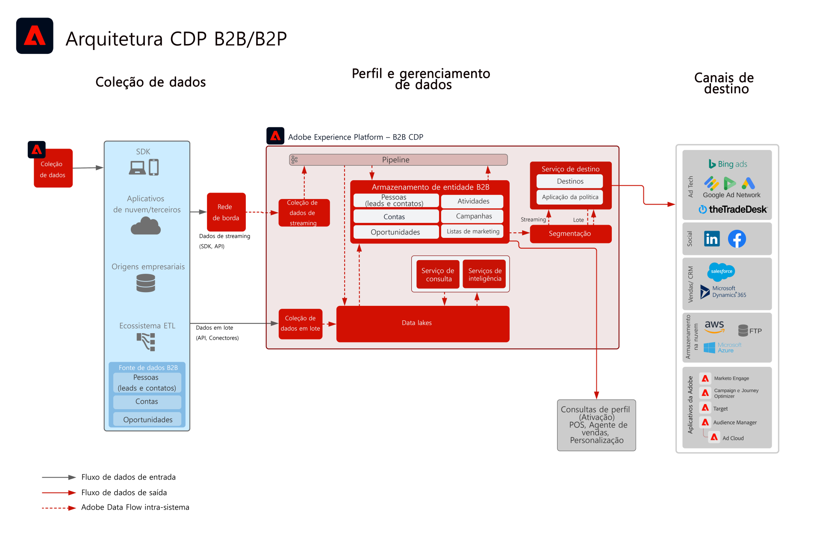

# Ativação de público-alvo e perfil B2B

Use as informações de conta, oportunidade e lead vinculadas a um cliente individual para criar perfis B2B acionáveis com o intuito de melhorar a personalização e o direcionamento nos canais.

## Casos de uso

* Crie públicos-alvo de pessoas para direcionamento e personalização nos canais em relação a dados B2B, incluindo contas, oportunidades e leads.
* Ative públicos-alvo para quaisquer destinos da Experience Platform para direcionamento e personalização.

## Aplicativos

* Real-time Customer Data Platform Edição B2B

## Padrões de integração

* Fontes de dados B2B (Marketo, Salesforce etc.) -> Edição B2B da Real-time Customer Data Platform -> Destinos
Várias fontes de dados B2B podem ser usadas para mapear dados de contas, leads, oportunidades e pessoas para a Edição B2B do Real-time Customer Data Platform.

## Arquitetura

 

## Medidas de proteção

Observe que as medidas de proteção e de implementação relacionadas ao Marketo Engage só são relevantes quando o Marketo Engage é usado como fonte e/ou destino.

### Suporte a várias instâncias e organizações IMS:

A seguir, são descritos os padrões suportados de instâncias de mapeamento da Experience Platform e do Marketo Engage.

#### Marketo como fonte de dados para a Experience Platform:

* Há suporte para várias instâncias do Marketo Engage para uma instância da Experience Platform.
* Não há suporte para várias instâncias do Marketo Engage para muitas instâncias da Experience Platform.
* Não há suporte para uma instância do Marketo Engage para muitas instâncias da Experience Platform.
* Há suporte para uma instância do Marketo Engage para uma instância da Experience Platform e várias sandboxes.

#### Marketo como destino da Experience Platform:

* Há suporte para a Experience Platform para muitas instâncias do Marketo Engage
* Há suporte para muitas instâncias da Experience Platform para uma instância do Marketo Engage

#### Proteção de perfil e segmentação da Experience Platform:

* Consulte a proteção de perfil e segmentação para a Experience Platform – [Diretrizes de perfil e segmentação](https://experienceleague.adobe.com/docs/experience-platform/profile/guardrails.html?lang=pt-BR)
* Segmentos B2B que incluem contas, leads, oportunidades usam relacionamentos de várias entidades que resultam na avaliação do segmento se transformando em lote. A segmentação de transmissão é compatível com segmentos que sejam limitados a pessoas e eventos.

#### Experience Platform – conector de origem do Marketo Engage:

* O preenchimento retroativo histórico pode levar até 7 dias para ser concluído, dependendo do volume de dados.
* As atualizações e alterações de dados constantes do Marketo são enviadas para a Experience Platform por meio da API de transmissão que pode estar latente até cerca de 5 minutos para o perfil e em torno de 15 minutos para o data lake, dependendo do volume.

#### Experience Platform – conector de destino do Marketo:

* O compartilhamento de segmentos de transmissão da Real-time Customer Data Platform para o Marketo Engage pode levar até 5 minutos.
* A segmentação em lote é compartilhada uma vez por dia com base na programação de segmentação da Experience Platform. Segmentos B2B que incluem contas, leads e oportunidades usam relacionamentos de várias entidades que resultam no segmento se transformando em lote.

#### Proteção do Marketo Engage:

* Os contatos e leads devem ser assimilados e definidos diretamente no Marketo Engage para que o público-alvo da Real-time Customer Data Platform corresponda a um contato e lead do Marketo Engage.

#### Proteção de destino

* Consulte a documentação de destino para obter orientações específicas sobre os destinos. [Diretrizes de destino](https://experienceleague.adobe.com/docs/experience-platform/destinations/home.html?lang=pt-BR)

## Etapas de implementação

Para obter orientações sobre como implementar e configurar a Edição B2B da Real-time Customer Data Platform, consulte a Edição B2B da Documentação da Real-time Customer Data Platform. [Edição B2B da Real-time Customer Data Platform](https://experienceleague.adobe.com/docs/experience-platform/rtcdp/b2b-overview.html?lang=pt-BR)

Existem dois padrões de implementação possíveis. A capacidade de assimilar perfis e dados B2B do Marketo Engage ou a capacidade de assimilar dados B2B de outras fontes de dados da CRM.

## Considerações de implementação

Orientações sobre as principais considerações e configurações do blueprint.

* Integração da CRM com e sem o Marketo:
Se a implementação usar o Marketo Engage como fonte e o Marketo Engage estiver conectado à CRM, use o conector de origem do Marketo na Experience Platform para assimilar os dados da CRM na Experience Platform. Use o conector de origem da Experience Platform se as tabelas adicionais forem necessárias. Se a implementação não estiver usando o Marketo Engage como uma fonte, conecte a fonte da CRM diretamente à AEP usando o conector de origem da Experience Platform da CRM.
* Não é recomendável iniciar e nutrir o lead apenas por meio da Edição B2B da Real-time Customer Data Platform. Para este caso de uso, recomenda-se o uso de uma ferramenta de nutrição do lead (como o Marketo Engage).
* O conector de destino do Marketo Engage para AEP, que envia públicos-alvo para o Marketo Engage para ativação, envia somente endereços de email e ECIDs. Ele não criará um novo lead se o contato ainda não existir, portanto, é necessário assimilar o perfil e os dados do lead no Marketo Engage.

## Documentação relacionada

* [Edição B2B da Real-time Customer Data Platform](https://experienceleague.adobe.com/docs/experience-platform/rtcdp/b2b-overview.html?lang=en)
* [Adobe Experience Platform](https://experienceleague.adobe.com/docs/experience-platform.html?lang=pt-BR)
* [Marketo Engage](https://experienceleague.adobe.com/docs/marketo/using/home.html?lang=pt-BR)
* [Adobe Experience Platform – Conector de origem do Marketo](https://experienceleague.adobe.com/docs/experience-platform/sources/connectors/adobe-applications/marketo/marketo.html?lang=pt-BR)
* [Adobe Experience Platform – Conector de destino do Marketo](https://experienceleague.adobe.com/docs/marketo/using/product-docs/core-marketo-concepts/smart-lists-and-static-lists/static-lists/push-an-adobe-experience-cloud-segment-to-a-marketo-static-list.html?lang=pt-BR)