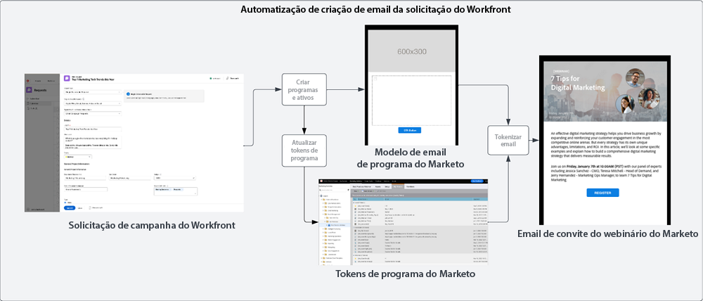
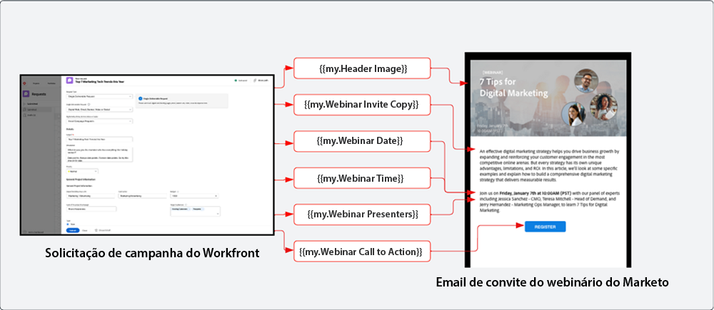
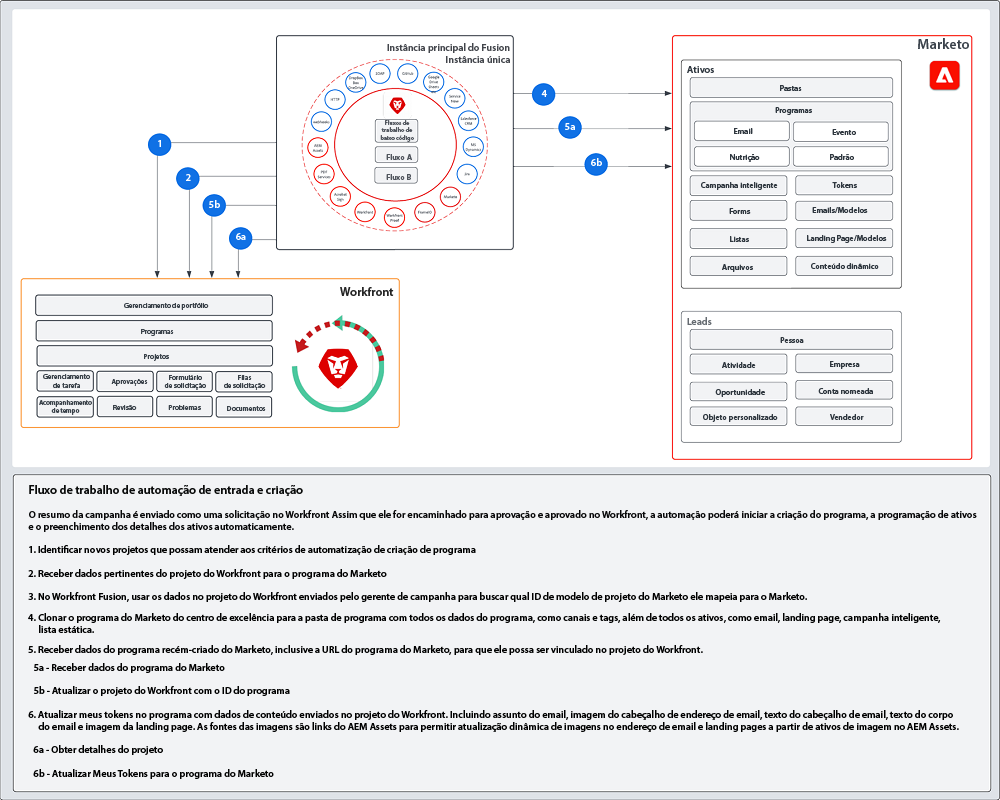

# Entrada e criação  blueprint {#intake-and-create}

O número de solicitações de marketing que uma equipe de operações de marketing recebe para lançar novas campanhas pode transformar uma equipe de alto rendimento em uma porta giratória de tarefas repetitivas, causando estagnação e esgotamento da inovação.

Ao estabelecer um processo para enviar solicitações de campanha e automatizar a criação de campanhas de marketing normalmente solicitadas, você pode: aumentar a velocidade das campanhas, reduzir erros, encaminhar solicitações para o membro certo das operações de marketing, equilibrar e aprimorar a utilização de recursos e concentrar as operações de marketing em tarefas mais estratégicas.

Com o Workfront e o Marketo Engage, uma conexão entre sistemas permite detalhes de um [Formulário de solicitação do Workfront](https://experienceleague.adobe.com/docs/workfront/using/administration-and-setup/customize/custom-forms/create-or-edit-a-custom-form.html?lang=pt-BR){target="_blank"} para criar um programa do Marketo Engage. Depois, preencha as variáveis principais, como: linhas de assunto, texto de email, imagens, datas, horas, informações do evento e muito mais.

Para essa integração, você usará o Workfront Fusion, uma camada de automação de trabalho que permite automatizar fluxos de trabalho entre o Workfront e outros sistemas.

O fluxo de trabalho abaixo mostra uma solicitação de webinário feita por um gerente de campanha usando um formulário de solicitação do Workfront. Os detalhes enviados na solicitação acionam um programa e email a serem criados no Marketo Engage para o webinário. Além disso, os dados são obtidos do formulário de solicitação para preencher o conteúdo do email.

>[!TIP]
>
>Para saber mais sobre os diferentes tipos de objetos que o Workfront usa para organizar a campanha de marketing e como ela é mapeada para um programa do Marketo Engage, verifique a [Visão geral do Marketo e Workfront](/help/blueprints/b2b/campaign-supply-chain/overview.md){target="_blank"}.

## Prepare o processo de desenvolvimento da campanha para automação {#prepare-your-campaign-development-process-for-automation}

Toda excelente automação de fluxo de trabalho tem um processo definido por trás, que garante que as equipes e as partes interessadas obtenham o máximo valor da automação.

**Que tipos de solicitações de marketing você receberá?**

Pense em quais tipos de táticas de marketing serão usadas, como emails, nutrição, webinars primários e eventos. Você também gerencia webinários ou mostra anúncios de terceiros? Cada uma dessas solicitações deve ser considerada, pois campos de entrada específicos podem ser necessários no formulário de solicitação que serão mapeados para diferentes modelos de programa no Marketo Engage e clonados.

Você também precisará entender se as campanhas serão realizadas em várias regiões. Se esse for o caso, você deverá registrar um Projeto no Workfront, criando vários programas no Marketo Engage, e cada programa representa o suporte a idiomas diferentes.

É importante saber previamente quais tipos de solicitações de marketing você espera receber para garantir que as solicitações possam ser facilitadas de maneira automatizada.

**Que informações devem ser capturadas na solicitação da campanha?**

Pense nas informações principais que precisarão ser capturadas no formulário de solicitação para cada uma das diferentes táticas executadas. Veja abaixo alguns exemplos de informações que podem ser capturadas em um formulário do Workfront para ajudar a automatizar o desenvolvimento da campanha.

<table> 
  <tr> 
   <td><b>Tática de marketing</b></td>
   <td><b>Informações para capturar</b></td>
  </tr>
  <tr> 
   <td>Envio de email em massa</td>
   <td>• Assunto do email 
• Data programada 
• Texto do e-mail 
• Chamada à ação 
• Imagens - Os URLs do AEM Assets podem ser referenciados diretamente para uso no Marketo 
• Critérios de qualificação de público-alvo</td>
  </tr>
  <tr>
   <td>Webinário/Evento</td>
   <td>• Nome do evento 
• Data do evento 
• Hora do evento 
• Cidade do evento 
•Descrição do evento 
•Página de registro do webinário - PageURL OnDemand 
• Nomes dos palestrantes 
• Cargos dos palestrantes 
• Imagens dos palestrantes 
• Emails necessários (Convite, Confirmação, Lembrete, Acompanhamento) 
• Imagens de cabeçalho de email 
• Critérios de qualificação de público-alvo</td>
  </tr>
  <tr>
   <td>Nutrição</td>
   <td>• Número de emails 
• Texto do email 
• Cabeçalhos de email 
• Chamada à ação 
• Critérios de qualificação de público-alvo</td>
  </tr>
  </tbody>
</table>

>[!NOTE]
>
>No momento, a criação programática de públicos-alvo por meio da automação é limitada no Marketo Engage, pois os tokens não são compatíveis com as listas inteligentes. Isso significa que um usuário precisará criar os públicos-alvo no Marketo Engage ou, se tiver um público-alvo predeterminado com o qual se comunica continuamente, você poderá incluir uma lista inteligente configurada como parte do modelo de programa clonado durante o processo de automação.

### Estabeleça seu centro de excelência {#establish-your-center-of-excellence}

Se quiser automatizar a criação de programas, você precisará de um centro de excelência no Marketo Engage. Um centro de excelência inclui programas e ativos de modelo para ajudar a agilizar e padronizar o processo de desenvolvimento da campanha. Por exemplo, você pode ter um modelo de programa para suas diferentes necessidades de campanha: email, criação, evento presencial e webinário. Além disso, você pode ter vários modelos de programa de email usados para diferentes regiões ou diferentes tipos de anúncios de email.

Criar seu centro de excelência com modelos de programa no Marketo Engage é um dos primeiros passos para ter uma abordagem mais programática para a execução da campanha e será a base para automatizar as solicitações de campanha.

Depois de ter um conjunto de modelos de programa reutilizáveis, você poderá dimensionar seus esforços usando a automação descrita neste blueprint para aumentar a velocidade de desenvolvimento da sua campanha.

Para saber mais sobre como criar seu próprio centro de excelência, consulte a [Comunidade Marketo](https://nation.marketo.com/t5/product-blogs/marketo-master-class-center-of-excellence-with-chelsea-kiko/ba-p/243221){target="_blank"} para ver as práticas recomendadas.

### Use tokens para preencher conteúdo {#use-tokens-to-populate-content}

Com o Marketo Engage, os tokens podem ser usados para preencher o conteúdo nos ativos da campanha. Por exemplo, após clonar um modelo de email do seu centro de excelência, o Workfront Fusion pode obter detalhes da solicitação de campanha no Workfront e transmiti-los para “Meus tokens” no programa do Marketo Engage. Os valores de token podem depois ser herdados diretamente no email para criar o email.

### Preencha com imagens do AEM Assets {#populate-images-from-aem-assets}

Você pode ainda automatizar o desenvolvimento de emails e landing pages utilizando tokens do Marketo Engage em combinação com links para ativos no AEM Assets. Os solicitantes de campanha podem enviar links de imagem publicados do AEM Assets como parte do processo de solicitação. O Workfront Fusion pode então incorporar esses links ao HTML de um email usando tokens do Marketo Engage.

Lembre-se, você precisará criar programas e modelos de programa no Marketo Engage para utilizar “Meus Tokens”, de forma que o Fusion possa atualizar os valores dos tokens com as informações enviadas no Workfront.

>[!NOTE]
>
>O AEM Assets não é necessário para permitir esse fluxo de trabalho, mas pode permitir um processo mais simplificado para gerenciar ativos da campanha na cadeia de suprimento de desenvolvimento da campanha.

### Monte uma biblioteca de pesquisa para todos os tipos de solicitação de programa {#assemble-a-lookup-library-for-all-program-request-types}

Ao automatizar a criação de novos programas do Marketo Engage a partir de solicitações do Workfront, é importante incluir uma etapa na automação do Workfront Fusion para obter informações da solicitação do Workfront e pesquisar os modelos de programa corretos que devem ser clonados no Marketo Engage.

Para isso, você pode importar um conjunto de dados no Workfront Fusion que inclui uma lista de todos os diferentes modelos de programas no seu centro de excelência do Marketo Engage.

Algumas informações básicas a serem incluídas na Biblioteca de pesquisa do modelo de programa são:

<table> 
  <tr> 
   <td><b>Coluna</b></td>
   <td><b>Descrição</b></td>
  </tr>
  <tr> 
   <td>Tipo de campanha</td>
   <td>Pode ser email, webinário, nutrição, evento, webinar de terceiros, importação de lista etc. O tipo de campanha atuará como uma descrição legível para o que está sendo solicitado.</td>
  </tr>
  <tr> 
   <td>Tipo de solicitação do Workfront</td>
   <td>Esse é o tipo de solicitação selecionado no formulário do Workfront, que pode igual ao tipo de campanha, como email, webinar, nutrição ou evento. Ele é usado para mapear a entrada selecionada no formulário do Workfront para um modelo de programa no Marketo.</td>
  </tr>
  <tr> 
   <td>ID de formulário do Workfront</td>
   <td>O identificador exclusivo do formulário de solicitação de Workfront usado para validar a solicitação de gravação está sendo mapeado para o modelo de programa do Marketo Engage.</td>
  </tr>
  <tr> 
   <td>ID de programa do Marketo</td>
   <td>Este é o ID do modelo de programa no Marketo Engage que mapeia para a solicitação efetuada. Essas informações prontamente disponíveis no Workfront Fusion permitirão que o Fusion faça a solicitação ao Marketo Engage e saiba exatamente qual programa clonar.</td>
  </tr>
  </tbody>
</table>

## Fluxo de automação de entrada e criação {#intake-and-create-automation-flow}

Veja aqui um exemplo de como a lógica do fluxo de trabalho pode ser criada no Fusion usando módulos pré-fabricados do [Workfront](https://experienceleague.adobe.com/docs/workfront/using/adobe-workfront-fusion/fusion-apps-and-modules/workfront-modules.html?lang=pt-BR){target="_blank"} and [Marketo Engage](https://experienceleague.adobe.com/docs/workfront/using/adobe-workfront-fusion/fusion-apps-and-modules/marketo-modules.html?lang=pt-BR){target="_blank"} que permitem acelerar a automação.

## Recursos {#resources}

* [Módulos do Adobe Marketo Engage](https://experienceleague.adobe.com/docs/workfront/using/adobe-workfront-fusion/fusion-apps-and-modules/marketo-modules.html?lang=pt-BR){target="_blank"}

* [Módulos do Adobe Workfront](https://experienceleague.adobe.com/docs/workfront/using/adobe-workfront-fusion/fusion-apps-and-modules/workfront-modules.html?lang=pt-BR){target="_blank"}

* [Visão geral do Marketo e do Workfront](/help/blueprints/b2b/campaign-supply-chain/overview.md){target="_blank"}
