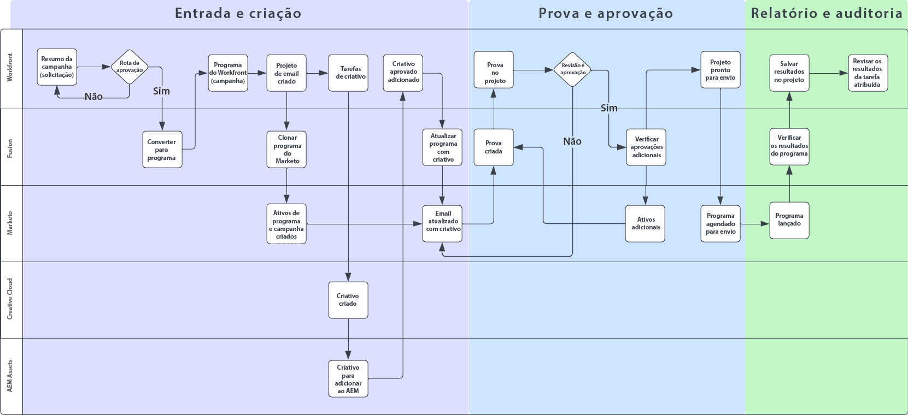
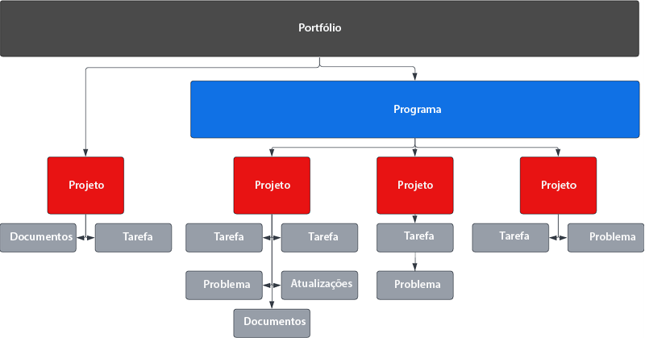
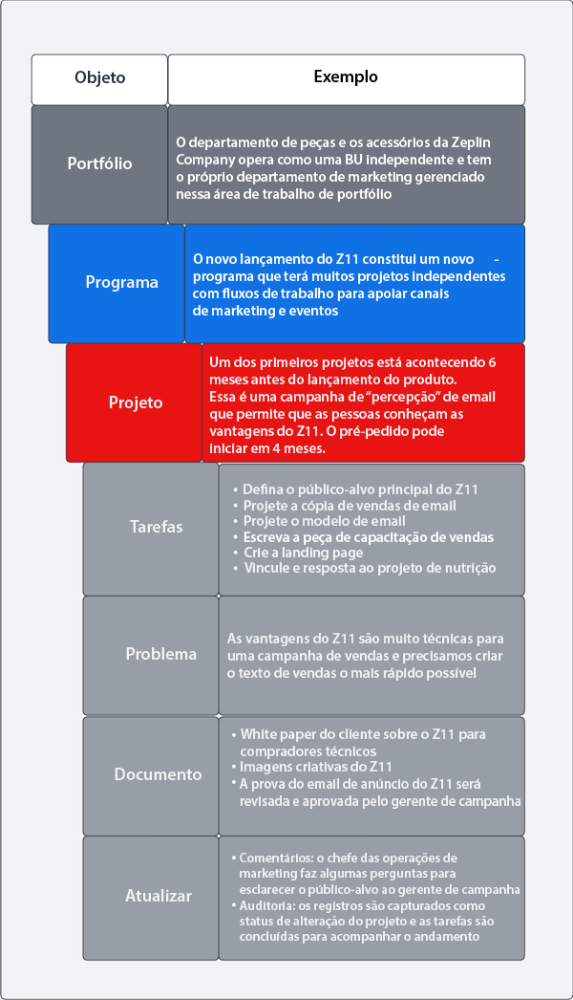
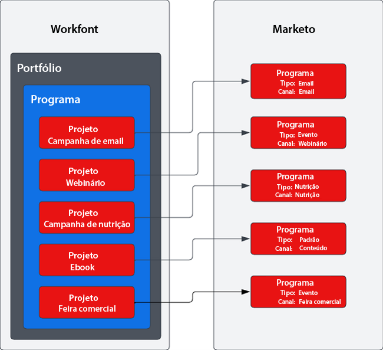

# Cadeia de suprimento da campanha com o Marketo e blueprints do Workfront {#overview}

## Redução do prazo para comercialização com a cadeia de suprimento otimizada da campanha {#achieving-faster-time-to-market-with-optimized-campaign-supply-chain}

O trabalho de marketing não para de crescer, com novos canais e mais maneiras de personalizar comunicações todos os dias. As equipes de marketing precisam de maneiras de continuar a automatizar e evoluir para atender às mudanças de demanda de marketing no mundo.

**“O ROI sempre foi o verdadeiro objetivo. Receita é excelente, mas não a qualquer custo. Especialmente, hoje.” - CMO, Setor de serviços empresariais**

As organizações que conseguem um ROI maior aumentando as receitas estão simplificando o processo de desenvolvimento de campanha, otimizando a velocidade de execução de campanha e melhorando a supervisão em toda a função de marketing.

Se sua organização quer atingir objetivos semelhantes aos descritos abaixo, este documento será útil para você:

* Dimensionar as operações da campanha para permitir equipes de marketing multidisciplinares
* Reduzir o prazo para comercialização com um processo de solicitação de campanha simplificado
* Estabelecer um sistema de registro para aumentar a visibilidade entre as partes interessadas da campanha
* Revisar e aprovar ativos da campanha (imagens, textos de e-mail)

As equipes operacionais da campanha precisam de sistemas que permitam planejar e executar campanhas de marketing de maneira eficiente e eficaz. Seja para email, webinário, evento, mídia paga, nutrição ou distribuição de conteúdo, as equipes de marketing precisam de uma solução central para organizar os colaboradores, os entregáveis e a execução da campanha.

Ao integrar o sistema de ativação de marketing multicanal (Marketo Engage) ao planejamento de marketing e ao sistema de registro (Workfront), você pode aumentar a velocidade da campanha e fornecer melhor visibilidade às partes interessadas.

Com o Workfront Fusion, as equipes de operações de marketing podem eliminar em grande parte as etapas manuais e propensas a erros envolvidas na transformação de um resumo de marketing em uma campanha. O Workfront Fusion oferece uma camada de integração pronta para usar entre o Workfront e o Marketo Engage, que permite flexibilidade e eficiência no desenvolvimento de fluxos de trabalho entre sistemas. Saiba mais sobre como configurar a integração e quais ações efetuar para automatizar os fluxos de trabalho [aqui](https://experienceleague.adobe.com/docs/workfront/using/adobe-workfront-fusion/fusion-apps-and-modules/marketo-modules.html?lang=pt-BR){target="_blank"}.

## Planejamento de campanha à execução – Casos de uso de automação {#campaign-planning-to-execution-automation-use-cases}

* Para ajudar as equipes de operações de marketing, automatize da criação de campanhas no Marketo Engage por meio de solicitações de entrada no Workfront
* Compartilhe rascunhos de emails e landing pages criados no Marketo Engage com o Workfront para obter a revisão final e a aprovação das partes interessadas multidisciplinares
* Compartilhe os resultados da campanha do Marketo Engage com o Workfront para democratizar o acesso às métricas de campanha

Você pode ver abaixo um diagrama de fluxo de trabalho do processo de desenvolvimento da campanha no caso de envio de email em massa. Além disso, você pode ver como o Workfront Fusion pode desempenhar uma função entre o Workfront e o Marketo Engage para impulsionar o fluxo de trabalho e a automação de processos em todo o ciclo de desenvolvimento da campanha.

{zoomable=&quot;yes&quot;}

Anote as diferentes fases no processo de desenvolvimento da campanha.

1. Entrada e criação: a campanha é solicitada e os ativos da campanha são montados de forma programática.

1. Prova e aprovação: depois da montagem da campanha, é hora de as partes interessadas revisarem e aprovarem os ativos da campanha, como emails e landing pages.

1. Relatório e auditoria: compartilhe os resultados da campanha com o Workfront para oferecer maior visibilidade a partes interessadas multidisciplinares.

>[!NOTE]
>
>No exemplo acima, o Workfront gerencia e planeja os esforços de trabalho durante todo o ciclo de vida do programa do Marketo Engage. Dito isso, é possível estender a flexibilidade do Workfront para gerenciar todos os esforços da sua equipe de marketing. Isso inclui account-based marketing, cadeias de suprimento de conteúdo de marketing, gerenciamento de agências, gerenciamento de campanhas digitais e sociais e programas de capacitação de vendas.

## Noções básicas sobre a representação das iniciativas de marketing no Workfront {#understanding-how-marketing-initiatives-are-represented-in-workfront}

O Adobe Workfront permite que as organizações gerenciem o trabalho para aumentar a eficiência da execução. No Workfront, há uma hierarquia de objetos que oferece uma estrutura para planejamento, gerenciamento de recursos e colaboração entre várias equipes.

Entender como mapear o processo empresarial para esses objetos será importante para compreender a relação entre o Workfront e o Marketo Engage.

{zoomable=&quot;yes&quot;}

### Hierarquia de portfólio definida {#portfolio-hierarchy-defined}

<table> 
  <tr> 
   <td><b>Objeto</b></td>
   <td><b>Definição</b></td>
  </tr>
  <tr> 
   <td>Portfólio</td>
   <td>Você pode usar o portfólio e os programas no Workfront para organizar projetos. Ao organizar projetos, você pode comparar projetos semelhantes e determinar onde é melhor gastar os recursos.  
   (Por exemplo, um portfólio é criado para uma unidade de negócios de uma empresa focada na venda de serviços e/ou produtos.)</td>
  </tr>
  <tr>
   <td>Programa</td>
   <td>Você pode usar os programas do Workfront para organizar os projetos. Ao organizar projetos, você pode comparar projetos semelhantes e determinar onde é melhor gastar os recursos.  
   (Por exemplo, uma estratégia de marketing com um objetivo de alto nível, como conscientizar e impulsionar a demanda de um lançamento de produto.)</td>
  </tr>
  <tr>
   <td>Projeto</td>
   <td>Os projetos do Workfront são uma coleção de itens de trabalho que precisam ser concluídos para, por exemplo, cumprir uma meta ou produzir um entregável ou um produto específico.  
   (Por exemplo, uma tática de marketing, como um envio de email em massa, uma campanha de nutrição, um webinário ou um evento presencial. Um projeto que abrange várias táticas, como email, anúncio de exibição, landing page e whitepaper para download para conduzir ao mesmo resultado, pode ser mais complexo.</td>
  </tr>
  <tr>
   <td>Tarefa</td>
   <td>Tarefas do Workfront são itens de trabalho planejados que podem fazer parte de um projeto ou uma iniciativa. As tarefas são atribuídas a usuários ou equipes para serem concluídas.  
   (Por exemplo, uma tarefa para criar um segmento de público-alvo ou um rascunho de email pode ser associada a um projeto para desenvolver um programa de email do Marketo Engage.)</td>
  </tr>
  <tr>
   <td>Problema</td>
   <td>Problemas são itens de trabalho não planejados no Workfront. Podem ser problemas que ocorrem durante um projeto ou solicitações enviadas por meio de uma fila de solicitações.  
   (Por exemplo, um tíquete de problema é criado porque as dimensões da imagem do banner estão erradas.)</td>
  </tr>
  <tr>
   <td>Documento</td>
   <td>Documentos podem ser tradicionais, como documentos do Word ou apresentações. Eles também podem ser arquivos de imagem. O Workfront permite a revisão de ativos por meio de comentários e anotações em documentos e imagens, para permitir a colaboração entre equipes.  
   (Por exemplo, uma imagem de cabeçalho de email que precisa ser revisada.)</td>
  </tr>
  <tr>
   <td>Atualização</td>
   <td>Inclui comentários e logs de auditoria para acompanhar o trabalho e facilitar a colaboração no Workfront.  
   (Por exemplo, log de auditoria da nova versão da imagem.)</td>
  </tr>
  </tbody>
</table>

## Exemplo de gerenciamento de trabalho da iniciativa de marketing {#marketing-initiative-work-management-example}

Vejamos como a hierarquia de portfólio do Workfront funciona em um exemplo real.

A Zeplin Company está lançando uma versão atualizada de um acessório de trator de utilidade compacta chamada Z11, que supera o modelo Z10, oferecendo mais durabilidade e personalização. Com isso, eles precisam planejar, desenvolver e executar uma estratégia de marketing para impulsionar a demanda e informar sobre o novo lançamento da nova divisão de trator da empresa. Essa estratégia de marketing precisa incluir diferentes táticas de marketing para aumentar a percepção para novos clientes e os clientes do Z10.

A hierarquia abaixo mostra como a estratégia, as táticas, as tarefas e os ativos são mapeados para o Workfront para essa campanha de marketing.

{zoomable=&quot;yes&quot;}

## Mapeamento do Workfront para o Marketo {#mapping-workfront-to-marketo}

Ao usar o Workfront como sistema upstream para planejamento de marketing e organização de projeto, é importante entender como as informações podem ser compartilhadas entre o Marketo Engage e o Workfront.

Para que esses sistemas funcionem em conjunto à medida que novas iniciativas de marketing forem desenvolvidas, é importante entender como diferentes tipos de registro no Workfront correspondem aos tipos de registro no Marketo Engage.

### Mapeamento de projetos do Workfront para programas do Marketo Engage {#mapping-workfront-projects-to-marketo-engage-programs}

Ao usar o Workfront Fusion como camada de integração, você pode mapear seus projetos no Workfront para um programa no Marketo Engage. Por exemplo, no caso acima, a Zeplin quer aumentar a percepção do novo modelo da empresa. Com isso, eles criam um programa no Workfront que abriga várias táticas de marketing que são representadas como projetos. Uma tática é um email de percepção que precisa ser enviado aos clientes do modelo Z10 para informar sobre o novo modelo Z11. No Workfront, seria criado um projeto para representar essa tática de email com um conjunto de tarefas associadas para criar o público-alvo, encontrar material criativo para as imagens do email e montar o email no Marketo Engage. O projeto no Workfront pode ser mapeado para um programa de email no Marketo Engage para que as informações possam ser sincronizadas entre os sistemas.

Veja abaixo um exemplo de como um programa pode incluir vários projetos e como esses projetos do Workfront podem ser mapeados para programas no Marketo Engage.

{zoomable=&quot;yes&quot;}

Você pode querer iniciar uma grande iniciativa de marketing que precise que vários projetos do Workfront sejam hospedados em um programa do Workfront, ou pode ter uma solicitação única para um webinário ou email que precise apenas da criação de um único projeto. Seja qual for a sua necessidade, com o Workfront, Workfront Fusion e o Marketo Engage, sua equipe tem a flexibilidade de integrar todo o processo de desenvolvimento da campanha, desde o planejamento até a execução.

### Mapeamento de tarefas do Workfront para ativos do Marketo Engage {#mapping-workfront-tasks-to-marketo-engage-assets}

Ao começar a mapear o processo de desenvolvimento de campanha no Workfront, você também pode pensar em quais tarefas mapear para trabalhar no Marketo Engage e como capturar informações no Workfront, ajudar a aumentar a consistência, a eficiência e a precisão na cadeia de suprimento de desenvolvimento de campanha.

Os projetos do Workfront podem ser transformados em modelos para que seu processo possa ser claramente definido sempre que uma tática de marketing específica for usada. Por exemplo, ao realizar em uma campanha de email, haverá um conjunto padrão de tarefas que precisam ser concluídas para sua organização. Essas tarefas podem envolver uma reunião inaugural com as partes interessadas, a obtenção e aprovação de ativos criativos, a criação do público-alvo, a criação, a tradução e a aprovação do email e o compartilhamento dos resultados dessa campanha com as partes interessadas.

Algumas dessas tarefas podem ser mapeadas diretamente para o trabalho a ser feito no Marketo Engage. Por exemplo, a tarefa de criação de email no Workfront pode ser personalizada para incluir campos que passarão informações ao Marketo Engage para automatizar a montagem do email. Isso pode incluir itens como a linha de assunto, o texto e as imagens no email.

## Próximas etapas {#next-steps}

Agora que você tem um entendimento básico de como o Workfront e o Marketo Engage podem revelar novas eficiências na cadeia de suprimento de desenvolvimento de campanha, confira os seguintes documentos e recursos para saber como automatizar fluxos de trabalho e processos entre o Marketo Engage e o Workfront usando o Workfront Fusion.

### Introdução à integração com Workfront Fusion, Workfront e Marketo Engage {#getting-started-with-workfront-fusion}

* [Entrada e criação](/help/blueprints/b2b/campaign-supply-chain/intake-and-create.md){target="_blank"} - Automação do desenvolvimento de campanha com o Marketo Engage e o Workfront

* Prova e aprovação (em breve)

* Relatório e auditoria (em breve)

### Gerenciamento de nomes de campanha do Marketo Engage e URLs associados {#managing-marketo-engage-campaign-names}

Padronizar suas convenções de nomenclatura para campanhas e URLs é fundamental para o gerenciamento preciso do programa no Marketo Engage e ajuda a ter um processo mais consistente em toda a cadeia de suprimento da campanha. Se estiver procurando ferramentas, recomendamos verificar algumas gratuitas de código aberto dos [Serviços de Sucesso da Adobe](https://main--marketo-campaign-tools--dr-adobe.hlx.live/){target="_blank"} que permitem desenvolver uma abordagem consistente para criar e gerenciar campanhas do Marketo Engage e URLs associados.

### Recursos {#resources}

* [Workfront Fusion para Marketo Engage](https://experienceleague.adobe.com/docs/workfront/using/adobe-workfront-fusion/fusion-apps-and-modules/marketo-modules.html?lang=pt-BR){target="_blank"}

* [Workfront Fusion para Workfront](https://experienceleague.adobe.com/docs/workfront/using/adobe-workfront-fusion/fusion-apps-and-modules/workfront-modules.html?lang=pt-BR){target="_blank"}
