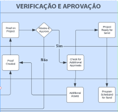
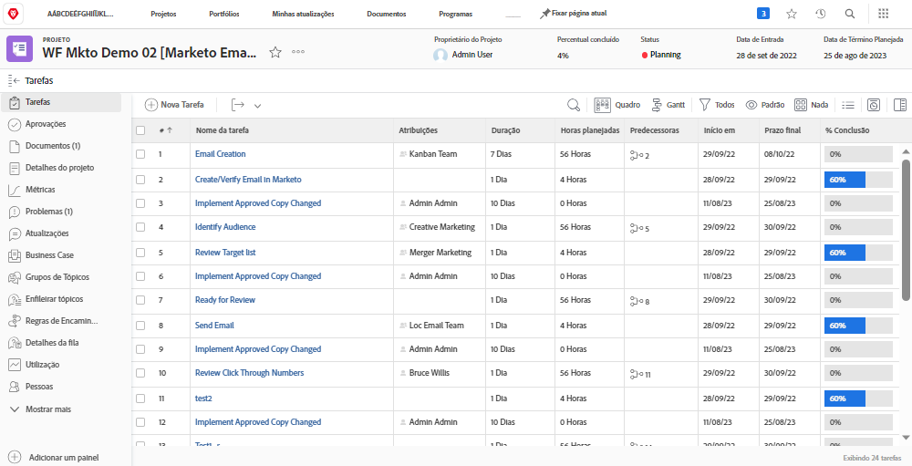
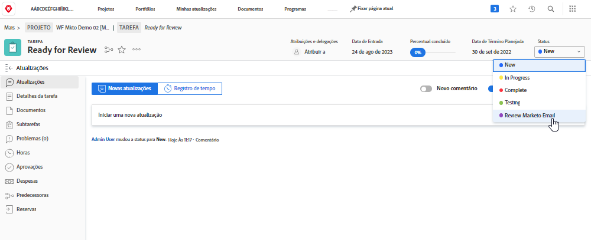
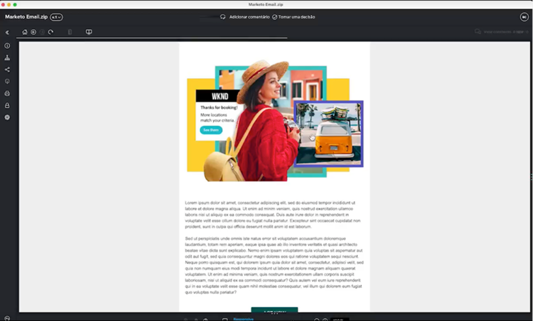

# Revisão e aprovação de blueprint {#review-and-approve-blueprint}

Garantir que os ativos e as campanhas de marketing atendam às expectativas e aos padrões de uma empresa vai além de fornecer o conteúdo e as mensagens certos ao público certo. As empresas também são responsáveis por cumprir as políticas internas, as normas do setor e até mesmo os pré-requisitos legais ao iniciar novas iniciativas de marketing. Ao incorporar etapas de análise e aprovação ao processo de desenvolvimento de campanha, as equipes de marketing podem garantir que a precisão e a conformidade do conteúdo e das mensagens com os padrões do setor, especialmente nos setores financeiro, de serviços de saúde e farmacêutico.

Com o Workfront e o Marketo Engage, as equipes de marketing podem ter a oportunidade de ter um sistema de marketing bem conectado, com mensagens precisas e em conformidade.

## Desbloqueie avaliações e aprovações avançadas para o Marketo Engage com Workfront {#unlock-proofing-and-advanced-approvals}

Ao pensar em criar campanhas de marketing, devemos considerar que vários sistemas oferecem suporte às diferentes etapas envolvidas, incluindo: planejamento, criação, revisão, feedback, aprovação e execução. Com o Workfront e o Marketo Engage, as equipes têm todas as ferramentas necessárias para conduzi-las durante todo o processo de planejamento e lançamento de uma nova campanha de marketing. Além disso, as equipes podem simplificar ainda mais o processo de análise e aprovação para aumentar a velocidade do desenvolvimento da campanha, garantindo que a precisão e a conformidade sejam mantidas no mais alto padrão.

### Revisar e aprovar casos de uso desbloqueados com o Marketo Engage e o Workfront {#review-and-approve-use-cases-unlocked-with-marketo-engage-and-workfront}

* Elimine feedbacks discrepantes e aumente a colaboração em um local centralizado com recursos de anotação e comentários do Workfront em ativos do Marketo Engage.

* Centralize suas aprovações acionando-as ao Marketo Engage a partir dos fluxos de trabalho de aprovação do Workfront.

* Ofereça suporte e simplifique fluxos de trabalho complexos de aprovação de ativos de marketing ao usar os recursos avançados de aprovação da Workfront com ativos do Marketo Engage.

* Democratize o acesso dos rascunhos de marketing extraindo programaticamente os ativos do Marketo no Workfront para serem revisados por várias partes interessadas.

* Controle alterações e crie um histórico documentado que centralize todo o trabalho de revisão e verificação de ativos Marketo Engage no Workfront.

## Planejamento do fluxo de trabalho de verificação e aprovação {#planning-your-proof-and-approval-workflow}

Antes de configurar a integração de verificação e aprovação entre o Marketo Engage e o Workfront, considere os seguintes aspectos:

* Quais ativos precisarão ser revisados e aprovados?
* Quem precisará ser o aprovador?
* Será necessário ter vários aprovadores para que o ativo de marketing possa ser ativado?
* Em que ponto do processo de desenvolvimento da campanha os ativos de marketing estarão montados e prontos para serem revisados?

Responda a essas perguntas para ajudar a ter uma referência para seu fluxo de aprovação e começar a pensar em como configurar sua instância do Workfront.

## Criação de um fluxo de trabalho de verificação e aprovação entre o Marketo Engage e o Workfront {#building-a-proof-and-approval-workflow}

Para simplificar o processo de verificação e aprovação entre o Workfront e o Marketo Engage, é possível usar o Workfront Fusion para integrar as duas soluções. O Workfront Fusion oferece uma interface de fluxo de trabalho para acionar ações e transmitir informações entre as instâncias do Workfront e do Marketo Engage.

Para fazer isso, considere as etapas abaixo como parte do processo para ter uma experiência integrada de revisão e aprovação.

1. Configure seu projeto do Workfront com uma tarefa “Pronto para revisão”.
1. Acione o email do Marketo Engage para sincronizar com o Workfront com uma alteração de status de tarefa.
1. Converta seu arquivo de email do Marketo Engage em uma prova que pode ser revisada no Workfront.
1. Use a prova do Workfront para colaborar por meio de comentários e anotações.
1. Permita que o Workfront Proof acione a aprovação de ativos no Marketo Engage e marque a tarefa como concluída.

### Configure um projeto do Workfront com uma tarefa “Pronta para revisão” {#configure-a-workfront-project-with-a-ready-for-review-task}

Use [modelos de projeto](https://experienceleague.adobe.com/docs/workfront/using/manage-work/projects/create-and-manage-project-templates/project-template-overview.html?lang=pt-BR){target="_blank"} para capturar a maioria dos processos, informações e configurações reproduzíveis associados aos projetos na sua organização. Você pode definir tarefas, colocar tópicos em fila, criar formulários personalizados e anexar documentos ao seu modelo.

No modelo de projeto no Workfront, inclua tarefas para revisar ativos que fazem parte da campanha de marketing. Além disso, você pode adicionar um processo de aprovação para tratar de aprovações únicas ou aprovações de vários níveis mais complexas.

Se quiser iniciar uma nova campanha de email, você deve ter um modelo de projeto que inclua uma tarefa de revisão do email, bem como um processo de aprovação para garantir que o email seja aprovado pela parte interessada correta antes que possa ser enviado.

{zoom=&quot;yes&quot;}

### Acione o email do Marketo Engage para sincronizar com o Workfront na alteração de status {#trigger-your-marketo-engage-email-to-sync-to-workfront}

Como parte do processo de revisão, você poderá sincronizar emails com seu projeto do Workfront depois que estiverem prontos para que sua equipe de marketing possa analisá-los. Para fazer isso, recomendamos configurar uma tarefa “Pronta para revisão” com um [status da tarefa](https://experienceleague.adobe.com/docs/workfront/using/manage-work/projects/update-work-on-a-project/update-task-status.html?lang=pt-BR){target="_blank"} que significa quando o email está pronto para ser revisado. No nosso exemplo, adicionamos uma opção “Revisar status de email do Marketo” na tarefa, que pode ser selecionada quando o rascunho de email estiver pronto para ser revisado pelas partes interessadas.

Com esse status em vigor no projeto do Workfront, você pode configurar o cenário do Workfront Fusion para acompanhar a tarefa “Pronta para revisão” para atualizar para “Revisar status de email do Marketo”. Depois dessa atualização, o cenário pode recuperar o email de Marketo Engage como um arquivo de HTML, compactá-lo e salvar uma cópia dele nos documentos de projeto do Workfront a serem revisados.

{zoom=&quot;yes&quot;}

### Converta seu email do Marketo Engage em uma prova que pode ser revisada no Workfront {#convert-your-marketo-engage-email-to-reviewable-proof-in-workfront}

Quando a tarefa “Pronta para revisão” passa para o status “Revisar email do Marketo” e o email do Marketo Engage é salvo no Workfront, você pode configurar o cenário do Workfront Fusion para converter o email em um Workfront Proof.

### Use provas do Workfront para colaborar por meio de comentários e anotações {#use-workfront-proofing-to-collaborate}

[Prova do Workfront](https://experienceleague.adobe.com/docs/workfront/using/review-and-approve-work/proofing/proofing-overview/proofing-basics.html){target="_blank"} Os recursos do permitem que sua equipe de marketing pegue um novo ativo, como uma imagem ou um email, e colabore por meio de comentários e anotações. Quando uma prova estiver pronta para ser ativada, os tomadores de decisão poderão aprovar o ativo a partir da ferramenta de prova.

{zoom=&quot;yes&quot;}

### Aprovar prova o Workfront Proof e acionar a aprovação de ativos no Marketo Engage, marcar a tarefa como concluída {#approve-workfront-proof-and-trigger-asset-approval-in-marketo-engage}

O Workfront Fusion pode detectar quando o email foi aprovado pelas partes interessadas e enviar uma solicitação ao Marketo Engage para aprovar o email dentro do Marketo.

Com o email revisado/aprovado pelos membros da equipe certa, o email está pronto para entrar no Marketo Engage!

## Modelos de cenário do Fusion {#fusion-scenario-templates}

Para ajudar a simplificar o desenvolvimento de fluxos de trabalho de revisão e aprovação na sua própria instância do Workfront e do Marketo Engage, criamos modelos do Fusion que ajudarão a começar a integração. Para utilizar esses modelos, você pode pesquisar “Marketo” na seção “Modelos públicos” do Fusion e baixá-los para sua instância.

### Revisar uma prova de email do seu rascunho de email do Marketo Engage no Workfront {#review-an-email-proof-of-your-marketo-engage-email-draft-in-workfront}

O cenário do Fusion abaixo conduzirá você durante a primeira metade do fluxo de revisão e aprovação, no qual o rascunho de email pode ser extraído do Marketo Engage e salvo no Workfront como uma prova. Depois de salvo como uma prova nos documentos do projeto do Workfront, ele pode ser revisado pelas partes interessadas de marketing, que podem fazer comentários e anotações como parte do processo de revisão.

{zoom=&quot;yes&quot;}

### Aprovar um email no Workfront que aciona a aprovação do ativo no Marketo Engage {#approve-an-email-in-workfront-that-triggers-approval}

O cenário do Fusion abaixo pode ser usado para detectar quando uma prova no Workfront foi aprovada e encaminhar essa aprovação ao Marketo Engage para atualizar o rascunho de email para deixá-lo ativo e pronto para ser usado em um programa Marketo Engage.

{zoom=&quot;yes&quot;}

Juntos, esses dois cenários podem ser usados para criar um caminho de duas vias para transferir ativos de marketing do Marketo Engage para os fluxos de trabalho robustos de revisão e aprovação da Workfront, e reenviar as aprovações ao Marketo Engage do Workfront.
