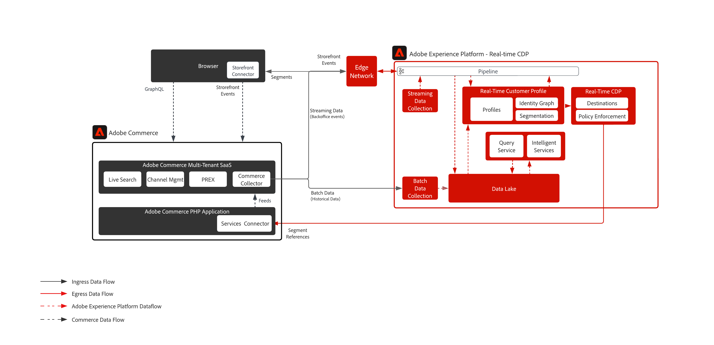

# ADOBE COMMERCE e RTCDP

A extensão [!DNL Data Connection] ajuda os clientes do Adobe Commerce a se integrarem perfeitamente ao Adobe Experience Platform para enriquecer o perfil do cliente e personalizar experiências na vitrine digital e em outros canais.

## Recursos técnicos habilitados

* Os dados da vitrine (do lado do cliente, como adicionar ao carrinho, abandonos de carrinho e assim por diante) coletados e enviados para qualquer produto da Adobe Experience Cloud.
* Status de pedido de back office para qualquer produto da Adobe Experience Cloud
* Os pedidos de histórico do back office podem ser enviados para a Adobe Experience Platform
* Compartilhar e personalizar públicos-alvo da RTCDP para a Adobe Commerce

## Pré-requisitos

Para usar a extensão [!DNL Data Connection], você deve ter o seguinte:

* Adobe Commerce 2.4.4 ou mais recente
* Adobe ID e ID da organização
* Adobe Experience Platform/RTCDP
* [CADL (Camada de Dados de Cliente) do Adobe](https://experienceleague.adobe.com/docs/experience-platform/tags/extensions/client/client-data-layer/overview.html?lang=pt-BR). A ACDL é necessária para coletar dados do evento da loja.

## Etapas de integração

### Coleta de dados do Adobe Commerce para o Adobe Experience Platform

* [Instalar](https://experienceleague.adobe.com/docs/commerce-merchant-services/data-connection/fundamentals/install.html?lang=pt-BR) a extensão [!DNL Data Connection].
* [Entre](https://helpx.adobe.com/br/manage-account/using/access-adobe-id-account.html) em sua conta Adobe e exiba para confirmar a ID da organização. A ID da organização é a ID associada à empresa de Experience Cloud provisionada. A ID é uma sequência de 24 caracteres alfanuméricos seguidos por (e deve incluir) @AdobeOrg.
* [Criar ou atualizar](https://experienceleague.adobe.com/docs/commerce-merchant-services/data-connection/fundamentals/update-xdm.html?lang=pt-BR) seu esquema XDM com grupos de campos específicos do Commerce.
* [Crie um conjunto de dados](https://experienceleague.adobe.com/docs/platform-learn/implement-mobile-sdk/experience-cloud/platform.html?lang=pt-BR#create-a-dataset) com base no esquema que você criou ou atualizou. Esse conjunto de dados conterá os dados do Commerce enviados.
* [Crie uma sequência de dados](https://experienceleague.adobe.com/docs/experience-platform/edge/datastreams/overview.html?lang=pt-BR) e selecione o esquema XDM que contém os grupos de campos específicos do Commerce.
* [Conecte-se aos Serviços Commerce](https://experienceleague.adobe.com/docs/commerce-merchant-services/user-guides/integration-services/saas.html?lang=pt-BR).
* [Conectar-se ao Adobe Experience Platform](https://experienceleague.adobe.com/docs/commerce-merchant-services/data-connection/fundamentals/connect-data.html?lang=pt-BR).

### Conectar-se ao destino do Commerce no Adobe Experience Platform para compartilhamento de público-alvo

Para se conectar ao destino do Adobe Commerce:

* Na [interface do Adobe Experience Platform](https://experience.adobe.com/platform/), vá para Destinos > Catálogo.
* Selecione Personalization.
* Selecione o destino do Adobe Commerce para realçá-lo e, em seguida, selecione Configurar.
* Siga as etapas descritas no [tutorial de configuração de destino](https://experienceleague.adobe.com/docs/experience-platform/destinations/ui/connect-destination.html?lang=pt-BR).

## Dados prontos para uso

* Eventos da loja (navegador/aplicativo)
* Eventos de back office
* Dados históricos do pedido

Para obter uma lista completa dos eventos suportados, consulte [Eventos da Commerce](https://experienceleague.adobe.com/docs/commerce-merchant-services/data-connection/event-forwarding/events.html?lang=pt-BR)

## Arquitetura

## Guias de implementação relacionados

| Guia | Link |
|:----|:----|
| Conector da plataforma | [Visão geral do conector do Adobe Commerce Experience Platform](https://experienceleague.adobe.com/docs/commerce-merchant-services/data-connection/overview.html?lang=pt-BR) |
| Destino do Commerce | [Conexão Adobe Commerce em RTCDP](https://experienceleague.adobe.com/docs/experience-platform/destinations/catalog/personalization/adobe-commerce.html?lang=pt-BR) |
| Edge Personalization | [Ativar públicos para destinos de personalização de borda](https://experienceleague.adobe.com/docs/experience-platform/destinations/ui/activate/activate-edge-personalization-destinations.html?lang=pt-BR) |
