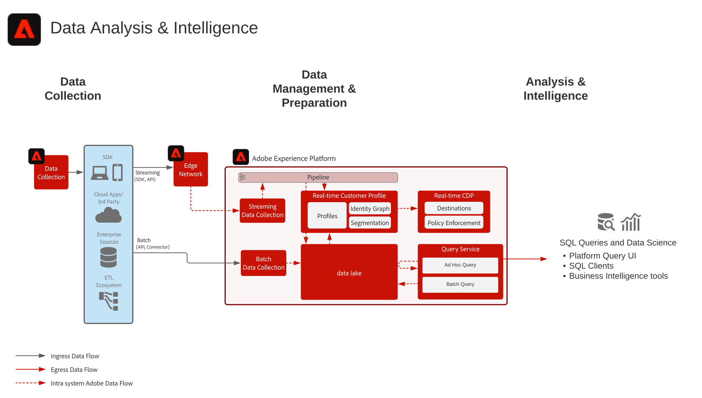

# Análise de dados e blueprint de inteligência

A análise e a inteligência de dados incluem a capacidade em [!DNL Experience Platform] de realizar uma consulta exploratória e uma análise dos dados existentes no data lake.

O [!UICONTROL Serviço de consulta] de [!DNL Experience Platform] permite que consultas SQL sejam executadas nos dados.

O [!DNL Experience Platform] permite conexões com clientes SQL, interfaces e ferramentas Business Intelligence (BI) de terceiros para se conectar diretamente, acessar e consultar os dados em [!DNL Experience Platform], usando o protocolo [!DNL PostgreSQL].

## Casos de uso

* Consulta interativa e agregação de dados
* Acesso de linhas e colunas a dados assimilados para exploração e validação
* Painéis e visualização de dados por meio de ferramentas de Business Intelligence

Outros casos de uso comuns para o serviço de consulta estão descritos aqui [Casos de uso do serviço de consulta](https://experienceleague.adobe.com/docs/experience-platform/query/use-cases/abandoned-browse.html?lang=pt-BR)

## Aplicativos

* Adobe [!DNL Experience Platform]

## Arquitetura

## Medidas de proteção

Consulte a Documentação do produto do Serviço de consulta para obter detalhes sobre práticas recomendadas e medidas de proteção.
[Diretrizes do Serviço de Consulta](https://experienceleague.adobe.com/docs/experience-platform/query/guardrails.html?lang=pt-BR)

## Documentação relacionada

* [Descrição do produto Adobe [!DNL Experience Platform] Intelligence](https://helpx.adobe.com/br/legal/product-descriptions/adobe-experience-platform-intelligence---product-description.html)
* [Documentação do [!UICONTROL Serviço de consulta]](https://experienceleague.adobe.com/docs/experience-platform/query/home.html?lang=pt-BR)
