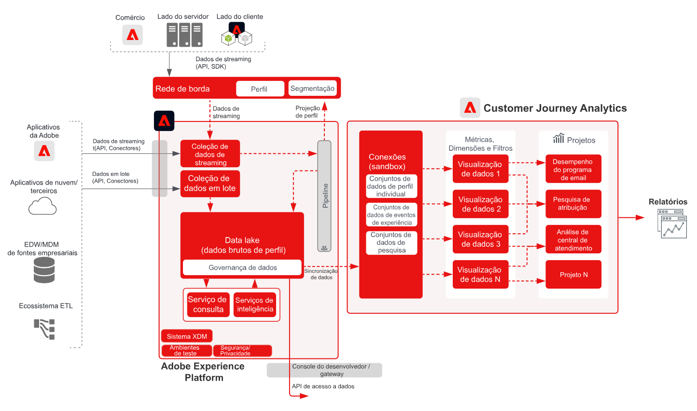

<!-- markdownlint-disable-next-line MD025 -->
# Blueprint do Customer Journey Analytics B2B

O Customer Journey Analytics B2B edition permite a emissão de relatórios e a análise com base em contas para organizações B2B. Ao contrário da análise B2C centrada em pessoas, esse blueprint coloca a **conta** no centro do modelo de dados para que você possa analisar jornadas de compra B2B complexas em várias partes interessadas, grupos de compra e ciclos de vendas. Use o [!DNL Customer Journey Analytics] para unificar dados comportamentais com dimensões B2B — contas, oportunidades, campanhas e listas de marketing — para insights baseados em jornada e criação de público-alvo.

## Aplicativos

* Adobe [!DNL Customer Journey Analytics] (B2B edition)
* Adobe Experience Platform (para B2B e dados de evento)

## Casos de uso

* **Otimizar o marketing de conta** — analise o impacto do marketing em campanhas, canais e conteúdo sobre grupos de compras em contas, progressão de pipeline e oportunidades de venda adicional/venda cruzada.
* **Aumentar contas principais** — Identifique pontos de contato de alto valor entre os grupos de compras nas contas principais para informar as ações de marketing e vendas e calcule o valor vitalício do cliente no nível da conta.
* **Criar valor do produto** — meça o impacto das versões do produto e seu uso na satisfação do cliente nos níveis da conta e do usuário para otimizar os recursos e informar o desenvolvimento.
* **Análise B2B com base em pessoas** — Combine o contexto de conta e de oportunidade com o comportamento individual do usuário para pontuação de lead, envolvimento e análise de jornada.

## Pré-requisitos

* [!DNL Customer Journey Analytics] Direito ao B2B edition.
* Dados B2B e comportamentais no Adobe Experience Platform: conjuntos de dados B2B (contas, oportunidades, pessoas, campanhas, listas de marketing, atividades B2B) e dados de evento (Web, celular ou outros canais) disponíveis em uma [conexão com o CJA](https://experienceleague.adobe.com/docs/analytics-platform/using/cja-connections/create-connection.html?lang=pt-BR).
* [Nomeação B2B para CJA](https://experienceleague.adobe.com/docs/analytics-platform/using/cja-dataviews/b2b.html): configurações de exibição de dados específicas de B2B (ID da conta, ID da oportunidade e dimensões relacionadas) configuradas para a conexão.

## Arquitetura

{zoomable="yes"}

Os dados fluem do Experience Platform (B2B e conjuntos de dados de evento) para [!DNL Customer Journey Analytics] por meio de uma conexão CJA. As dimensões B2B são expostas nas visualizações de dados para que a análise e os públicos-alvo possam ser criados nos níveis de conta, oportunidade e pessoa.

## Medidas de proteção

* Para obter limites e direitos de produto do B2B edition, consulte a [descrição do produto B2B do Customer Journey Analytics](https://helpx.adobe.com/br/legal/product-descriptions/customer-journey-analytics-b2b.html).
* Para conhecer os limites técnicos da Analytics Platform e do CJA, consulte [medidas de proteção da Analytics Platform](https://experienceleague.adobe.com/pt-br/docs/analytics-platform/using/technotes/guardrails).
* Para obter os limites de assimilação e conexão de dados do CJA, consulte [medidas de proteção de assimilação de dados do Customer Journey Analytics](https://experienceleague.adobe.com/docs/experience-platform/sources/connectors/adobe-applications/analytics.html?lang=pt-BR#what-is-the-expected-latency-for-analytics-data-on-platform%3F).
* Se estiver publicando públicos-alvo da CJA na Real-time Customer Data Platform, consulte [medidas de proteção de compartilhamento de público-alvo da Customer Journey Analytics](https://experienceleague.adobe.com/docs/analytics-platform/using/cja-components/audiences/publish.html?lang=pt-BR#latency).
* Para obter latências de ponta a ponta e medidas de proteção da plataforma, consulte o [documento medidas de proteção da implantação](../experience-platform/guardrails.md).

## Etapas de implantação

1. **Assimilar dados B2B e de eventos na Experience Platform** — Leve dados de conta, oportunidade, pessoa, campanha e atividade, além de eventos comportamentais, usando [fontes](https://experienceleague.adobe.com/docs/experience-platform/sources/home.html?lang=pt-BR) (por exemplo, [!DNL Marketo Engage], CRM ou outros conectores B2B).
2. **Criar uma conexão do CJA** — [Adicione os conjuntos de dados relevantes do Experience Platform](https://experienceleague.adobe.com/docs/analytics-platform/using/cja-connections/create-connection.html?lang=pt-BR) (B2B e evento) a uma conexão do Customer Journey Analytics.
3. **Configurar B2B na visualização de dados** — Habilitar [Nomeação B2B e dimensões de chave](https://experienceleague.adobe.com/docs/analytics-platform/using/cja-dataviews/b2b.html) (ID de conta, ID de oportunidade etc.) nas visualizações de dados da conexão.
4. **Criar análise e públicos-alvo com base em conta** — Use os [casos de uso e relatórios B2B do CJA](https://experienceleague.adobe.com/docs/analytics-platform/using/cja-usecases/b2b.html?lang=pt-BR) para criar relatórios, detalhamentos e públicos-alvo no nível de conta e oportunidade; opcionalmente, [publicar públicos-alvo na Real-time CDP](https://experienceleague.adobe.com/docs/analytics-platform/using/cja-components/audiences/publish.html?lang=pt-BR) para ativação.

## Documentação relacionada

### Customer Journey Analytics B2B edition

* [Customer Journey Analytics B2B edition](https://experienceleague.adobe.com/docs/analytics-platform/using/cja-overview/cja-b2b/cja-b2b-edition.html?lang=pt-BR)
* [Casos de uso B2B](https://experienceleague.adobe.com/docs/analytics-platform/using/cja-usecases/b2b.html?lang=pt-BR)
* [Visão geral dos casos de uso do B2B edition](https://experienceleague.adobe.com/docs/analytics-platform/using/cja-usecases/b2b/b2b-edition/use-cases-overview.html?lang=pt-BR)
* [Um exemplo de projeto B2B com base em pessoas](https://experienceleague.adobe.com/docs/analytics-platform/using/cja-usecases/b2b/example.html?lang=pt-BR)

### Conexões e visualizações de dados

* [Criar uma conexão](https://experienceleague.adobe.com/docs/analytics-platform/using/cja-connections/create-connection.html?lang=pt-BR)
* [Configurações de visualização de dados B2B](https://experienceleague.adobe.com/docs/analytics-platform/using/cja-dataviews/b2b.html)

### Públicos-alvo e medidas de proteção

* [Publicar públicos da CJA na Real-time CDP](https://experienceleague.adobe.com/docs/analytics-platform/using/cja-components/audiences/publish.html?lang=pt-BR)
* [Proteções do Experience Platform e do aplicativo](../experience-platform/guardrails.md)
