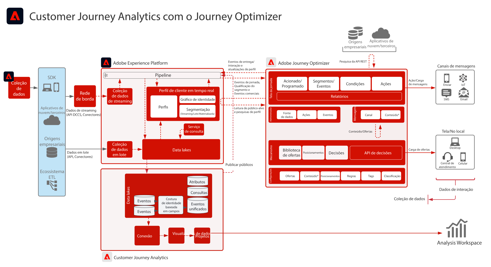

# Customer Journey Analytics com Journey Optimizer    blueprint

Os dados do Journey Optimizer são compartilhados com o data lake da Experience Platform e estão disponíveis para assimilação, análise e relatórios no Customer Journey Analytics. A entrega, a interação e a eficácia da jornada podem ser analisadas e reportadas no Customer Journey Analytics.

Além disso, os públicos criados no Customer Journey Analytics podem ser publicados no Perfil do cliente em tempo real da Experience Platform e estão disponíveis para execução de jornada no Journey Optimizer.

## Guia de implementação

Consulte a documentação a seguir para obter orientação sobre a implementação e a configuração dos dados do Journey Optimizer no Customer Journey Analytics. [Documentação](https://experienceleague.adobe.com/docs/journey-optimizer/using/reporting/reports/sharing-overview.html?lang=pt-BR)

## Arquitetura do Customer Journey Analytics com Journey Optimizer

{zoomable=&quot;yes&quot;}
