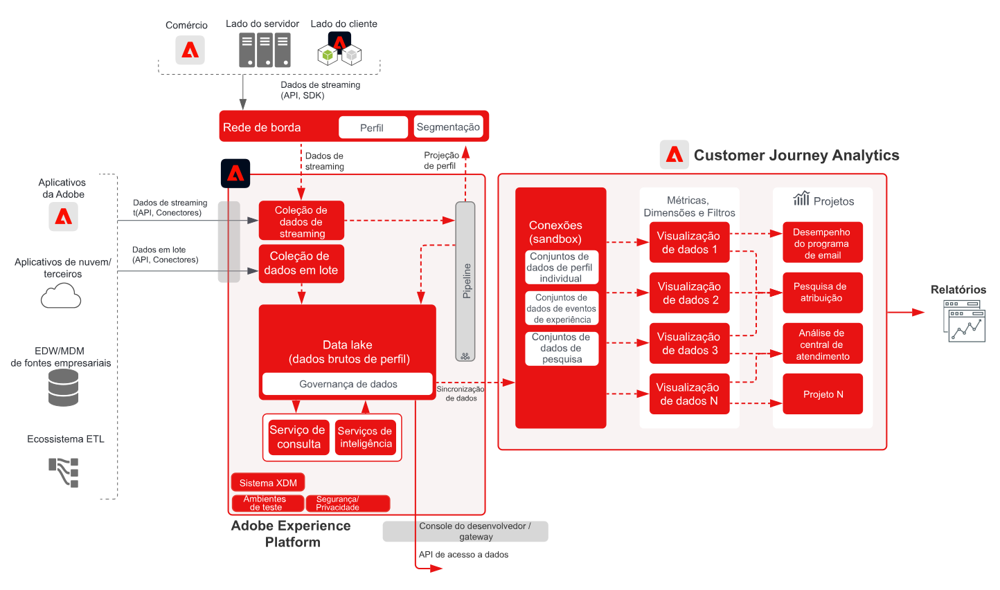

# Customer Journey Analytics com o blueprint da Real-time Customer Data Platform

Crie e publique públicos-alvo identificados no Customer Journey Analytics (CJA) para o Perfil do cliente em tempo real na Adobe Experience Platform para direcionamento e personalização do cliente. Ideal para criar públicos-alvo usando dados históricos ou públicos-alvo mais refinados por meio da filtragem granular e campos calculados no Customer Journey Analytics.

## Guia de publicação do público do Customer Journey Analytics

Consulte a documentação a seguir para obter orientação sobre a implementação e a configuração na publicação de públicos do Customer Journey Analytics para a Real-time Customer Data Platform. [Documentação](https://experienceleague.adobe.com/docs/analytics-platform/using/cja-components/audiences/publish.html?lang=pt-BR)

## Arquitetura de blueprints do Customer Journey Analytics

{zoomable="yes"}

## Diagrama de medidas de proteção para blueprints do Customer Journey Analytics

* Para obter informações detalhadas e medidas de proteção para latências de ponta a ponta, consulte o [documento de medidas de proteção de implantação](../experience-platform/guardrails.md)