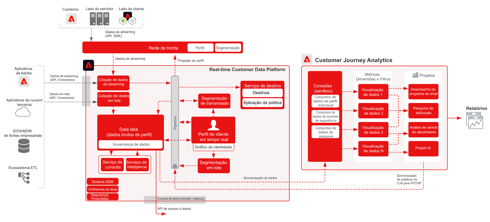

# Customer Journey Analytics com Real-time Customer Data Platform

Crie e publique públicos-alvo identificados no Customer Journey Analytics (CJA) para o Perfil do cliente em tempo real no Adobe Experience Platform para direcionamento e personalização do cliente. Ideal para criar públicos-alvo usando dados históricos ou públicos-alvo mais refinados a partir de filtragem granular e campos calculados no Customer Journey Analytics.

## Arquitetura de Blueprints do Customer Journey Analytics

## Diagrama de medidas de proteção para Blueprints do Customer Journey Analytics

## Guia de publicação do público-alvo do Customer Journey Analytics

Consulte a documentação a seguir para obter orientação sobre implementação e configuração na publicação de públicos-alvo do Customer Journey Analytics para a Real-time Customer Data Platform. [Documentação](https://experienceleague.adobe.com/docs/analytics-platform/using/cja-components/audiences/publish.html)

## Publicações do blog relacionadas

* [[!DNL Blueprint for Multi-Channel Orchestration in Adobe Experience Platform]](https://medium.com/adobetech/blueprint-for-multi-channel-orchestration-in-adobe-experience-platform-c68317e94184)
* [[!DNL Leveraging External Data Platforms in Adobe Experience Platform Journey Orchestration]](https://medium.com/adobetech/leveraging-external-data-platforms-in-adobe-experience-platform-journey-orchestration-54fc6134fe17)
* [[!DNL Event-Based Triggering on Adobe Experience Platform Orchestration Service using Apache Airflow]](https://medium.com/adobetech/event-based-triggering-on-adobe-experience-platform-orchestration-service-using-apache-airflow-8607b28251f1)
* [[!DNL Adobe Campaign Classic Integration with Journey Orchestration]](https://medium.com/adobetech/adobe-campaign-classic-integration-with-journey-orchestration-ae577653281)
* [[!DNL Demonstrating the Power of Adobe’s New Journey Orchestration Service to Build Personalized Omnichannel Experiences in Real-Time]](https://medium.com/adobetech/demonstrating-the-power-of-adobes-new-journey-orchestration-service-to-build-personalized-aa60d88cd34)
* [[!DNL Journey Orchestration in an Omnichannel World]](https://medium.com/adobetech/journey-orchestration-in-an-omnichannel-world-3a2d32d556d9)
