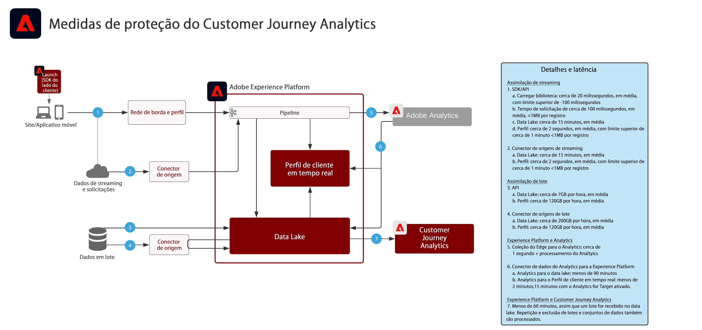

# Customer Journey Analytics

O Customer Journey Analytics apresenta como as marcas podem unificar os dados e o comportamento do cliente oriundos de vários canais e fontes de interação. O objetivo é criar uma visualização com base na jornada de todas as interações do cliente. É possível elaborar relatórios e análises no serviço de aplicativos do Customer Journey Analytics para avaliar e obter insights da interação com o cliente e de padrões de comportamento.

Análises comuns incluem:

* Caminhos de conversão do início ao fim
* Engajamento e conversão de canal
* Conteúdo mais visualizado
* Principais categorias e produtos
* Quais campanhas resultaram em conversão e aumento de engajamento
* Análise de uso de ferramentas para otimizar experiências de autoatendimento

| Blueprint | Descrição | Aplicativos da Experience Cloud |
|---|---|---|
| **[Análise da jornada entre canais](https://experienceleague.adobe.com/docs/analytics-platform/using/cja-usecases/cross-channel.html?lang=pt-BR)** | <ul><li>Tenha uma visualização consolidada única do comportamento do cliente em vários canais ao unificar dados de várias propriedades da web, móveis e offline.</li></ul> | <ul><li>Adobe Experience Platform</li><li>Customer Journey Analytics</li><li>Adobe Analytics (opcional)</li></ul> |
| **[Análise da jornada da diminuição de chamadas](https://experienceleague.adobe.com/docs/analytics-platform/using/cja-usecases/call-center.html?lang=pt-BR)** | <ul><li>Determine quais comportamentos são mais indicativos nos resultados de chamadas atendidas por agentes ao reunir dados da central de atendimento com dados da web, dispositivos móveis e outros dados de interação.</li><li>É possível usar esses insights para aprimorar a experiência do cliente e encurtar o caminho para interações atendidas por agentes por meio de conteúdo e ferramentas de autoatendimento.  </li></ul> | <ul><li>Adobe Experience Platform</li><li>Customer Journey Analytics</li> |

## Diagrama de medidas de proteção para Blueprints do Customer Journey Analytics

## Publicações do blog relacionadas

* [[!DNL Blueprint for Multi-Channel Orchestration in Adobe Experience Platform]](https://medium.com/adobetech/blueprint-for-multi-channel-orchestration-in-adobe-experience-platform-c68317e94184)
* [[!DNL Leveraging External Data Platforms in Adobe Experience Platform Journey Orchestration]](https://medium.com/adobetech/leveraging-external-data-platforms-in-adobe-experience-platform-journey-orchestration-54fc6134fe17)
* [[!DNL Event-Based Triggering on Adobe Experience Platform Orchestration Service using Apache Airflow]](https://medium.com/adobetech/event-based-triggering-on-adobe-experience-platform-orchestration-service-using-apache-airflow-8607b28251f1)
* [[!DNL Adobe Campaign Classic Integration with Journey Orchestration]](https://medium.com/adobetech/adobe-campaign-classic-integration-with-journey-orchestration-ae577653281)
* [[!DNL Demonstrating the Power of Adobe’s New Journey Orchestration Service to Build Personalized Omnichannel Experiences in Real-Time]](https://medium.com/adobetech/demonstrating-the-power-of-adobes-new-journey-orchestration-service-to-build-personalized-aa60d88cd34)
* [[!DNL Journey Orchestration in an Omnichannel World]](https://medium.com/adobetech/journey-orchestration-in-an-omnichannel-world-3a2d32d556d9)
