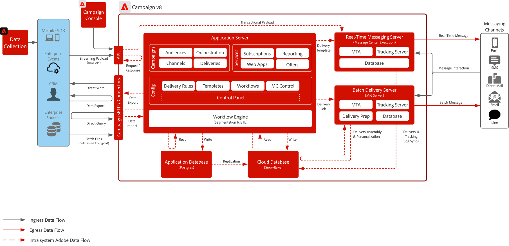

# Blueprint do Campaign v8

O Adobe Campaign v8 é uma plataforma de gerenciamento de campanha de última geração projetada para canais de marketing tradicionais, como email e correspondência direta. Ele oferece recursos avançados de ETL e gerenciamento de dados para oferecer suporte a segmentação complexa e direcionamento de público, além de um poderoso mecanismo de orquestração para a criação de programas de marketing orientados por lote e multitoque.

Ele também inclui um servidor de mensagens escalável em tempo real que permite comunicações transacionais — como redefinições de senha, confirmações de pedidos e recibos eletrônicos — ao aceitar cargas completas de sistemas externos para entrega imediata.

## Casos de uso

>[!BEGINTABS]

>[!TAB Execução da campanha em lote]

- Projete e entregue campanhas de marketing programadas e em larga escala por email, SMS e correspondência direta.
- Ideal para propagandas, boletins informativos e ofertas sazonais com segmentação e direcionamento complexos.

>[!TAB Orquestração Multitoque]

- Crie programas multicanal de várias etapas que orientam os clientes por meio de uma jornada de marketing predefinida.
- Oferece suporte à reentrada de público-alvo, lógica condicional e transições baseadas em tempo.

>[!TAB Gerenciamento de dados &amp; ETL]

- Assimilar, transforme e gerencie dados do cliente de várias fontes para oferecer suporte ao direcionamento preciso.
- Permite a criação de esquemas personalizados, campos calculados e definições de público-alvo.

>[!TAB Mensagens transacionais]

- Enviar mensagens predefinidas em tempo real acionadas por sistemas externos (por exemplo, redefinições de senha, confirmações de pedidos, recibos eletrônicos).
- Usa um servidor de mensagens escalável que aceita cargas completas dos sistemas de TI para entrega imediata.

>[!ENDTABS]

 

## Diagramas de arquitetura

Saiba mais sobre os [modelos de implantação do Campaign v8](https://experienceleague.adobe.com/docs/campaign/campaign-v8/config/architecture/architecture.html#ac-deployment){target="_blank"}.

### Implantação do Campaign Enterprise (FFDA)

 

### Implantação do FDA no Campaign v8

 

## Padrões de integração

| Cenário | Descrição | Considerações técnicas |
| :-- | :--- | :--- |
| [[!DNL Real-time Customer Data Platform] com Adobe [!DNL Campaign]](rtcdp-and-campaign-v8.md) | Mostra como a Adobe Experience Platform e seu Perfil do Cliente em Tempo Real e a ferramenta de segmentação centralizada podem ser utilizados com o Adobe [!DNL Campaign] para fornecer conversas personalizadas | <ul><li>Compartilhamento de perfis e públicos do [!DNL Real-Time CDP] para o Adobe [!DNL Campaign] por meio do uso da troca de arquivos de armazenamento em nuvem e dos fluxos de trabalho de assimilação do Adobe [!DNL Campaign] </li><li>Compartilhe facilmente dados de entrega e interação de conversas com clientes no [!DNL Real-Time CDP] a partir do Adobe [!DNL Campaign] para aprimorar o Perfil do cliente em tempo real e fornecer relatórios entre canais sobre campanhas de mensagens</li></ul> |
| [[!DNL Journey Optimizer] com Adobe [!DNL Campaign]](ajo-and-campaign-v8.md) | Mostra como você pode usar o Adobe Journey Optimizer para orquestrar 1:1 experiências utilizando o Perfil de Cliente em Tempo Real e aproveitar o sistema de mensagens transacionais [!DNL Campaign] nativo do Adobe para enviar a mensagem | <ul><li>Envia até 1 milhão de mensagens por hora por meio do servidor de mensagens em tempo real<li>Nenhuma limitação é executada a partir de [!DNL Journey Optimizer], portanto, garanta a verificação técnica por um arquiteto corporativo de pré-vendas</li><li>A gestão de decisões não é compatível com cargas para o Campaign v8</li></ul> |

 

## Pré-requisitos

Existem os seguintes pré-requisitos para este blueprint.

### Servidor de aplicativo e servidor de mensagens em tempo real

- O Console do Cliente do Adobe [!DNL Campaign] é necessário para interagir e usar o software [!DNL Campaign] v8. Trata-se de um cliente baseado em Windows que usa protocolos-padrão de Internet (SOAP, HTTP, etc.). Certifique-se de que as permissões necessárias para distribuir, instalar e executar o software estão ativas em sua organização

- Lista de permissões de endereço IP:
   - Identifique os intervalos IP que todos os usuários utilizam durante o acesso ao console do cliente.
   - Identifique quais sistemas corporativos têm permissão para se comunicar com o servidor de mensagens em tempo real e verifique se eles têm um IP atribuído estaticamente ou um intervalo que você possa incluir na lista de permissões.
   - A configuração e o controle podem ser feitos pelo Painel de controle do Campaign.
- Gerenciamento de chaves sFTP:
   - Tenha chaves públicas SSH disponíveis para serem usadas com o sFTP fornecido pelo Campaign. A configuração e o controle podem ser feitos pelo Painel de controle do Campaign.

### Email

- Ter um subdomínio pronto para ser usado para enviar mensagens.
- O subdomínio pode ser totalmente delegado à Adobe (recomendado) ou os CNAMEs podem ser usados para apontar para servidores DNS específicos da Adobe (personalizados).
- O registro TXT do Google é necessário para cada subdomínio para garantir uma boa capacidade de entrega.

### Push para publicação de conteúdo para dispositivos móveis

- Tenha um desenvolvedor móvel disponível para implantar, configurar e criar o aplicativo móvel.
- A Adobe oferece apenas um SDK para coletar as informações necessárias do FCM (Android) e do APNS (iOS) para enviar cargas de mensagem aos servidores deles. A forma como o aplicativo móvel precisa ser codificado, implantado, gerenciado e depurado é responsabilidade do cliente.

### Aplicativos web (opcional)

- Pode delegar um subdomínio adicional para páginas de destino e de cancelamento de inscrição hospedadas no Campaign.
- O certificado SSL é altamente recomendado.

 

## Medidas de proteção

### Dimensionamento do servidor de aplicativos

- O armazenamento pode ser dimensionado para até 200 milhões de perfis com potencial para dimensionar até 1 bilhão de perfis.
- Configure e controle o acesso do usuário via Adobe [!DNL Admin Console].
- Espera-se que o carregamento de dados para [!DNL Campaign] seja feito por meio de arquivos em lotes:
   - O suporte ao carregamento de dados de API serve principalmente para o gerenciamento de perfis ou objetos simples no banco de dados (ou seja, criar e atualizar). Não foi projetado para o carregamento de grandes volumes de dados ou operações semelhantes a lotes.
   - A utilização de APIs para ler dados para aplicativos personalizados não é compatível
   - Os dados carregados por meio de API são preparados no banco de dados do aplicativo e, em seguida, replicados a cada hora para o banco de dados na nuvem
- Os limites para chamadas de API se aplicam. Saiba mais na [Descrição do produto Adobe Campaign](https://helpx.adobe.com/br/legal/product-descriptions/adobe-campaign-managed-cloud-services.html){target="_blank"}.

### Dimensionamento do servidor de mensagens em lote

- Pode ser dimensionado para lidar com até 20 milhões de mensagens por hora

### Dimensionamento do servidor de mensagens em tempo real

- Pode enviar até 1 milhão de mensagens por hora
- Por padrão, são provisionados dois servidores de mensagens em tempo real. Capacidade de aumentar até chegar a um total de oito servidores de mensagens em tempo real.

### Configuração de SMS

- O Campaign oferece o recurso de se integrar a um provedor de SMS. O provedor é adquirido pelo cliente e integrado ao Campaign para envio de mensagens baseadas em SMS.
- O suporte é por meio do protocolo SMPP.
- Há três (3) tipos diferentes de SMS, e a Adobe é compatível com todos eles:
   - SMS MT (Terminado por Dispositivo Móvel): um SMS emitido pelo Adobe [!DNL Campaign] para telefones celulares por meio do provedor SMPP.
   - SMS MO (Originado por dispositivo móvel): um SMS enviado por um dispositivo móvel para o Adobe [!DNL Campaign] por meio do provedor SMPP.
   - SMS SR (Relatório de Status) ou DR ou DLR (Recibo de Entrega): um recibo de retorno enviado pelo dispositivo móvel ao Adobe [!DNL Campaign] por meio do provedor SMPP, indicando que o SMS foi recebido com êxito. O Adobe [!DNL Campaign] também pode receber um SR indicando que a mensagem não pôde ser entregue, geralmente com uma descrição do erro.

 

## Etapas de implantação

Consulte o guia de introdução para a [Implementação do Adobe Campaign v8](https://experienceleague.adobe.com/docs/campaign/campaign-v8/implement/implement.html)

## Documentação relacionada

- [Documentação do Campaign v8](https://experienceleague.adobe.com/docs/campaign-v8.html)
- [Descrição do produto Campaign v8](https://helpx.adobe.com/br/legal/product-descriptions/adobe-campaign-managed-cloud-services.html)
- [Documentação de tags da Experience Platform](https://experienceleague.adobe.com/docs/launch.html)
- [Documentação do SDK móvel da Experience Platform](https://experienceleague.adobe.com/docs/mobile.html)