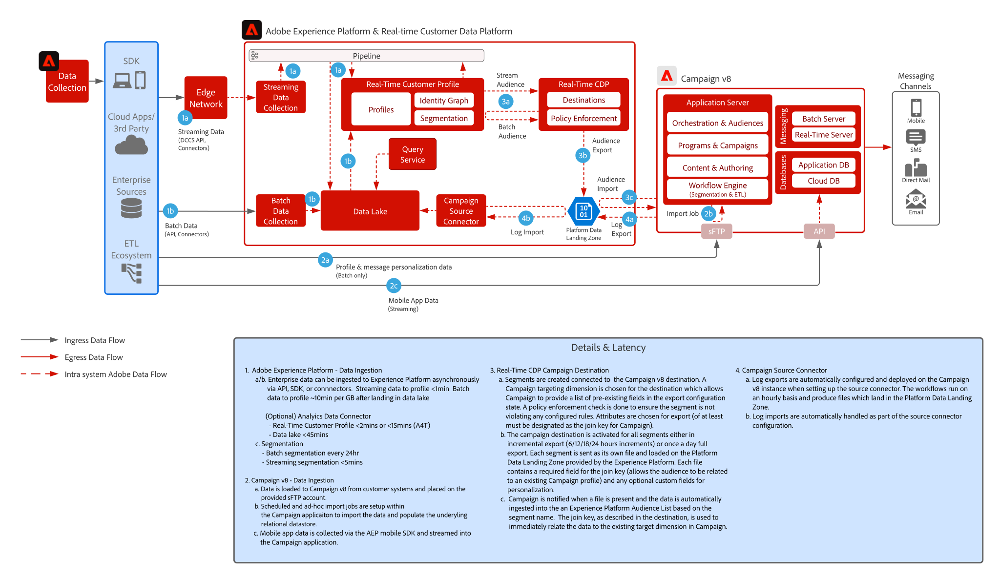

# [!DNL Real-Time CDP] com o padrão de integração do Adobe [!DNL Campaign] v8

Mostra como o Adobe [!DNL Experience Platform] e seu Perfil do Cliente em Tempo Real e a ferramenta de segmentação centralizada podem ser utilizados com o Adobe Campaign para fornecer conversas personalizadas.

## Aplicativos

* Adobe [!DNL Experience Platform Real-Time CDP]
* Adobe [!DNL Campaign] v8

## Arquitetura

 

## Pré-requisitos

* O cliente deve ser provisionado para a Experience Cloud com uma Organização IMS válida
* Recomenda-se que o Adobe Experience Platform e o [!DNL Campaign] sejam provisionados na mesma Organização IMS para URL de logon único
* O cliente deve ser provisionado com a instância V8 de [!DNL Campaign]
* O cliente deve ser qualificado e ter acesso para RTCDP, Fontes e Destinos.
* O contexto de produto [!DNL Campaign] do Adobe deve existir

 

## Etapas de implementação

Consulte a documentação a seguir sobre como configurar o conector de origem do Campaign v8 para o Adobe Experience Platform e o conector de destino da Real-time Customer Data Platform para o Campaign v8.
[Conectores do Campaign e do AEP](https://experienceleague.adobe.com/docs/campaign/campaign-v8/connect/ac-aep.html?lang=pt-BR)

## Medidas de proteção

### Adobe Campaign

* Consulte a documentação do conector de origem do Campaign – [Conector de origem da campanha](https://experienceleague.adobe.com/docs/experience-platform/sources/ui-tutorials/create/adobe-applications/campaign.html?lang=pt-BR)
* Compatível somente com implantações de uma única entidade organizacional do Adobe Campaign

### Compartilhamento de segmentos do Real-time Customer Data Platform da Experience Platform

* Consulte o conector de Destino do Campaign RTCDP – [Conexão do Campaign RTCDP](https://experienceleague.adobe.com/docs/experience-platform/destinations/catalog/email-marketing/adobe-campaign-managed-services.html?lang=pt-BR)

* Consulte medidas de proteção de ingestão de perfil e dados para AEP – [Link](https://experienceleague.adobe.com/docs/experience-platform/profile/guardrails.html?lang=pt-BR)
