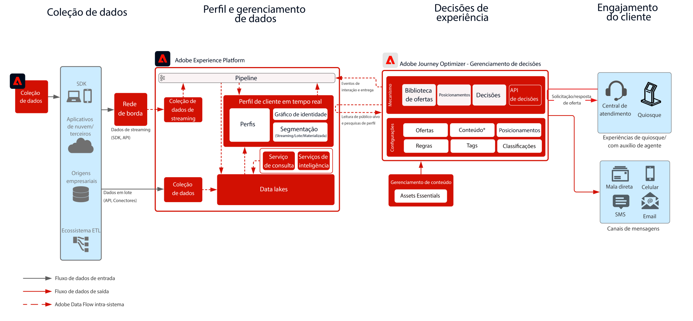

# Gestão de decisões no blueprint do Hub

Para saber mais sobre a gestão de decisões, consulte a documentação do produto [AQUI](https://experienceleague.adobe.com/docs/journey-optimizer/using/offer-decisioniong/get-started-decision/starting-offer-decisioning.html?lang=pt-BR) e a Visão geral da gestão de decisões [AQUI](https://experienceleague.adobe.com/docs/blueprints-learn/architecture/customer-journeys/journey-optimizer/decision-management/decision-management-overview.html?lang=pt-BR)

A gestão de decisões da Adobe é um serviço fornecido como parte do Adobe Journey Optimizer. Esse blueprint descreve os casos de uso e os recursos técnicos do aplicativo e fornece mais detalhes sobre os diferentes componentes da arquitetura e considerações que compõem a gestão de decisões.

O Journey Optimizer é usado para fornecer a melhor oferta e experiência aos clientes em todos os pontos de contato no momento certo. A gestão de decisões ajuda você a enviar a oferta certa para o os clientes no momento certo, facilitando a personalização com uma biblioteca central de ofertas de marketing e um mecanismo de decisão que aplica regras e restrições a perfis avançados em tempo real criados pela Adobe Experience Platform.

A gestão de decisões pode ser implantada de duas maneiras. A primeira é por meio do hub da Adobe Experience Platform, que é uma arquitetura de datacenter centralizada. Na abordagem de “hub”, as ofertas são executadas, personalizadas e entregues na latência de >500 milissegundos. Por isso, a arquitetura de hub é mais adequada para experiências do cliente que não exigem latência de subsegundo. Exemplos incluem definições de ofertas que são fornecidas para quiosques ou experiências assistidas por agentes, como em centrais de atendimento ou em interações pessoais. As ofertas inseridas em emails e campanhas de saída também são possibilitadas pela abordagem de hub.

A segunda abordagem é por meio da Experiência [!DNL [!DNL Edge Network]], que é uma infraestrutura distribuída globalmente e localizada geograficamente para atender experiências rápidas de subsegundos e milissegundos. A experiência do consumidor final é executada pela infraestrutura de borda mais próxima da localização geográfica do consumidor para minimizar a latência. A gestão de decisões na borda foi projetada para fornecer experiências do consumidor em tempo real, como solicitações de personalização de entrada da Web ou móvel.

Esse blueprint abordará as especificidades da gestão de decisões no hub.

Para obter mais informações sobre a gestão de decisões na borda, consulte o blueprint [Gestão de decisões na borda](https://experienceleague.adobe.com/docs/blueprints-learn/architecture/customer-journeys/journey-optimizer/decision-management/decision-management-edge.html?lang=pt-BR).

## Casos de uso da gestão de decisões no hub

* Casos de uso de transmissão em que a latência de contexto do perfil não é estrita: 15 minutos ou mais.
* Ofertas personalizadas em quiosques e experiências em loja.
* Ofertas personalizadas por meio de experiências assistidas por agente, como centrais de atendimento ou interações de vendas.
* Ofertas incluídas em emails, mensagens SMS, notificações por push ou outras interações de saída.
* Forneça ofertas a sistemas externos de ESP e de envio de mensagens para delivery.
* Execução de jornada entre canais – consistência de ofertas na Web, dispositivos móveis, email e outros canais de interação por meio do Adobe Journey Optimizer.

>[!IMPORTANT]
>
>Para casos de uso de oferta e jornada que exigem o acesso ao perfil para obter informações e contexto adicionais. É importante considerar a latência associada da assimilação de dados no perfil no hub para garantir que ele esteja disponível no momento da decisão. Para cenários em que o contexto é de transmissão ou assimilação no perfil e a oferta ou jornada deve ter esse contexto disponível em segundos ou minutos após a decisão de oferta, esses cenários são mais adequados para o Gerenciamento de decisão no Edge.

## Arquitetura

## Medidas de proteção

* Para as medidas de proteção do Journey Optimizer, consulte [Medidas de proteção do Journey Optimizer](https://experienceleague.adobe.com/docs/journey-optimizer/using/get-started/limitations.html?lang=pt-BR).
* Para as medidas de proteção da gestão de decisões, consulte [Descrição do produto gestão de decisões](https://helpx.adobe.com/br/legal/product-descriptions/offer-decisioning-app-service.html).

[Medidas de Proteção e Orientação de Latência de Ponta a Ponta](https://experienceleague.adobe.com/docs/blueprints-learn/architecture/architecture-overview/deployment/guardrails.html?lang=pt-BR)

## Padrões de implementação

* Implementado em emails, mensagens SMS e canais de saída por meio da integração direta com o [Adobe Journey Optimizer](https://experienceleague.adobe.com/docs/journey-optimizer/using/offer-decisioniong/get-started-decision/offers-e2e.html?lang=pt-BR).
* Para a implementação baseada em API de servidor da gestão de decisões, utilize a [API de decisão](https://experienceleague.adobe.com/docs/journey-optimizer/using/offer-decisioniong/api-reference/offer-delivery/decisioning-vs-edge-apis.html?lang=pt-BR).
* Para a implementação de decisões baseadas em lote para fornecer ofertas em massa para um aplicativo de entrega de mensagem, utilize a [API de decisão em lote](https://experienceleague.adobe.com/docs/journey-optimizer/using/offer-decisioniong/api-reference/offer-delivery/batch-decisioning-api.html?lang=pt-BR).
* Para experiências em tempo real baseadas em borda, use o SDK da Web/móvel ou a API de decisão na borda, conforme descrito no [Blueprint na borda da gestão de decisões](https://experienceleague.adobe.com/docs/blueprints-learn/architecture/customer-journeys/journey-optimizer/decision-management/decision-management-edge.html?lang=pt-BR).

## Documentação relacionada

* [Adobe Experience Platform](https://experienceleague.adobe.com/docs/experience-platform.html?lang=pt-BR)
* [Adobe Journey Optimizer](https://experienceleague.adobe.com/docs/journey-optimizer.html?lang=pt-BR)
* [Gestão de decisões do Adobe Journey Optimizer](https://experienceleague.adobe.com/docs/journey-optimizer/using/offer-decisioniong/get-started-decision/starting-offer-decisioning.html?lang=pt-BR)
* [Descrição do produto Adobe Journey Optimizer](https://helpx.adobe.com/br/legal/product-descriptions/adobe-journey-optimizer.html)
* [Descrição do produto gestão de decisões da Adobe](https://helpx.adobe.com/br/legal/product-descriptions/offer-decisioning-app-service.html)
