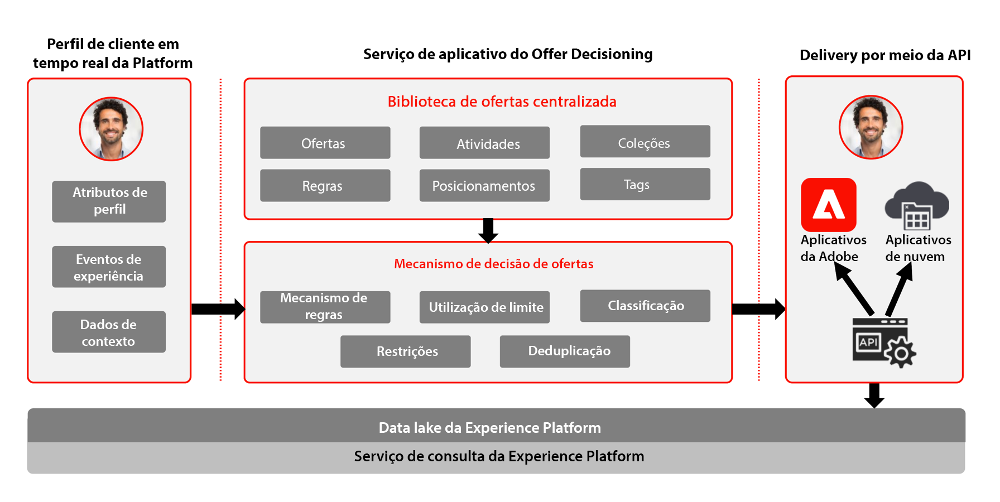

# Journey Optimizer – Visão geral da Gestão de decisões

Para saber mais sobre a gestão de decisões, consulte a [documentação do produto](https://experienceleague.adobe.com/docs/journey-optimizer/using/offer-decisioniong/get-started-decision/starting-offer-decisioning.html?lang=pt-BR).

Consulte a documentação a seguir para obter as medidas de proteção relacionadas à Gestão de decisões. [Medidas de proteção do Gerenciamento de decisão](https://experienceleague.adobe.com/en/docs/journey-optimizer/using/get-started/guardrails#decision-management)

A gestão de decisões da Adobe é um serviço fornecido como parte do Adobe Journey Optimizer. Esse blueprint descreve os casos de uso e os recursos técnicos do aplicativo e fornece mais detalhes sobre os diferentes componentes da arquitetura e considerações que compõem a gestão de decisões.

O Journey Optimizer é usado para fornecer a melhor oferta e experiência aos clientes em todos os pontos de contato no momento certo. A gestão de decisões ajuda você a enviar a oferta certa para o os clientes no momento certo, facilitando a personalização com uma biblioteca central de ofertas de marketing e um mecanismo de decisão que aplica regras e restrições a perfis avançados em tempo real criados pela Adobe Experience Platform.

O recurso gestão de decisões consiste em dois componentes principais:

* A Biblioteca de ofertas centralizada, que é a interface onde você cria e gerencia os diferentes elementos que compõem suas ofertas, bem como onde define suas regras e restrições.
* O mecanismo de Offer Decisioning que utiliza os dados da Adobe Experience Platform e os perfis de cliente em tempo real, juntamente com a Biblioteca de ofertas, para selecionar o momento, os clientes e os canais certos nos quais as ofertas serão entregues.

A gestão de decisões pode ser implantada de duas maneiras: na borda ou por meio do hub. Cada um desses métodos tem um conjunto específico de interfaces e protocolos para operação do serviço, conforme descrito nos respectivos blueprints referenciados abaixo. Além disso, mais informações estão disponíveis na [documentação da Gestão de decisões](https://experienceleague.adobe.com/docs/journey-optimizer/using/offer-decisioniong/api-reference/offer-delivery-api/decisioning-vs-edge-apis.html?lang=pt-BR).

## Gestão de decisões no hub

A primeira é por meio do hub da Adobe Experience Platform, que é uma arquitetura de datacenter centralizada. Na abordagem de “hub”, as ofertas são executadas, personalizadas e entregues na latência de >500 milissegundos. Por isso, a arquitetura de hub é mais adequada para experiências do cliente que não exigem latência de subsegundo. Exemplos incluem definições de ofertas que são fornecidas para quiosques ou experiências assistidas por agentes, como em centrais de atendimento ou em interações pessoais. As ofertas inseridas em emails, mensagens SMS ou notificações por push e outras campanhas de saída também são possibilitadas pela abordagem de hub. Para obter mais informações sobre a gestão de decisões no hub, consulte o blueprint [Gestão de decisões no hub](https://experienceleague.adobe.com/docs/blueprints-learn/architecture/customer-journeys/journey-optimizer/decision-management/decision-management-hub.html?lang=pt-BR).

* A qualificação da oferta pode se basear no perfil completo do cliente em tempo real, incluindo todos os atributos e eventos de experiência

### Casos de uso da gestão de decisões no hub

* Ofertas personalizadas em quiosques e experiências em loja.
* Ofertas personalizadas por meio de experiências assistidas por agente, como centrais de atendimento ou interações de vendas.
* Ofertas incluídas em emails, mensagens SMS ou outras interações de saída.
* Execução de jornada entre canais – consistência de ofertas na Web, dispositivos móveis, email e outros canais de interação por meio do Adobe Journey Optimizer.

### Considerações técnicas sobre a gestão de decisões no hub

* Acesso ao perfil completo do cliente em tempo real, incluindo atributos, eventos de experiência e associações de público.

## Gestão de decisões na borda   

A segunda abordagem é por meio da Experiência [!DNL Edge Network], que é uma infraestrutura distribuída globalmente e localizada geograficamente para atender às rápidas experiências de subsegundos e milissegundos. A experiência do consumidor final é executada pela infraestrutura de borda mais próxima da localização geográfica do consumidor para minimizar a latência. A gestão de decisões na borda foi projetada para fornecer experiências do consumidor em tempo real, como solicitações de personalização de entrada da Web ou móvel. Para obter mais informações sobre a gestão de decisões na borda, consulte o blueprint [Gestão de decisões na borda](https://experienceleague.adobe.com/docs/blueprints-learn/architecture/customer-journeys/journey-optimizer/decision-management/decision-management-edge.html?lang=pt-BR).

### Casos de uso da gestão de decisões na borda

* Personalização online por meio de experiências de entrada da Web ou móvel.
* Execução de jornada entre canais – consistência de ofertas na Web, dispositivos móveis, email e outros canais de interação por meio do Adobe Journey Optimizer.

### Considerações técnicas sobre o Gerenciamento de decisão de borda

* Acesso ao perfil de borda em tempo real. Somente atributos de perfil e públicos projetados na borda ficam disponíveis no perfil.

## Documentação relacionada

* [Adobe Experience Platform](https://experienceleague.adobe.com/docs/experience-platform.html?lang=pt-BR)
* [Adobe Journey Optimizer](https://experienceleague.adobe.com/docs/journey-optimizer.html?lang=pt-BR)
* [Gestão de decisões do Adobe Journey Optimizer](https://experienceleague.adobe.com/docs/journey-optimizer/using/offer-decisioniong/get-started-decision/starting-offer-decisioning.html?lang=pt-BR)
* [Descrição do produto Adobe Journey Optimizer](https://helpx.adobe.com/br/legal/product-descriptions/adobe-journey-optimizer.html)
* [Descrição do produto gestão de decisões da Adobe](https://helpx.adobe.com/br/legal/product-descriptions/offer-decisioning-app-service.html)
