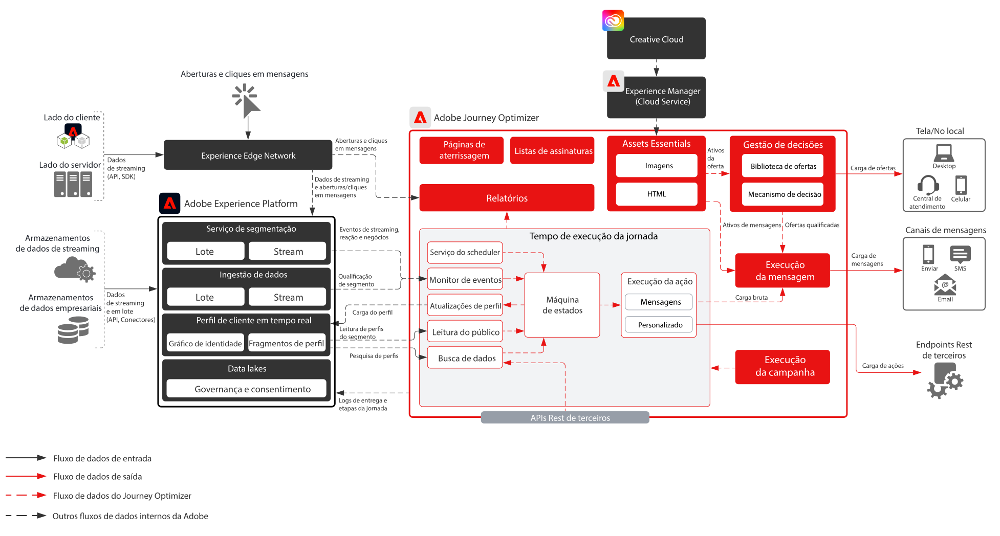
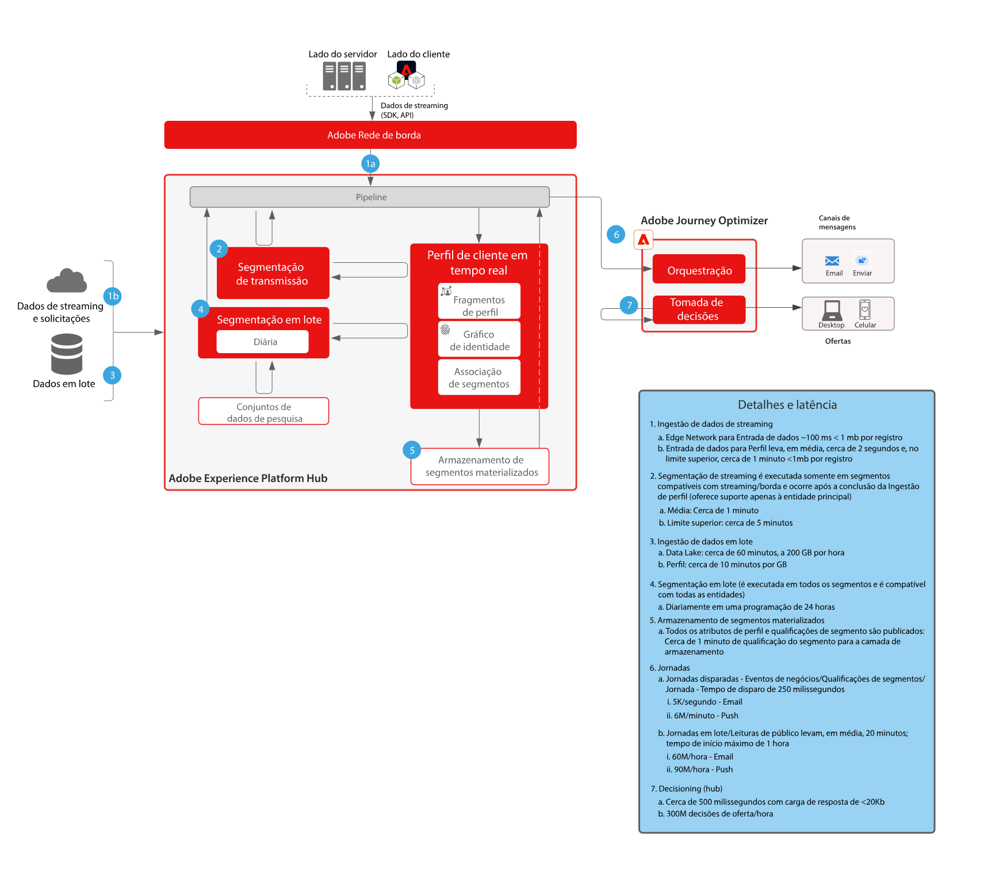

# Journey Optimizer

O Adobe Journey Optimizer é um sistema criado para as equipes de marketing reagirem em tempo real aos comportamentos dos clientes e atendê-los onde quer que eles estejam. Os recursos de gerenciamento de dados foram transferidos para a Adobe Experience Platform, permitindo que as equipes de marketing se concentrem no que fazem de melhor: criar jornadas de clientes de alto nível e conversas personalizadas.  Este blueprint descreve os recursos técnicos do aplicativo e fornece detalhes sobre os diferentes componentes de arquitetura que compõem o Adobe Journey Optimizer.

 

## Casos de uso

* Mensagens acionadas
* Confirmações de boas-vindas e registro
* Carrinho de compras e abandonos de formulários de aplicação
* Mensagens acionadas de localização
* Experiências in loco
* Experiências de viagem e hospitalidade antes da chegada e durante a estadia

 

## Arquitetura

 

## Cenários do blueprint

| Cenário | Descrição | Recursos |
| :-- | :--- | :--- |
| [Mensagens de terceiros](3rd-party-messaging.md) | Demonstra como o Adobe Journey Optimizer pode ser usado com sistemas de mensagens de terceiros para orquestrar e enviar comunicações personalizadas | Entrega imediata de comunicações individualizadas e personalizadas para os clientes enquanto eles interagem com sua marca ou empresa  Considerações: <ul><li>O sistema de terceiros deve suportar tokens de portador para autenticação</li><li>Devido à arquitetura de vários locatários, não é compatível com IPs estáticos</li><li>Esteja ciente das restrições de arquitetura ao sistema de terceiros em matéria de chamadas de API por segundo.  O cliente pode precisar comprar volume adicional do fornecedor terceirizado para comportar o volume proveniente do Journey Optimizer</li><li>Não é compatível com a gestão de decisões em mensagens ou cargas</li></ul> |

 

## Padrões de integração

| Integração | Descrição | Recursos |
| :-- | :--- | :--- |
| [Journey Optimizer com Adobe Campaign](ajo-and-campaign.md) | Mostra como usar o Adobe Journey Optimizer para organizar experiências individualizadas utilizando o Perfil do cliente em tempo real e aproveitar o sistema nativo de mensagens transacionais do Adobe Campaign para enviar a mensagem | Aproveite o Perfil do cliente em tempo real e o poder do Journey Optimizer para organizar as experiências na hora, enquanto utiliza os recursos nativos de mensagens em tempo real do Adobe Campaign para fazer a comunicação de última milha  Considerações: <ul><li>O aplicativo do Campaign deve ser build v7 superior a 21.1 ou v8</li><li>Taxa de transferência de mensagens</li><ul><li>Campaign v7 - até 50 mil por hora</li><li>Campaign v8 - até 1 milhão por hora</li><li>Campaign Standard - até 50 mil por hora</li></ul><li>Como não é feita nenhuma regulagem, os casos de uso precisam da avaliação técnica de um arquiteto empresarial</li><li>Não há suporte para a utilização da gestão de decisões em mensagem enviada pelo Campaign</li></ul> |

 

## Pré-requisitos

Adobe Experience Platform

* Os esquemas e conjuntos de dados devem ser configurados no sistema antes que você possa configurar as fontes de dados do Journey Optimizer
* Para esquemas do Experience Event baseados em classe, adicione o grupo de campos “eventID de orquestração” quando quiser acionar um evento que não seja baseado em regras
* Para esquemas de Perfil individual baseados em classe, adicione o grupo de campos “Detalhes do teste de perfil” para carregar perfis de teste a serem usados com o Journey Optimizer

Email

* Deve ter um subdomínio pronto para ser usado no envio de mensagens
* O subdomínio pode ser totalmente delegado à Adobe (recomendado) ou podem ser usados CNAMEs para indicar servidores DNS específicos da Adobe (personalizado)
* É necessário registro TXT do Google para cada subdomínio, para garantir um boa capacidade de entrega

Push para publicação de conteúdo para dispositivos móveis

* O cliente deve ter um desenvolvedor de publicações de conteúdo para dispositivos móveis disponível para criar o aplicativo
* SDK móvel da Adobe Experience Platform

 

## Medidas de proteção

[Link do produto medidas de proteção do Journey Optimizer](https://experienceleague.adobe.com/docs/journeys/using/starting-with-journeys/limitations.html?lang=pt-BR)

Fique ciente dos seguintes itens, os quais não estão listados no link acima:

* Segmentos em lote – precisam assegurar que você entenda o volume diário de usuários qualificados e que o sistema de destino possa lidar com a taxa de transferência intermitente por jornada e em todas as jornadas
* Segmentos de transmissão – precisam assegurar que a intermitência inicial de qualificações de perfis possam ser manipuladas com o volume de qualificações de transmissão diárias por jornada e em todas as jornadas
* Oferece compatibilidade com a gestão de decisões de forma nativa somente em mensagens (sem ações personalizadas)
* Tipos de mensagem compatíveis:
   * Email
   * Push (FCM/APNS)
   * Ações personalizadas (por meio de API Rest)
* Integrações de saída para sistemas de terceiros
   * Não há suporte para um único IP estático, pois nossa infraestrutura é multilocatária (é necessário incluir todos os IPs do data center na lista de permissões)
   * Somente os métodos POST e PUT são compatíveis com ações personalizadas
   * Autenticação por usuário/senha ou token de autorização
* Não é possível empacotar e mover componentes individuais da Adobe Experience Platform ou do Journey Optimizer entre várias sandboxes. Em ambientes novos, deve ser implementado outra vez

### Medidas de proteção da assimilação de dados

 

### Medidas de Proteção de ativação

 

## Etapas de implementação

### Adobe Experience Platform

#### Esquemas/Conjuntos de dados

1. [Configure perfil individual, evento de experiência e esquemas de várias entidades](https://experienceleague.adobe.com/?recommended=ExperiencePlatform-D-1-2021.1.xdm&amp;lang=pt-BR) na Experience Platform com base nos dados fornecidos pelo cliente.
1. [Crie conjuntos de dados](https://experienceleague.adobe.com/docs/platform-learn/tutorials/data-ingestion/create-datasets-and-ingest-data.html?lang=pt-BR) na Experience Platform para que os dados sejam assimilados.
1. [Adicione rótulos de uso de dados](https://experienceleague.adobe.com/docs/platform-learn/tutorials/data-governance/classify-data-using-governance-labels.html?lang=pt-BR) na Experience Platform para o conjunto de dados para governança.
1. [Crie políticas](https://experienceleague.adobe.com/docs/platform-learn/tutorials/data-governance/create-data-usage-policies.html?lang=pt-BR) que apliquem governança nos destinos.

#### Perfil/Identidade

1. [Crie qualquer namespace específico para clientes](https://experienceleague.adobe.com/docs/platform-learn/tutorials/identities/label-ingest-and-verify-identity-data.html?lang=pt-BR).
1. [Adicione identidades a esquemas](https://experienceleague.adobe.com/docs/platform-learn/tutorials/identities/label-ingest-and-verify-identity-data.html?lang=pt-BR).
1. [Habilite os esquemas e conjuntos de dados para o Perfil](https://experienceleague.adobe.com/docs/platform-learn/tutorials/profiles/bring-data-into-the-real-time-customer-profile.html?lang=pt-BR).
1. [Configure políticas de mesclagem](https://experienceleague.adobe.com/docs/platform-learn/tutorials/profiles/create-merge-policies.html?lang=pt-BR) para visualizações diferentes do [!UICONTROL Perfil de cliente em tempo real] (opcional).
1. Crie segmentos para o uso do Journey.

#### Origens/Destinos

1. [Assimile dados na Experience Platform](https://experienceleague.adobe.com/?recommended=ExperiencePlatform-D-1-2020.1.dataingestion&amp;lang=pt-BR) usando APIs de transmissão e conectores de origem.

### Journey Optimizer

1. Configure sua fonte de dados da Experience Platform e determine quais campos que devem ser armazenados em cache como parte dos dados de profileStreaming usados para iniciar uma jornada do cliente têm que ser primeiro configurados no Journey Optimizer para obter uma ID de orquestração. Depois, essa ID de orquestração será fornecida ao desenvolvedor para usá-la na assimilação
1. Configure as origens de dados externos.
1. Configure as ações personalizadas.

### Configuração de push para publicação de conteúdo para dispositivos móveis

1. Implemente o SDK móvel da Experience Platform para coletar tokens de push e informações de logon a serem vinculadas a perfis de clientes conhecidos
1. Aproveite as tags da Adobe e crie uma propriedade de publicação de conteúdo para dispositivos móveis com a seguinte extensão:
1. Adobe Journey Optimizer
1. Rede de borda da Adobe Experience Platform
1. Identidade    para Edge Network
1. Mobile Core
1. Certifique-se de ter um fluxo de dados dedicado para implantações de aplicativos móveis e implantações da Web
1. Para mais informações, siga o [Manual do Adobe Journey Optimizer Mobile](https://aep-sdks.gitbook.io/docs/using-mobile-extensions/adobe-journey-optimizer)

## Documentação relacionada

* [Documentação da Experience Platform](https://experienceleague.adobe.com/docs/experience-platform.html?lang=pt-BR)
* [Documentação de tags da Experience Platform](https://experienceleague.adobe.com/docs/experience-platform/tags/home.html?lang=pt-BR)
* [Documentação do SDK móvel da Experience Platform](https://experienceleague.adobe.com/docs/mobile.html?lang=pt-BR)
* [Documentação do Journey Optimizer](https://experienceleague.adobe.com/docs/journey-optimizer/using/ajo-home.html?lang=pt-BR)
* [Descrição do produto do Journey Optimizer](https://helpx.adobe.com/br/legal/product-descriptions/adobe-journey-optimizer.html)
