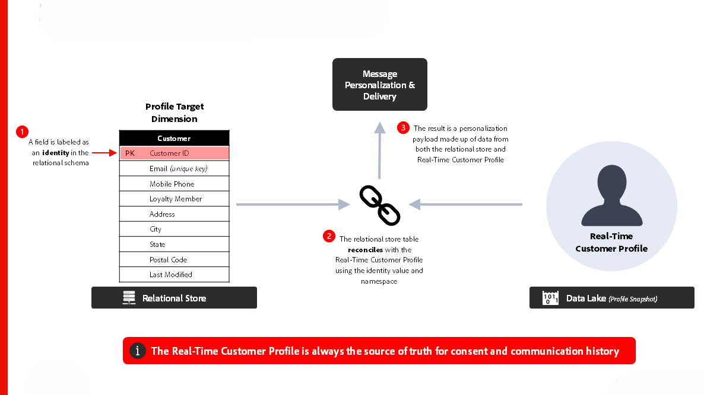
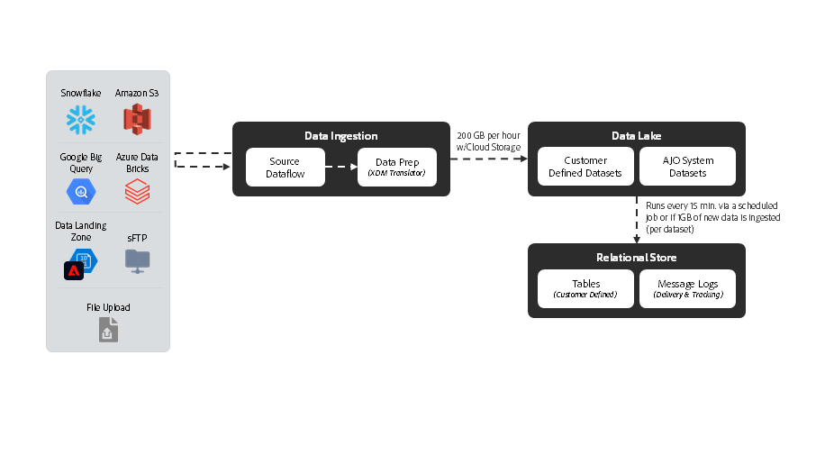

# [!DNL Journey Optimizer] - Blueprint da orquestração de campanha

>[!TIP]
>Este blueprint também está disponível como um [padrão de caso de uso](/help/blueprints/use-case-patterns/campaign-management-orchestration/batch-outbound-message-activation.md) em Gerenciamento e orquestração de campanhas.

O AJO Campaign Orchestration permite que os profissionais de marketing criem e executem comunicações programadas, baseadas em públicos, em várias etapas, entre canais de saída, como email, SMS, push e correspondência direta. Ao contrário do AJO Jornada, que reage a comportamentos individuais dos clientes usando dados em tempo real do Perfil do cliente em tempo real, as campanhas são esforços de marketing coordenados que direcionam os públicos em intervalos planejados. Juntas, campanhas e jornadas oferecem abordagens complementares — as campanhas impulsionam estratégias de envolvimento com a marca, enquanto as jornadas fornecem experiências personalizadas e responsivas.

 

## Arquitetura

 

### Arquitetura de execução de mensagens

 

### Armazenamento relacional - Latência de assimilação de dados

 

## Considerações de arquitetura para Jornadas

- **Arquitetura de dados**: a Orquestração do AJO Campaign utiliza um banco de dados relacional subjacente para a criação e a orquestração de públicos-alvo
- **Integração com o Audience Portal**: integrado nativamente ao Audience Portal dentro do Perfil do Cliente em Tempo Real para ler de públicos existentes e salvar novos públicos ao criar campanhas
- **Criação de público-alvo sob demanda**: compile, avalie e execute um público-alvo imediatamente para casos de uso urgentes de marketing
- **Integração do Perfil do Cliente em Tempo Real:** fonte da verdade para o histórico de consentimento e comunicação; oferece suporte ao design de &quot;perfil reduzido&quot; para personalização
- **Envio de Mensagens de Várias Entidades:** capacidade de enviar várias mensagens por perfil em uma única entrega (por exemplo, enviar uma mensagem por reserva para o endereço de email do cliente)
- **Segmentação de várias entidades**: comece a criar um público-alvo a partir de qualquer entidade dentro do armazenamento relacional (ou seja, produto, inventário, plano etc.)

 

## Medidas de proteção

[Link de produto de campanhas orquestradas](https://experienceleague.adobe.com/pt-br/docs/journey-optimizer/using/campaigns/orchestrated-campaigns/guardrails)

[Medidas de proteção e orientação de latência completa](https://experienceleague.adobe.com/docs/blueprints-learn/architecture/architecture-overview/deployment/guardrails)

 

## Documentação relacionada

- [[!DNL Journey Optimizer] Campanhas Orquestradas](https://experienceleague.adobe.com/en/docs/journey-optimizer/using/campaigns/orchestrated-campaigns/orchestrated-campaigns-landing-page.html)
- [Documentação do [!DNL Experience Platform]](https://experienceleague.adobe.com/docs/experience-platform.html?lang=pt-BR)
- [Documentação de [!DNL Experience Platform] tags](https://experienceleague.adobe.com/docs/experience-platform/tags/home.html?lang=pt-BR)
- [Documentação do [!DNL Experience Platform Mobile SDK]](https://experienceleague.adobe.com/docs/mobile.html?lang=pt-BR)
- [Documentação do [!DNL Journey Optimizer]](https://experienceleague.adobe.com/docs/journey-optimizer/using/ajo-home.html?lang=pt-BR)
- [Descrição do produto [!DNL Journey Optimizer]](https://helpx.adobe.com/br/legal/product-descriptions/adobe-journey-optimizer.html)
