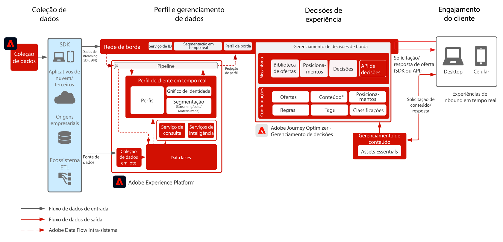

# Journey Optimizer - Offer decisioning na borda

O Gerenciamento de decisão do Adobe é um serviço fornecido como parte da Adobe Journey Optimizer. Este blueprint descreve os casos de uso e os recursos técnicos do aplicativo e fornece um mergulho profundo nos vários componentes da arquitetura e considerações que compõem o Offer Decisioning.

O Gerenciamento de decisões pode ser implantado de uma das duas maneiras. O primeiro é através do Adobe Experience Platform Hub, que é uma arquitetura de data center única. Na abordagem &quot;hub&quot;, as ofertas são executadas, personalizadas e entregues na segunda latência. Assim, a arquitetura do hub é mais adequada para a experiência do cliente que não exige latência de subsegundo, os exemplos incluem decisões de oferta que são fornecidas para quiosques ou experiências assistidas por agentes, como em centrais de atendimento ou em interações pessoais.

A segunda abordagem é por meio da Experience Edge Network, que é uma infraestrutura distribuída geograficamente globalmente para fornecer experiências rápidas de sub-segundo e milissegundo. A experiência do consumidor final que está sendo executada pela infraestrutura de borda mais próxima da localização geográfica dos consumidores para minimizar a latência. O Gerenciamento de decisões no Edge foi projetado para fornecer experiências do consumidor em tempo real. Isso inclui experiências como solicitações de personalização de entrada da Web ou móvel.

Esse blueprint abordará as especificidades do Gerenciamento de decisões no Edge.

Para saber mais sobre o Gerenciamento de decisões no hub, consulte [Gerenciamento de decisões no hub](https://experienceleague.adobe.com/docs/blueprints-learn/architecture/customer-journeys/journey-optimizer/offer-decisioning/offers-hub.html?lang=en) blueprint.

Para saber mais sobre o Gerenciamento de decisões, consulte a documentação do produto [AQUI](https://experienceleague.adobe.com/docs/journey-optimizer/using/offer-decisioniong/get-started-decision/starting-offer-decisioning.html)

## Casos de uso

* Personalização online via Web ou móvel.
* Offer decisioning de entrada e apresentações de oferta.
* Execução de jornada entre canais - consistência de ofertas na Web, dispositivos móveis, email e outros canais de interação por meio do Adobe Journey Optimizer.

 

## Arquitetura

 

## Padrões de integração

| Integração | Descrição |
| :-- | :--- |
| [Offer Decisioning com Adobe Target](https://experienceleague.adobe.com/docs/target/using/integrate/ajo/offer-decision.html) | O Offer Decisioning pode ser integrado ao Adobe Target, de modo que as ofertas possam ser testadas e entregues como experiências do Target. |

## Pré-requisitos

Adobe Experience Platform

* Os esquemas e conjuntos de dados devem ser configurados no sistema antes que você possa configurar as fontes de dados do Journey Optimizer
* Para esquemas do Experience Event baseados em classe, adicione o grupo de campos “eventID de orquestração” quando quiser acionar um evento que não seja baseado em regras
* Para esquemas de Perfil individual baseados em classe, adicione o grupo de campos “Detalhes do teste de perfil” para carregar perfis de teste a serem usados com o Journey Optimizer

 

## Medidas de proteção

* Para as medidas de proteção da Journey Optimizer, consulte o seguinte [Journey Optimizer Guardrails](https://experienceleague.adobe.com/docs/journey-optimizer/using/get-started/limitations.html).
* Para as medidas de proteção de Offer decisioning, consulte [Descrição do produto Offer Decisioning](https://helpx.adobe.com/legal/product-descriptions/offer-decisioning-app-service.html).

### Medidas de proteção da assimilação de dados

 

### Medidas de Proteção de ativação

 

## Padrões de implementação

* Use o SDK da Web ou móvel para implantação em sites e aplicativos móveis para implementar o Offer Decisioning, onde o SDK foi implantado.
   * [Blueprint do SDK Web/móvel](https://experienceleague.adobe.com/docs/blueprints-learn/architecture/data-ingestion/websdk.html?lang=pt-BR)
   * [WebSDK](https://experienceleague.adobe.com/docs/experience-platform/edge/personalization/offer-decisioning/offer-decisioning-overview.html)
   * [MobileSDK](https://aep-sdks.gitbook.io/docs/)

Ou

* Para uma implementação baseada em servidor de API, use a API do Serviço de Rede de Borda para implementar o Offer Decisioning diretamente do servidor para o servidor.
   * [API do Servidor de Rede de Borda](https://experienceleague.adobe.com/docs/journey-optimizer/using/offer-decisioniong/api-reference/offer-delivery/deliver-offers.html)
   * [API de decisão](https://experienceleague.adobe.com/docs/journey-optimizer/using/offer-decisioniong/api-reference/offer-delivery/decisioning-vs-edge-apis.html)

 

## Etapas de implementação

### Adobe Experience Platform

#### Esquemas/Conjuntos de dados

1. [Configure perfil individual, evento de experiência e esquemas de várias entidades](https://experienceleague.adobe.com/?recommended=ExperiencePlatform-D-1-2021.1.xdm) na Experience Platform com base nos dados fornecidos pelo cliente.
1. [Crie conjuntos de dados](https://experienceleague.adobe.com/docs/platform-learn/tutorials/data-ingestion/create-datasets-and-ingest-data.html?lang=pt-BR) na Experience Platform para que os dados sejam assimilados.
1. [Adicione rótulos de uso de dados](https://experienceleague.adobe.com/docs/platform-learn/tutorials/data-governance/classify-data-using-governance-labels.html?lang=pt-BR) na Experience Platform para o conjunto de dados para governança.
1. [Crie políticas](https://experienceleague.adobe.com/docs/platform-learn/tutorials/data-governance/create-data-usage-policies.html?lang=pt-BR) que apliquem governança nos destinos.

#### Perfil/Identidade

1. [Crie qualquer namespace específico para clientes](https://experienceleague.adobe.com/docs/platform-learn/tutorials/identities/label-ingest-and-verify-identity-data.html?lang=pt-BR).
1. [Adicione identidades a esquemas](https://experienceleague.adobe.com/docs/platform-learn/tutorials/identities/label-ingest-and-verify-identity-data.html).
1. [Habilite os esquemas e conjuntos de dados para o Perfil](https://experienceleague.adobe.com/docs/platform-learn/tutorials/profiles/bring-data-into-the-real-time-customer-profile.html?lang=pt-BR).
1. [Configure políticas de mesclagem](https://experienceleague.adobe.com/docs/platform-learn/tutorials/profiles/create-merge-policies.html?lang=pt-BR) para visualizações diferentes do [!UICONTROL Perfil de cliente em tempo real] (opcional).
1. Crie segmentos para o uso do Journey.

#### Origens/Destinos

1. [Assimile dados na Experience Platform](https://experienceleague.adobe.com/?recommended=ExperiencePlatform-D-1-2020.1.dataingestion&amp;lang=pt-BR) usando APIs de transmissão e conectores de origem.

## Documentação relacionada

* [Adobe Experience Platform](https://experienceleague.adobe.com/docs/experience-platform.html)
* [Adobe Journey Optimizer](https://experienceleague.adobe.com/docs/journey-optimizer.html)
* [Gerenciamento de decisões da Adobe Journey Optimizer](https://experienceleague.adobe.com/docs/journey-optimizer/using/offer-decisioniong/get-started-decision/starting-offer-decisioning.html)
* [Descrição do produto Adobe Journey Optimizer](https://helpx.adobe.com/legal/product-descriptions/adobe-journey-optimizer.html)
* [Descrição do produto Offer decisioning Adobe](https://helpx.adobe.com/legal/product-descriptions/offer-decisioning-app-service.html)
