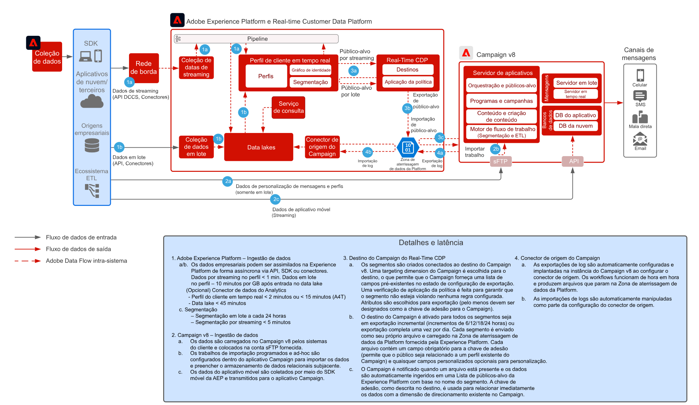

# Padrão de integração do Real-Time CDP com Adobe Campaign v8

Mostra como a Adobe Experience Platform, seu Perfil do cliente em tempo real e sua ferramenta de segmentação centralizada podem ser usados com o Adobe Campaign para proporcionar conversas personalizadas.

 

## Aplicativos

* Real-Time CDP da Adobe Experience Platform
* Adobe Campaign v8

 

## Arquitetura

 

## Pré-requisitos

* O cliente deve ser provisionado para a Experience Cloud com uma Organização IMS válida
* Recomenda-se que o Adobe Experience Platform e o Campaign sejam provisionados na mesma Organização IMS para URL de logon único
* O cliente deve ser provisionado para a instância V8 do Campaign
* O cliente deve ser qualificado e ter acesso para RTCDP, Fontes, Destinos.
* O contexto do produto Adobe Campaign deve existir

 

## Etapas de implementação

Consulte a documentação a seguir sobre como configurar o conector de origem do Campaign v8 para o Adobe Experience Platform e o conector de destino do Real-time Customer Data Platform para o Campaign v8.
[Conectores do Campaign e AEP](https://experienceleague.adobe.com/docs/campaign/campaign-v8/connect/ac-aep.html?lang=en)

## Medidas de proteção

### Adobe Campaign

* Consulte a documentação do conector de origem do Campaign - [Conector de origem da campanha](https://experienceleague.adobe.com/docs/experience-platform/sources/ui-tutorials/create/adobe-applications/campaign.html?lang=en)
* Compatível somente com implantações de uma única entidade organizacional do Adobe Campaign
* O Adobe Campaign é a fonte confiável para todos os perfis ativos. Isso significa que os perfis devem existir no Adobe Campaign e que novos perfis não devem ser criados com base em segmentos da Experience Platform.

### Compartilhamento de segmentos do Experience Platform Real-time Customer Data Platform

* Consulte o conector de Destino da Campanha RTCDP - [Conexão de campanha RTCDP](https://experienceleague.adobe.com/docs/experience-platform/destinations/catalog/email-marketing/adobe-campaign-managed-services.html)
* Recomendação de limite de 50 segmentos
* Observe que a realização de associação de segmento da AEP é latente para lote (1 por dia) e streaming (~5 min) e com base no agendamento de avaliação de segmento.
* A latência de ativação é mínima de 3 horas
* Somente atributos de esquema de união estão disponíveis para ativação (sem suporte para array/mapas/eventos de experiência)
* Recomendação de não ultrapassar 20 atributos por segmento
* Um arquivo por segmento de todos os perfis com associação de segmentos “realizada”. OU, se a associação de segmentos estiver adicionada como um atributo no arquivo, nos perfis “realizada” e “encerrada”
* Exportações incrementais e de segmentos completos são compatíveis
* A criptografia de arquivos não é compatível
* Consulte medidas de proteção de ingestão de perfil e dados para o AEP - [Link](https://experienceleague.adobe.com/docs/experience-platform/profile/guardrails.html?lang=pt-BR)