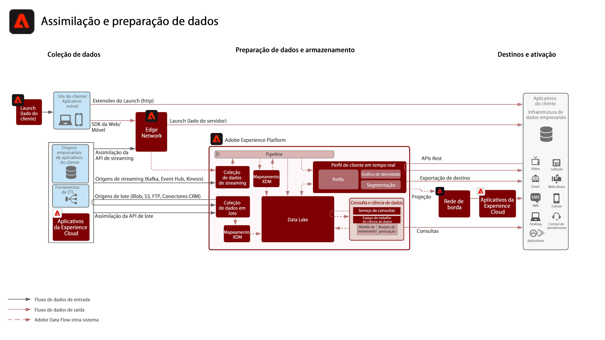

# Blueprint de preparação e assimilação de dados

O blueprint de preparação e assimilação de dados abrange todos os métodos pelos quais os dados podem ser preparados e assimilados na Adobe Experience Platform.

A preparação de dados inclui o mapeamento dos dados de origem para o esquema do Experience Data Model (XDM). Inclui também transformações nos dados, como formatação de dados, separação/concatenação/conversões de campos e junção/mesclagem/rechaveamento de registros. A preparação de dados ajuda na unificação dos dados do cliente para fornecer análise agregada/filtrada, incluindo relatórios ou preparação dos dados para agrupamento/ciência de dados/ativação do perfil do cliente.

## Arquitetura

## Métodos de assimilação de dados

| Métodos de assimilação | Descrição |
|------------------------------|-----------------------------------------------------------------------------------------------------------------------------------------------------------------------------------------------------------------------------------------------------------------------------------------------------------------------------------------------------------------------------------------------------------------------------------------|
| SDK da Web/Móvel | Latência:<ul><li>Tempo real - coleção da mesma página para a Edge Network</li><li>Assimilação por streaming para o Perfil ~1 minuto</li><li>Assimilação por streaming para o data lake (microlote ~15 minutos)</ul>Documentação: <ul><li>[SDK da Web](https://experienceleague.adobe.com/docs/web-sdk.html?lang=pt-BR)</li><li>[SDK móvel](https://experienceleague.adobe.com/docs/mobile.html?lang=pt-BR)</li></ul> |
| Fontes de streaming | Latência:<ul><li>Tempo real - coleção da mesma página para a Edge Network</li><li>Assimilação por streaming para o Perfil ~1 minuto</li><li>Assimilação por streaming para o data lake (microlote ~15 minutos)</li></ul>[Documentação](https://experienceleague.adobe.com/docs/experience-platform/sources/home.html?lang=pt-BR#connectors) |
| API de streaming | Latência:<ul><li>Tempo real - coleção da mesma página para a Edge Network</li><li>Assimilação por streaming para o Perfil ~1 minuto</li><li>Assimilação por streaming para o data lake (microlote ~15 minutos)</li><li>7 GB/hora</li></ul>[Documentação](https://experienceleague.adobe.com/docs/experience-platform/ingestion/streaming/overview.html?lang=pt-BR#what-can-you-do-with-streaming-ingestion%3F) |
| Ferramentas de ETL | Use ferramentas de ETL para modificar e transformar dados corporativos antes de assimilá-los na Experience Platform.  Latência:<ul><li>O tempo depende da programação da ferramenta externa de ETL. Em seguida, aplicam-se medidas de proteção padrão de assimilação, com base no método usado.</li></ul> |
| Origens de lote | Busca programada na origem Latência: ~ 200 GB/hora  [Documentação](https://experienceleague.adobe.com/docs/experience-platform/sources/home.html?lang=en#connectors) [Tutoriais em vídeo](https://experienceleague.adobe.com/docs/platform-learn/tutorials/sources/overview.html?lang=pt-BR) |
| API de lote | Latência:<ul><li>A assimilação em lote para o Perfil depende do tamanho e das cargas de tráfego ~45 minutos</li><li>A assimilação em lote para o data lake depende do tamanho e das cargas de tráfego</li></ul>[Documentação](https://experienceleague.adobe.com/docs/experience-platform/ingestion/batch/overview.html?lang=pt-BR#batch) |
| Conectores de aplicativos da Adobe | Assimile automaticamente os dados cuja origem se encontra nos aplicativos da Adobe Experience Cloud<ul><li>Adobe Analytics: [Documentação](https://experienceleague.adobe.com/docs/experience-platform/sources/connectors/adobe-applications/analytics.html?lang=pt-BR#connectors) e [Tutorial em vídeo](https://experienceleague.adobe.com/docs/platform-learn/tutorials/sources/ingest-data-from-adobe-analytics.html?lang=pt-BR)</li><li>Audience Manager: [Documentação](https://experienceleague.adobe.com/docs/experience-platform/sources/connectors/adobe-applications/audience-manager.html?lang=pt-BR#connectors) e [Tutorial em vídeo](https://experienceleague.adobe.com/docs/platform-learn/tutorials/sources/ingest-data-from-aam.html?lang=pt-BR)</li></ul> |

## Métodos de preparação de dados

| Métodos de preparação de dados | Descrição |
|------------------------------------------------------------|------------------------------------------------------------------------------------------------------------------------------------------------------------------------------------------------------------------------------------------------------------------------------------------------|
| [!UICONTROL Data Science Workspace] - Preparação de dados | Transformação orientada por modelos, transformação por script. [Documentação](https://experienceleague.adobe.com/docs/experience-platform/data-science-workspace/home.html?lang=pt-BR) |
| Ferramenta de ETL externa ([!DNL Snaplogic], [!DNL Mulesoft], [!DNL Informatica] e assim por diante) | Execute transformações complexas em ferramentas de ETL e use as APIs padrão dos [!UICONTROL Serviços de fluxo] da Experience Platform ou os conectores de origem para assimilar os dados resultantes. |
| [!UICONTROL Serviço de consulta] - Preparação de dados | Reúna, separe, mescle, transforme, consulte e filtre dados em um novo conjunto de dados. Utilização do Create Table as Select (CTAS)  [Documentação](https://experienceleague.adobe.com/docs/experience-platform/query/home.html?lang=pt-BR#sql) |
| Mapeador XDM e funções de preparação de dados (em lote e por streaming) | Mapeie atributos de origem no formato CSV ou JSON para atributos XDM durante a assimilação da Experience Platform. Compute funções sobre dados conforme eles são assimilados, ou seja, formatação, separação, concatenação de dados, e assim por diante. [Documentação](https://experienceleague.adobe.com/docs/experience-platform/data-prep/home.html?lang=pt-BR) |

## Publicações do blog relacionadas

* [[!DNL Leveraging External Data Platforms in Adobe Experience Platform Journey Orchestration]](https://medium.com/adobetech/leveraging-external-data-platforms-in-adobe-experience-platform-journey-orchestration-54fc6134fe17?source=your_stories_page-------------------------------------)
* [[!DNL High Throughput Ingestion with Iceberg]](https://medium.com/adobetech/high-throughput-ingestion-with-iceberg-ccf7877a413f?source=your_stories_page-------------------------------------)
* [[!DNL Query Service Tricks in Adobe Experience Platform (Writing Queries and Storing Derived Datasets)]](https://medium.com/adobetech/query-service-tricks-in-adobe-experience-platform-writing-queries-and-storing-derived-datasets-eaee0d6d683e?source=your_stories_page-------------------------------------)
* [[!DNL Digging into Adobe Experience Platform’s Experience Data Model to More Fully Understand the Power of Real-time Customer Profile]](https://medium.com/adobetech/digging-into-adobe-experience-platforms-experience-data-model-to-more-fully-understand-the-power-3e109271e04f?source=your_stories_page-------------------------------------)
* [[!DNL An Introductory Look at Exploratory Data Analysis on Adobe Experience Platform]](https://medium.com/adobetech/an-introductory-look-at-exploratory-data-analysis-on-adobe-experience-platform-1bfce7501d9a?source=your_stories_page-------------------------------------)
* [[!DNL Modeling XDM Data for Data Science at Scale on Adobe Experience Platform]](https://medium.com/adobetech/modeling-xdm-data-for-data-science-at-scale-on-adobe-experience-platform-222bb2a6dbf7?source=your_stories_page-------------------------------------)
