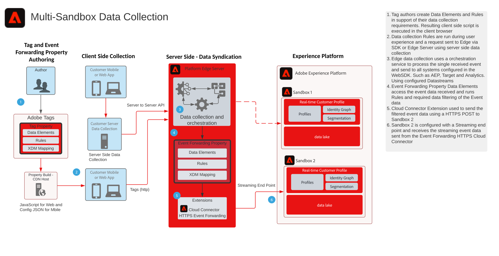

# Blueprint de coleta de dados do encaminhamento de eventos de várias sandboxes

O Multi Sandbox Event Forwarding Data Collection Blueprint mostra como os dados coletados com Adobe Experience Platform Web e Mobile SDKs podem ser configurados para coletar um único evento e encaminhar para várias sandboxes da AEP. Este Blueprint é um caso de uso específico que usa o recurso Encaminhamento de eventos das Tags de Adobe.

Além de replicar o evento, usando os recursos de Encaminhamento de eventos, você pode adicionar, filtrar ou manipular os dados coletados originais que atendem aos requisitos de outras sandboxes. Por exemplo, a Sandbox A precisa receber todos os elementos de dados do evento e a Sandbox B deve receber apenas dados não PII.

O Encaminhamento de eventos usa uma propriedade de tag separada que contém os Elementos de dados, Regras e Extensões necessários para seus requisitos de dados. Com um evento de entrada, sua propriedade de encaminhamento de eventos pode coletar os dados e gerenciar, conforme necessário, antes do encaminhamento.

Sua caixa de entrada de destino precisaria de um Ponto Final de Streaming HTTP configurado que fosse usado pela Extensão HTTPS do Encaminhamento de Eventos.

## Casos de uso

* Relatórios de dados globais - ao usar várias sandboxes para isolar ambientes operacionais e a necessidade de consolidar a Coleta de dados em uma sandbox para relatórios entre sandbox. O Encaminhamento de eventos para uma sandbox de relatórios permite que cada ambiente operacional da sandbox envie dados conforme são coletados em tempo real para uma sandbox de relatórios
* Gerencie a coleta de dados em sandboxes com base em regras de dados diferentes para cada ambiente operacional da sandbox. Esses ambientes operacionais que exigem filtragem de dados confidenciais, como Saúde e Serviços Financeiros

## Aplicativos

* Coleção da Adobe Experience Platform

## Arquitetura

1. Os Autores da tag definem uma propriedade de tag e uma propriedade de encaminhamento de eventos. Aqui, os autores definirão os Elementos de dados, Regras e Ações que gerenciam a coleta de dados. Lembre-se, o código da propriedade de tag é executado no cliente e distribuído por um Host CDN. O código da propriedade de encaminhamento de eventos é executado no servidor do Adobe Edge.

1. Os dados coletados no cliente são enviados para o Servidor de Borda. Os clientes também têm a opção de enviar dados para seu próprio servidor primeiro como um método de coleta do lado do servidor.
O WebSDK pode fornecer um recurso de coleta de Servidor para Servidor . No entanto, é necessário um modelo de programação diferente para a execução. Consulte a documentação **Visão geral da API do Servidor de rede de borda** below

1. O Platform Edge Server recebe cargas de coleta de dados e orquestra o fluxo de dados para os sistemas necessários, como Target e Analytics.

1. A propriedade Encaminhamento de evento Elementos de dados é usada para acessar Dados do evento que chegam no payload. As regras também podem ser usadas para manipular os dados do Evento, conforme necessário, antes do encaminhamento. Como formatar os dados no XDM necessário para a assimilação de dados de fluxo

1. O Encaminhamento de eventos fornece a extensão HTTPS que fornece a capacidade de encaminhar seus dados de eventos para um ponto final HTTPS.

1. A sandbox 2 é configurada com um Ponto final de transmissão que recebe o evento encaminhado.

## Documentação relacionada

* [Documentação de encaminhamento do evento](https://experienceleague.adobe.com/docs/experience-platform/tags/event-forwarding/overview.html?lang=pt-BR)
* [Vídeos sobre encaminhamento de eventos](https://experienceleague.adobe.com/docs/launch-learn/tutorials/server-side/overview.html?lang=pt-BR)
* [Aula sobre encaminhamento de eventos](https://experienceleague.adobe.com/docs/platform-learn/implement-web-sdk/event-forwarding/setup-event-forwarding.html?lang=pt-BR) do tutorial do SDK da Web
* [Visão geral do Experience Platform WebSDK](https://experienceleague.adobe.com/docs/experience-platform/edge/home.html?lang=pt-BR)
* [Visão geral da API do Servidor de rede de borda](https://experienceleague.adobe.com/docs/experience-platform/edge-network-server-api/overview.html?lang=pt-BR)

## Publicações do blog relacionadas

* [[!DNL Boosting Website Performance with Adobe Experience Platform Web SDK and Edge Network]](https://medium.com/adobetech/boosting-website-performance-with-adobe-experience-platform-web-sdk-and-edge-network-329fcf70fdf9)
* [[!DNL Solving Implementation Pain Points with Adobe Experience Platform Web SDK and Edge Network]](https://medium.com/adobetech/solving-implementation-pain-points-with-adobe-experience-platform-web-sdk-and-edge-network-880b635e6819)
* [[!DNL Adobe Experience Platform Web SDK for Audience Management]](https://medium.com/adobetech/adobe-experience-platform-web-sdk-for-audience-management-751fa6d063bc)
* [[!DNL Adobe Experience Platform Web SDK — Adobe Target]](https://medium.com/adobetech/adobe-experience-platform-web-sdk-adobe-target-9b9f621d271)
* [[!DNL Adobe Experience Platform Web SDK Migration Scenarios for Adobe Analytics]](https://medium.com/adobetech/adobe-experience-platform-web-sdk-migration-scenarios-for-adobe-analytics-91c255ec82b0)
* [[!DNL Unify Your Adobe Experience Platform Services with Adobe Experience Platform Web SDK]](https://medium.com/adobetech/unify-your-adobe-experience-platform-services-with-adobe-experience-platform-web-sdk-75cf6851a9fc)
* [[!DNL Accelerate Your Mobile Application Development with Adobe Experience Platform Mobile SDK and Launch]](https://medium.com/adobetech/accelerate-your-mobile-application-development-with-adobe-experience-platform-mobile-sdk-and-launch-ed023536d611)
* [[!DNL Simplifying Customer Workflows with Adobe Experience Platform Web SDK]](https://medium.com/adobetech/simplifying-customer-workflows-with-adobe-experience-platform-web-sdk-4e54fe134f4a)
