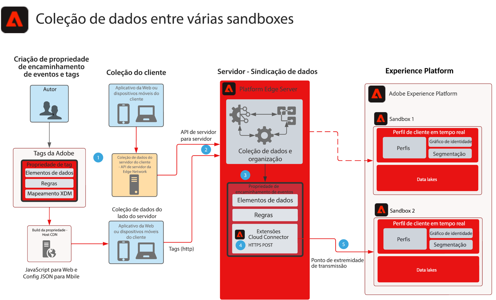

# Blueprint de coleção de dados do Encaminhamento de eventos de várias sandboxes

Este blueprint mostra como os dados coletados com SDKs da Web e móveis do Experience Platform podem ser configurados para coletar um único evento e encaminhar para várias sandboxes da AEP. Este blueprint é um caso de uso específico para a coleta de dados de várias sandboxes que usa o encaminhamento de eventos para atingir essa meta.

Além de replicar o evento com recursos de encaminhamento de eventos, você pode adicionar, filtrar ou manipular os dados coletados originais que atendem aos requisitos de outras sandboxes.

O encaminhamento de eventos usa uma propriedade separada que contém os elementos de dados, as regras e as extensões necessárias para seus requisitos de dados. Com um evento de entrada, sua propriedade de encaminhamento de eventos pode coletar os dados e gerenciar conforme necessário antes do encaminhamento.

Sua sandbox de destino requer um Ponto de extremidade de transmissão HTTP configurado que é usado pela extensão Adobe Cloud Connector.

## Casos de uso

* Relatórios de dados globais - em caso de utilização de várias sandboxes para isolar ambientes operacionais e da necessidade de consolidar a coleção de dados em uma sandbox para relatórios entre sandboxes. Roteamento de um evento da Experience Edge por meio do encaminhamento de eventos para uma sandbox de relatórios permite que cada ambiente operacional da sandbox envie dados conforme são coletados em tempo real para uma sandbox de relatórios
* Gerencie a coleção de dados em sandboxes com base em regras de dados diferentes para cada ambiente operacional de sandbox.

## Aplicativos

* Coleção de dados da Adobe Experience Platform
* Encaminhamento de eventos
* Extensão da AEP
* Extensão do Cloud Connector

## Considerações

Tendo o encaminhamento de eventos como a abordagem para enviar dados para várias sandboxes, há considerações que devem ser levadas em conta na arquitetura da solução.

### Sem dados HIPAA

O encaminhamento de eventos não é considerado HIPAA pronto e não deve ser usado em nenhum caso de uso de HIPAA em que os dados HIPAA sejam coletados. No entanto, a infraestrutura usada para o encaminhamento de eventos é considerada pronta para a HIPAA e fica a critério exclusivo do cliente. Enquanto a propriedade Tag de encaminhamento de eventos estiver no sistema de encaminhamento de eventos, toda a carga de dados coletada será enviada para o sistema de encaminhamento de eventos para processamento. Esse processo é responsável pelo encaminhamento de eventos em relação a casos de uso da HIPAA. Com toda a carga enviada para o sistema de encaminhamento de eventos, isso incluiria quaisquer valores de HIPAA. Embora as regras de encaminhamento de eventos filtrem esses dados antes de enviá-los para seu destino, esses dados da HIPAA ainda são enviados para uma infraestrutura que não esteja pronta para a HIPAA. No entanto, os dados de payload nunca são armazenados e são apenas uma passagem.

### Diferentes fluxos de dados e pontos de extremidade de transmissão

À medida que os dados fluem pelos fluxos de dados da rede de borda da plataforma, ao usar o encaminhamento de eventos para outra sandbox da AEP, um requisito GRAVE é NUNCA usar o mesmo fluxo de dados ou ponto de extremidade de transmissão que a sequência de dados que faz a coleção original. Isso pode ser prejudicial à instância da AEP e possivelmente acionar uma situação de DoS.

### Volumes de tráfego estimados

Os volumes de tráfego são necessários para análise com cada caso de uso. Isso é importante, pois grandes volumes podem resultar em uma situação de limitação, e os clientes serão notificados se isso ocorrer.

## Arquitetura

1. A coleta e o envio de dados de eventos para a Rede de borda da plataforma são necessários para usar o encaminhamento de eventos. Os clientes podem usar tags Adobe para o lado do cliente ou a API do servidor de rede de borda da plataforma para a coleta de dados de servidor para servidor. A API de rede de borda da plataforma pode fornecer um recurso de coleção de servidor para servidor. Para isso, no entanto, é necessário implementar um modelo de programação diferente. Consulte [Visão geral da API do servidor de rede de borda](https://experienceleague.adobe.com/docs/experience-platform/edge-network-server-api/overview.html?lang=en)

1. As cargas coletadas são enviadas da implementação de tags para a rede de borda da plataforma para o serviço de encaminhamento de eventos e processadas por seus próprios elementos de dados, regras e ações. Você pode ler mais sobre as diferenças de [Tags e encaminhamento de eventos](https://experienceleague.adobe.com/docs/experience-platform/tags/event-forwarding/overview.html?lang=en#differences-from-tags).

1. Uma propriedade de encaminhamento de eventos também é necessária para receber dados de eventos coletados da Rede de borda da plataforma. Se esses dados do evento foram enviados para a Rede de borda da Platform por uma implementação de tags implantadas ou uma coleção de servidor para servidor. Os autores definem os elementos de dados, as regras e as ações usadas para enriquecer os dados do evento antes do encaminhamento para a segunda sandbox. Considere usar o elemento de dados JavaScript de código personalizado para ajudar na estruturação dos dados para assimilação da sandbox. Combinado com os recursos de Preparo de dados da AEP, você tem várias opções para gerenciar a estrutura de dados.

1. Atualmente, o uso da extensão do Adobe Cloud Connector é necessário na propriedade de encaminhamento de eventos. Depois que as regras processam ou enriquecem os dados do evento, o Conector de nuvem é usado em uma Chamada de busca configurada para um POST enviando a carga para a segunda sandbox

1. Um Ponto final de transmissão para assimilação de dados é necessário para a segunda sandbox. Você também pode considerar os recursos de Preparo de dados na AEP para ajudar na assimilação e no mapeamento das cargas de encaminhamento de eventos para o XDM. Consulte a documentação da AEP Criar um [Conexão de transmissão da API HTTP usando a interface do](https://experienceleague.adobe.com/docs/experience-platform/sources/ui-tutorials/create/streaming/http.html?lang=pt-BR)
