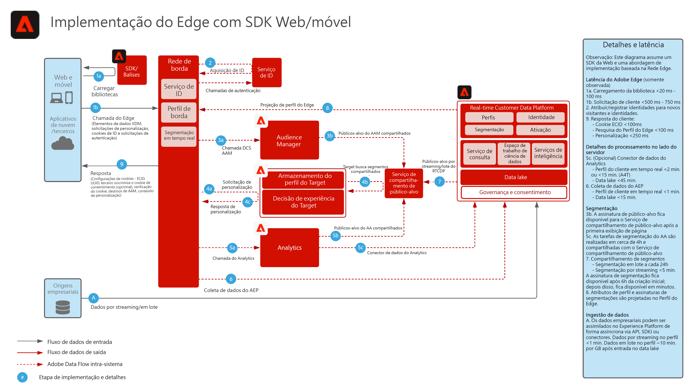

# Coleta de dados do SDK da Web/móvel da Experience Platform

O diagrama de arquitetura abaixo ilustra os caminhos de integração e a coleção de dados utilizando o SDK da Web da Experience Platform.

## Documentação de referência

* [Visão geral do SDK da Web/Móvel da Experience Platform](https://experienceleague.adobe.com/docs/experience-platform/edge/home.html?lang=pt-BR)
* [Implementar a Adobe Experience Cloud com o tutorial do SDK da Web](https://experienceleague.adobe.com/docs/platform-learn/implement-web-sdk/overview.html?lang=pt-BR)
* [Tutorial Implementar o Adobe Experience Cloud em aplicativos móveis](https://experienceleague.adobe.com/docs/platform-learn/implement-mobile-sdk/overview.html)