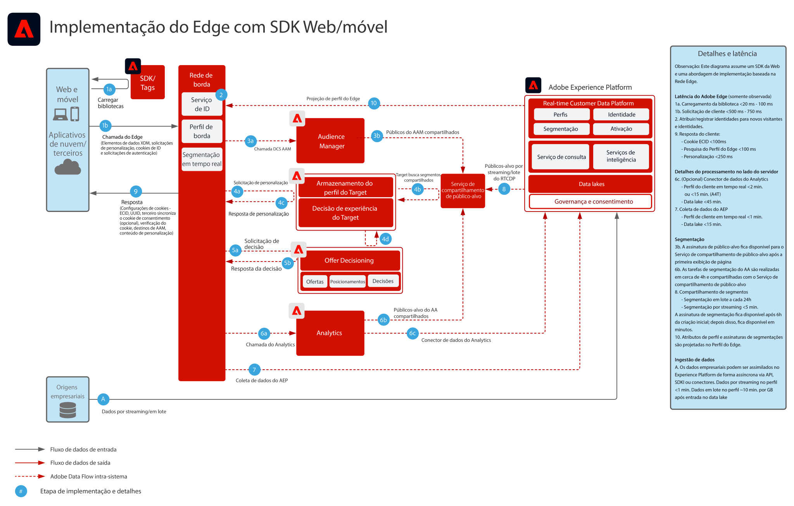
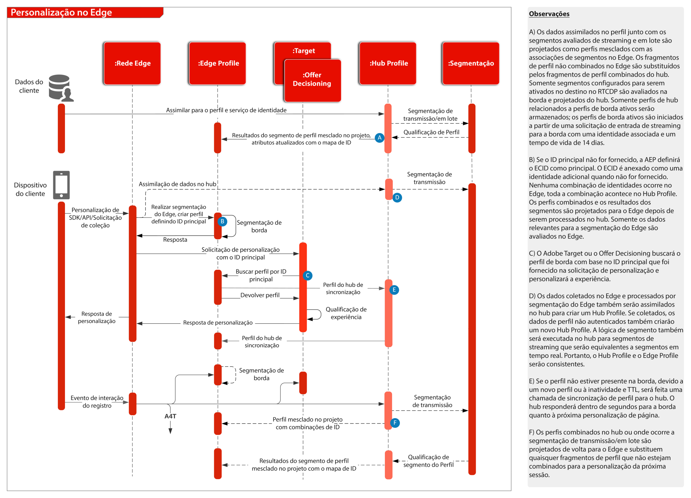

# Visão geral

Para obter uma visão geral e detalhes sobre o SDK da Web e móvel, e a API do servidor de rede de borda, consulte o seguinte.
* [Visão geral do WebSDK](https://experienceleague.adobe.com/docs/web-sdk.html?lang=pt-BR)
* [Visão geral do MobileSDK](https://aep-sdks.gitbook.io/docs/)
* [API do Servidor de Rede de Borda](https://experienceleague.adobe.com/docs/experience-platform/edge-network-server-api/overview.html)

Para obter um outline detalhado de qual funcionalidade de aplicativo é compatível no WebSDK, consulte a seguinte documentação.
* [Suporte à funcionalidade do aplicativo WebSDK](https://github.com/orgs/adobe/projects/18/views/1)

Para obter detalhes relacionados à migração de SDKs específicos do aplicativo para SDKs móveis e da Web, consulte a seguinte documentação.
* [Serviços de identidade](https://experienceleague.adobe.com/docs/experience-platform/edge/identity/overview.html)
* [Analytics](https://experienceleague.adobe.com/docs/experience-platform/edge/data-collection/adobe-analytics/analytics-overview.html)
* [Target](https://experienceleague.adobe.com/docs/experience-platform/edge/personalization/adobe-target/target-overview.html)
* [Analytics para Target](https://experienceleague.adobe.com/docs/experience-platform/edge/personalization/adobe-target/a4t/overview.html)

## Experience Platform Web/Mobile SDK ou Implantação de API do Edge Network Server

O diagrama de arquitetura abaixo ilustra a implantação e a coleta de dados utilizando o Experience Platform Web SDK.

Diagrama de sequência da Experience Edge, serviços do Experience Platform e aplicativos

## Documentação de referência

* [Implementar a Adobe Experience Cloud com o tutorial do SDK da Web](https://experienceleague.adobe.com/docs/platform-learn/implement-web-sdk/overview.html?lang=pt-BR)
* [Tutorial sobre como Implementar a Adobe Experience Cloud em aplicativos móveis](https://experienceleague.adobe.com/docs/platform-learn/implement-mobile-sdk/overview.html?lang=pt-BR)