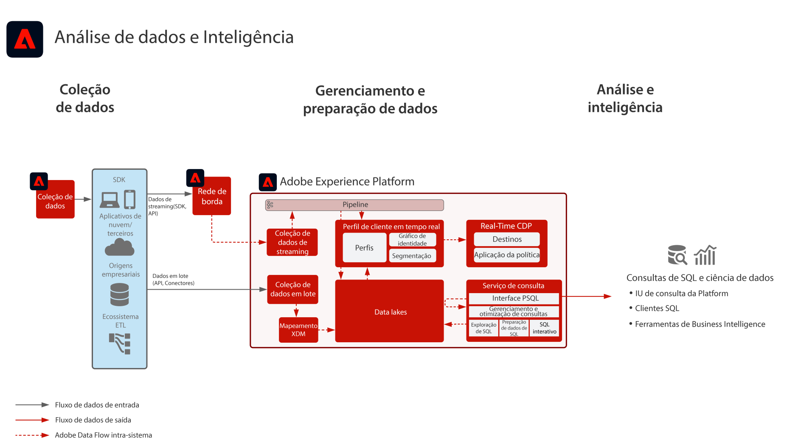

# Blueprint de análise de dados e inteligência

A Análise de dados e Inteligência consiste na capacidade da Adobe Experience Platform de realizar consultas e análises exploratórias dos dados existentes no data lake.

Com o [!UICONTROL Serviço de consulta] da Experience Platform é possível realizar consultas SQL nos dados.

A Experience Platform permite conexões com clientes SQL de terceiros, interfaces e ferramentas de Business Intelligence (BI) para conectar, acessar e consultar os dados diretamente na Experience Platform, usando o protocolo [!DNL PostgreSQL].

## Casos de uso

* Consulta interativa e agregação de dados
* Acesso de linhas e colunas a dados assimilados para exploração e validação
* Painéis e visualização de dados por meio de ferramentas de Business Intelligence

Outros casos de uso comuns para o serviço de query são descritos aqui [Casos de uso do serviço de query](https://experienceleague.adobe.com/docs/experience-platform/query/use-cases/abandoned-browse.html)

## Aplicativos

* Adobe Experience Platform

## Arquitetura

## Medidas de proteção

Consulte a documentação do produto Serviço de consulta para detalhes sobre práticas recomendadas e medidas de proteção.
[Guia do Serviço de consulta](https://experienceleague.adobe.com/docs/experience-platform/query/guardrails.html)

## Etapas de implementação

1. [Crie esquemas](https://experienceleague.adobe.com/?recommended=ExperiencePlatform-D-1-2021.1.xdm) para que os dados sejam assimilados.
1. [Crie conjuntos de dados](https://experienceleague.adobe.com/docs/platform-learn/tutorials/data-ingestion/create-datasets-and-ingest-data.html?lang=pt-BR) para que os dados sejam assimilados.
1. [Assimile dados](https://experienceleague.adobe.com/?recommended=ExperiencePlatform-D-1-2020.1.dataingestion&amp;lang=pt-BR) na Experience Platform.
1. Confirme se os dados estão disponíveis para [[!UICONTROL Serviço de query]](https://experienceleague.adobe.com/docs/platform-learn/tutorials/queries/explore-data.html?lang=pt-BR).
1. [Conecte as ferramentas de Business Intelligence e os clientes SQL ao [!UICONTROL Serviço de consulta]](https://experienceleague.adobe.com/docs/experience-platform/query/clients/overview.html) para visualização, consulta de dados e exploração.

## Documentação relacionada

* [Descrição do produto Adobe Experience Platform Intelligence](https://helpx.adobe.com/br/legal/product-descriptions/adobe-experience-platform-intelligence---product-description.html)
* Documentação do [[!UICONTROL Serviço de consulta]](https://experienceleague.adobe.com/docs/experience-platform/query/home.html?lang=pt-BR)
