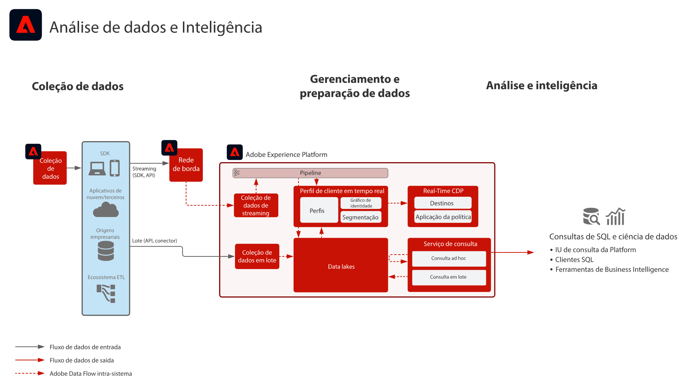

# Blueprint de análise e inteligência de dados

A Análise de dados e a Inteligência incluem a capacidade do Adobe Experience Platform de realizar consultas exploratórias e análises dos dados existentes no lago de dados.

O Experience Platform [!UICONTROL Query Service a1/> permite que consultas SQL sejam executadas nos dados. ] [!UICONTROL O Data Science ] Workspace permite que a exploração de dados, a ciência de dados e as cargas de trabalho de aprendizado de máquina sejam executadas nos dados.

Além disso, o Experience Platform permite que conexões com clientes SQL, interfaces e ferramentas de Business Intelligence (BI) de terceiros se conectem, acessem e consultem diretamente os dados no Experience Platform, usando o protocolo [!DNL PostgreSQL].

Determinadas medidas de proteção se aplicam ao tempo limite da consulta e à quantidade de dados incluídos no resultado da consulta, conforme observado nos detalhes do blueprint.

## Casos de uso

* Consulta interativa e agregação de dados
* Acesso de linhas e colunas a dados assimilados para exploração e validação
* Painéis e visualização de dados por meio de ferramentas de Business Intelligence

## Aplicativos

* Adobe Experience Platform

## Arquitetura

## Medidas de proteção

* Tempo limite de 10 minutos para consultas interativas
* Limite de 100 registros retornados na interface
* Limite de 50.000 registros retornados por meio do conector SQL

## Etapas de implementação

1. Configure conjuntos de dados e esquemas para assimilação de dados no data lake.
1. Assimile os dados.
1. Confirme se os dados estão disponíveis para [!UICONTROL Serviço de consulta] e [!UICONTROL Data Science Workspace] para acesso e consulta brutos.
1. Conecte as ferramentas do Business Intelligence e os clientes SQL a [!UICONTROL Serviço de Consulta] para visualização, consulta de dados e exploração.

## Documentos relacionados

* [Descrição do produto Adobe Experience Platform Intelligence](https://helpx.adobe.com/br/legal/product-descriptions/adobe-experience-platform-intelligence---product-description.html)
* [Documentação do Serviço de consulta](https://experienceleague.adobe.com/docs/experience-platform/query/home.html?lang=pt-BR)
