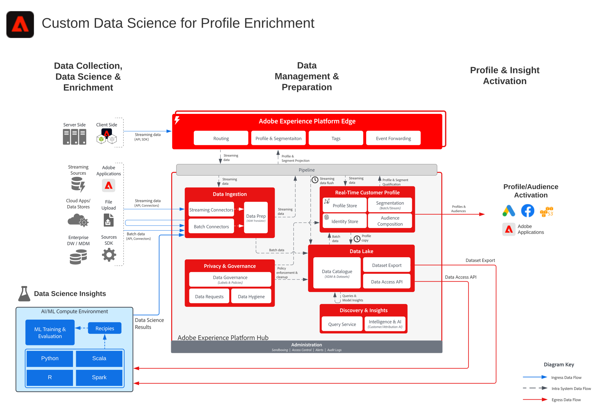

# Blueprint de ciência de dados personalizada para aprimoramento de perfis

O Blueprint de ciência de dados personalizada para aprimoramento de perfis ilustra como os dados na Adobe Experience Platform podem ser usados no [!UICONTROL Data Science Workspace] para treinar, implantar e pontuar modelos a fim de fornecer insights de aprendizado de máquina. Esses modelos podem ser enviados diretamente para um conjunto de dados habilitado para o [!UICONTROL Perfil de cliente em tempo real] para aprimorar ainda mais os perfis de clientes. Esses insights podem ser utilizados na personalização. Exemplos de insights de aprendizado de máquina incluem pontuação de valor vitalício, afinidade de categorias e produtos, propensão à conversão ou à rotatividade.

## Casos de uso

* Extraia insights e descubra padrões a partir de dados do cliente na Experience Platform. Treine e classifique modelos com esses dados.
* Aprimore o [!UICONTROL Perfil de cliente em tempo real] com insights e atributos orientados por modelos para uma personalização mais detalhada e jornadas aperfeiçoadas.
* Treine e classifique modelos para determinar insights do cliente, como valor vitalício do cliente, propensão à conversão ou à rotatividade, afinidade de conteúdos e produtos e classificação de engajamentos.

## Arquitetura

## Etapas de implementação

1. [Crie esquemas](https://experienceleague.adobe.com/?recommended=ExperiencePlatform-D-1-2021.1.xdm) para que os dados sejam assimilados.
1. [Crie conjuntos de dados](https://experienceleague.adobe.com/docs/platform-learn/tutorials/data-ingestion/create-datasets-and-ingest-data.html?lang=pt-BR) para que os dados sejam assimilados.
1. [Assimile dados](https://experienceleague.adobe.com/?recommended=ExperiencePlatform-D-1-2020.1.dataingestion&amp;lang=pt-BR) na Experience Platform.
1. [Crie um DSW notebook](https://experienceleague.adobe.com/docs/platform-learn/tutorials/data-science-workspace/load-data-in-jupyterlab-notebooks.html?lang=pt-BR).
1. Escolha um idioma. Python e PySpark são compatíveis.
1. [Crie um modelo](https://experienceleague.adobe.com/docs/platform-learn/tutorials/data-science-workspace/recipe-builder-template.html?lang=pt-BR) no notebook.
1. [Treine o modelo](https://experienceleague.adobe.com/docs/platform-learn/tutorials/data-science-workspace/schedule-training-scoring.html?lang=pt-BR).
1. [Classifique o modelo](https://experienceleague.adobe.com/docs/platform-learn/tutorials/data-science-workspace/schedule-training-scoring.html?lang=en) para gerar predições com os dados do público-alvo.
1. [Habilite o conjunto de dados de resultados do modelo para perfil em caso de envio de resultados do modelo para o [!UICONTROL Perfil de cliente em tempo real]](https://experienceleague.adobe.com/docs/platform-learn/tutorials/data-science-workspace/dsw-profile-segmentation.html?lang=pt-BR).

## Documentação relacionada

* [Descrição do produto Adobe Experience Platform Intelligence](https://helpx.adobe.com/br/legal/product-descriptions/adobe-experience-platform-intelligence---product-description.html)
* Documentação do [[!UICONTROL Data Science Workspace]](https://experienceleague.adobe.com/docs/experience-platform/data-science-workspace/home.html?lang=pt-BR)
* Tutoriais do [[!UICONTROL Data Science Workspace]](https://experienceleague.adobe.com/docs/platform-learn/tutorials/data-science-workspace/understanding-data-science-workspace.html?lang=pt-BR)

## Publicações do blog relacionadas

* [[!DNL Simplifying the Data Science Lifecycle with Adobe Platform Experience]](https://medium.com/adobetech/simplifying-the-data-science-lifecycle-with-adobe-platform-experience-8ea4f056d82f)
* [[!DNL Content and Commerce AI: Personalizing Your Interactions with Customers Through Content Intelligence]](https://medium.com/adobetech/content-and-commerce-ai-personalizing-your-interactions-with-customers-through-content-intelligence-dc182601deab)
* [[!DNL Gaining a Deeper Understanding of Churn Using Data Science Workspace]](https://medium.com/adobetech/gaining-a-deeper-understanding-of-churn-using-data-science-workspace-18a2190e0cf3)
* [[!DNL Understanding Data Science In Adobe Experience Platform]](https://medium.com/adobetech/understanding-data-science-in-adobe-experience-platform-5bce5a17b42)
* [[!DNL An Introductory Look at Exploratory Data Analysis on Adobe Experience Platform]](https://medium.com/adobetech/an-introductory-look-at-exploratory-data-analysis-on-adobe-experience-platform-1bfce7501d9a)
* [[!DNL Cutting Across Adobe Experience Products with Machine Learning to Elevated User Experience]](https://medium.com/adobetech/cutting-across-adobe-experience-products-with-machine-learning-to-elevated-user-experience-7c85000510d1)
* [[!DNL Modeling XDM Data for Data Science at Scale on Adobe Experience Platform]](https://medium.com/adobetech/modeling-xdm-data-for-data-science-at-scale-on-adobe-experience-platform-222bb2a6dbf7)
* [[!DNL Segmentation.AI: Automated Audience-Clustering-as-a-Service in Adobe Experience Platform]](https://medium.com/adobetech/segmentation-ai-automated-audience-clustering-as-a-service-in-adobe-experience-platform-261f4099462c)
* [[!DNL Reimagining Jupyter Notebooks for Enterprise Scale]](https://medium.com/adobetech/reimagining-jupyter-notebooks-for-enterprise-scale-8bc6340d504a)
* [[!DNL Accelerate Intelligent Insights with Adobe Experience Platform Data Science Workspace]](https://medium.com/adobetech/accelerate-intelligent-insights-with-adobe-experience-platform-data-science-workspace-89538bacbbea)
* [[!DNL A Preview of Time Series Forecasting with Adobe Experience Platform]](https://medium.com/adobetech/preview-of-time-series-forecasting-with-adobe-experience-platform-38a2fc778e89)
* [[!DNL Cutting Across Adobe Experience Products with Machine Learning to Elevated User Experience]](https://medium.com/adobetech/cutting-across-adobe-experience-products-with-machine-learning-to-elevated-user-experience-7c85000510d1)
