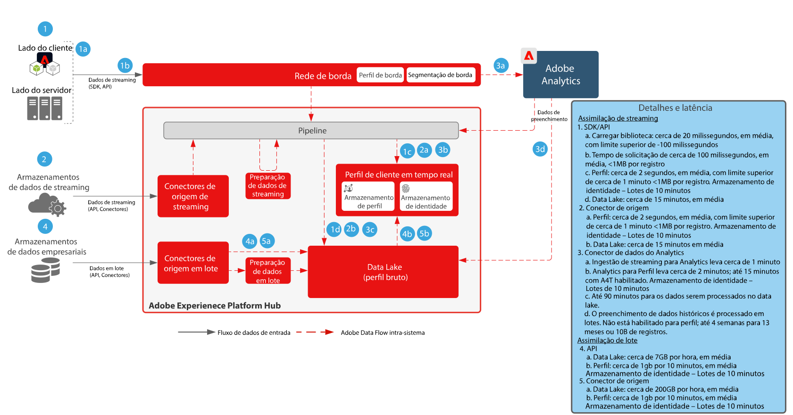
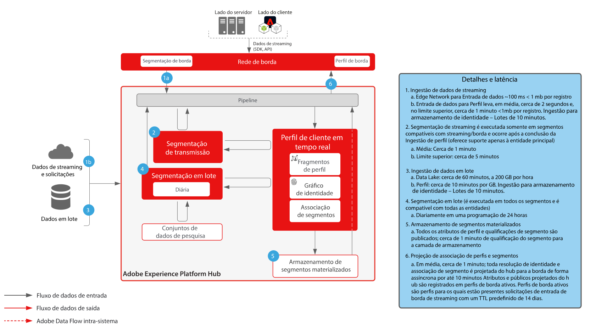
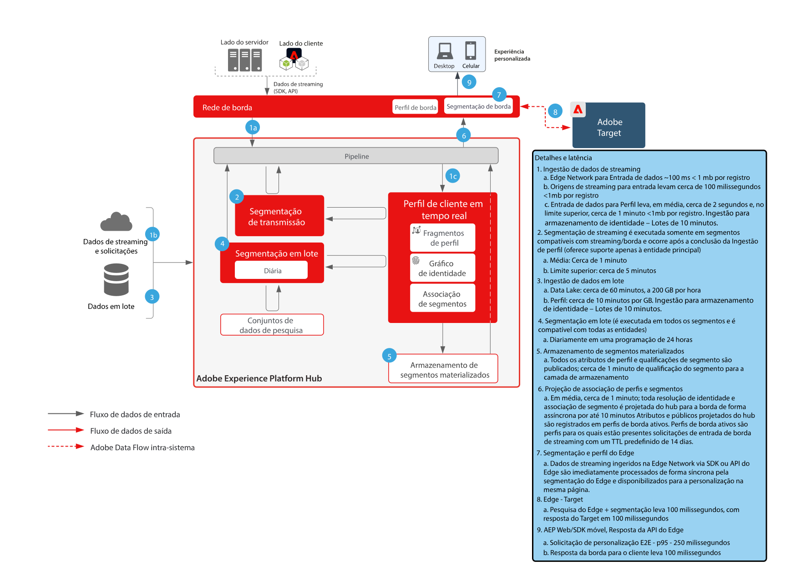
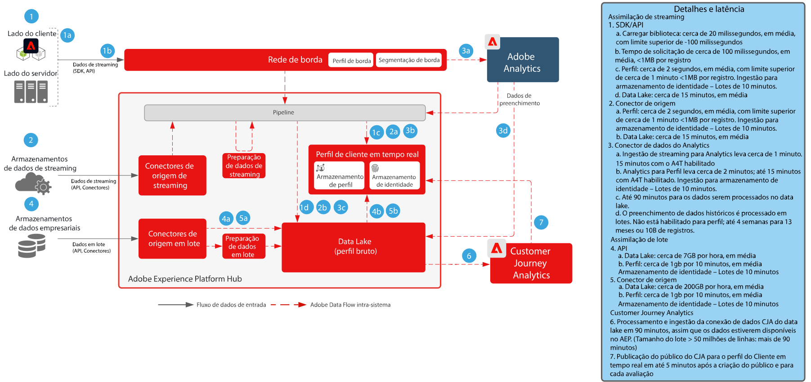
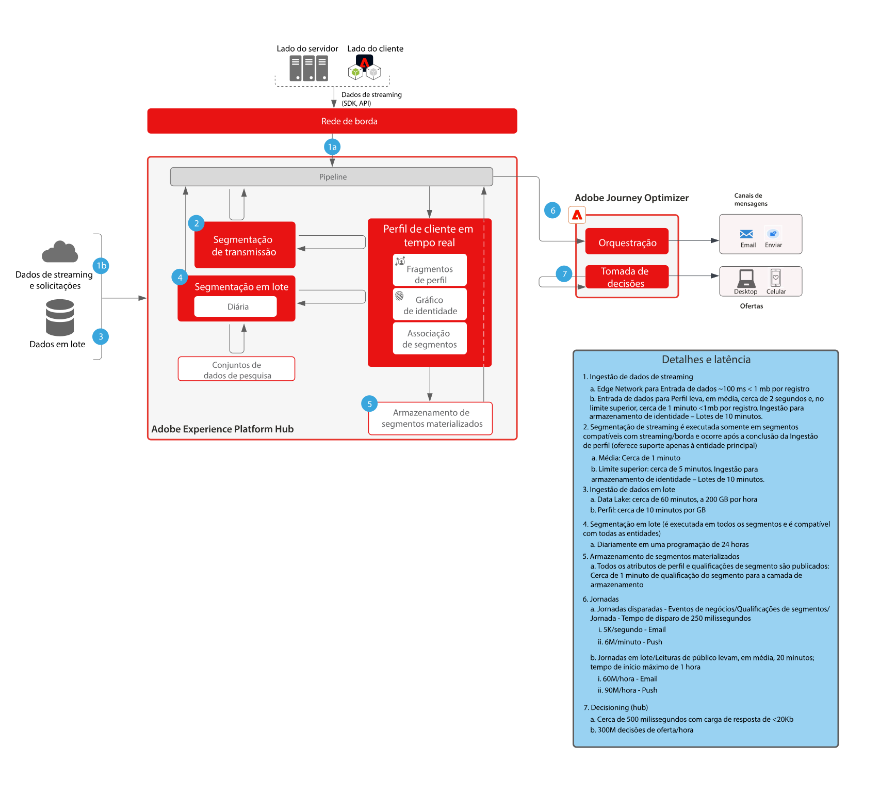

# Medidas de proteção

As medidas de proteção são limites recomendados que oferecem orientação para o uso de dados e sistemas, otimizando o desempenho e evitando erros ou resultados inesperados na Adobe Experience Platform e nos Aplicativos da Adobe. As medidas de proteção destinam-se a refletir as restrições do sistema e as expectativas de desempenho para facilitar a otimização do desempenho de casos de uso e da arquitetura do cliente. As medidas de proteção não se destinam a ser contratos de nível de serviço. Para acessar informações sobre contratos de nível de serviço específicos do produto, consulte a documentação de Descrições do produto vinculada abaixo.

## Documentação de referência sobre as medidas de proteção da Adobe Experience Platform e dos aplicativos da Adobe

[Proteção da assimilação de dados](https://experienceleague.adobe.com/docs/experience-platform/ingestion/guardrails.html?lang=pt-BR)

[Proteção à API de rede de borda](https://experienceleague.adobe.com/docs/experience-platform/edge-network-server-api/guardrails.html?lang=pt-BR)

[Medidas de proteção do perfil do cliente em tempo real](https://experienceleague.adobe.com/docs/experience-platform/profile/guardrails.html?lang=pt-BR)

[Medidas de proteção de identidade](https://experienceleague.adobe.com/docs/experience-platform/identity/guardrails.html?lang=pt-BR)

[Proteções de compartilhamento de público do Customer Journey Analytics](https://experienceleague.adobe.com/docs/analytics-platform/using/cja-components/audiences/publish.html?lang=pt-BR#latency)

[Proteções de assimilação de dados do Customer Journey Analytics](https://experienceleague.adobe.com/docs/experience-platform/sources/connectors/adobe-applications/analytics.html?lang=pt-BR#what-is-the-expected-latency-for-analytics-data-on-platform%3F)

[Medidas de proteção do serviço de Query](https://experienceleague.adobe.com/docs/experience-platform/query/guardrails.html?lang=pt-BR)

[Medidas de proteção de ativação de destino](https://experienceleague.adobe.com/docs/experience-platform/destinations/guardrails.html?lang=pt-BR)

[Medidas de proteção do Journey Optimizer](https://experienceleague.adobe.com/docs/journey-optimizer/using/get-started/guardrails.html?lang=pt-BR)

 

## Diagramas de latência de ponta a ponta

### Assimilação de dados

 

### Segmentação

 

### Real-time Customer Data Platform e Adobe Target

 

### Customer Journey Analytics

 

### Journey Optimizer

 

## Descrições dos produtos

[Experience Platform Collection Enterprise](https://helpx.adobe.com/br/legal/product-descriptions/adobe-experience-platform-collection-enterprise.html)

[Real-time Customer Data Platform](https://helpx.adobe.com/br/legal/product-descriptions/real-time-customer-data-platform.html)

[B2B Customer Data Platform](https://helpx.adobe.com/br/legal/product-descriptions/adobe-experience-platform-b2b.html)

[Experience Platform Activation](https://helpx.adobe.com/br/legal/product-descriptions/adobe-experience-platform0.html)

[Experience Platform Intelligence](https://helpx.adobe.com/br/legal/product-descriptions/adobe-experience-platform-intelligence---product-description.html)

[Serviços inteligentes](https://helpx.adobe.com/br/legal/product-descriptions/intelligent-services.html)

[Data Distiller](https://helpx.adobe.com/br/legal/product-descriptions/data-distiller.html)

[Customer Journey Analytics](https://helpx.adobe.com/br/legal/product-descriptions/customer-journey-analytics.html)

[Journey Optimizer](https://helpx.adobe.com/br/legal/product-descriptions/adobe-journey-optimizer.html)

[Journey Orchestration](https://helpx.adobe.com/br/legal/product-descriptions/journey-orchestration.html)

[Offer Decisioning](https://helpx.adobe.com/br/legal/product-descriptions/offer-decisioning-app-service.html)
