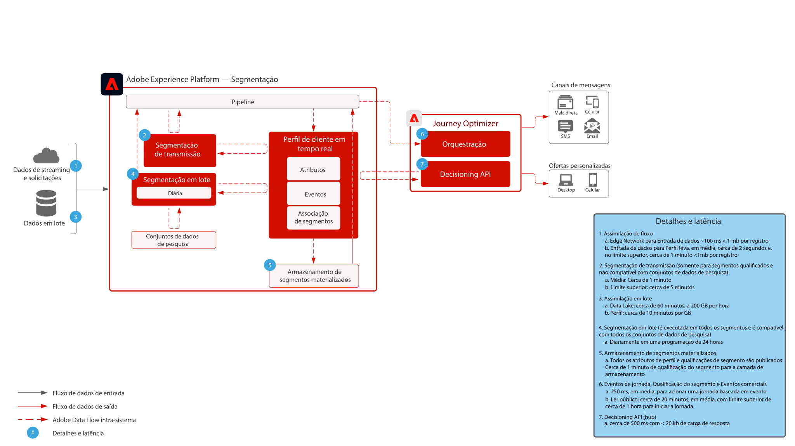

# Medidas de proteção

As medidas de proteção são limites recomendados que fornecem orientação para o uso de dados e sistema, otimizando o desempenho e evitando erros ou resultados inesperados no Adobe Experience Platform e em aplicativos. As garantias destinam-se a refletir as restrições do sistema e as expectativas de desempenho para facilitar a arquitetura do cliente e a otimização do desempenho do caso de uso. As garantias não se destinam a ser contratos de nível de serviço. Para obter informações sobre contratos de nível de serviço específicos do produto, consulte a documentação Descrições do produto vinculada abaixo.

## Garantias para Adobe Experience Platform e Aplicativos

[Medidas de proteção da assimilação de dados](https://experienceleague.adobe.com/docs/experience-platform/ingestion/guardrails.html?lang=en)

[Proteção da API de rede de borda](https://experienceleague.adobe.com/docs/experience-platform/edge-network-server-api/guardrails.html?lang=en)

[Medidas de proteção de perfil do cliente em tempo real](https://experienceleague.adobe.com/docs/experience-platform/profile/guardrails.html?lang=en)

[Medidas de proteção de identidade](https://experienceleague.adobe.com/docs/experience-platform/identity/guardrails.html?lang=en)

[Medidas de Proteção do Serviço de Consulta](https://experienceleague.adobe.com/docs/experience-platform/query/guardrails.html?lang=en)

[Medidas de Proteção de Ativação de Destino](https://experienceleague.adobe.com/docs/experience-platform/destinations/guardrails.html)

[Journey Optimizer Guardrails](https://experienceleague.adobe.com/docs/journey-optimizer/using/get-started/guardrails.html?lang=en)

 

## Latência de Fim a Fim

### Assimilação de dados

O diagrama abaixo ilustra as medidas de proteção de desempenho médio e a latência para a assimilação de dados na Adobe Experience Platform.

 

### Journey Optimizer

 

## Descrições do produto

[Experience Platform Collection Enterprise](https://helpx.adobe.com/legal/product-descriptions/adobe-experience-platform-collection-enterprise.html)

[Real-time Customer Data Platform](https://helpx.adobe.com/br/legal/product-descriptions/real-time-customer-data-platform.html)

[Plataforma de dados do cliente B2B](https://helpx.adobe.com/legal/product-descriptions/adobe-experience-platform-b2b.html)

[Experience Platform Activation](https://helpx.adobe.com/br/legal/product-descriptions/adobe-experience-platform0.html)

[Experience Platform Intelligence](https://helpx.adobe.com/legal/product-descriptions/adobe-experience-platform-intelligence---product-description.html)

[Serviços inteligentes](https://helpx.adobe.com/legal/product-descriptions/intelligent-services.html)

[Customer Journey Analytics](https://helpx.adobe.com/br/legal/product-descriptions/customer-journey-analytics.html)

[Journey Optimizer](https://helpx.adobe.com/legal/product-descriptions/adobe-journey-optimizer.html)

[Journey Orchestration](https://helpx.adobe.com/legal/product-descriptions/journey-orchestration.html)

[Offer Decisioning](https://helpx.adobe.com/legal/product-descriptions/offer-decisioning-app-service.html)
