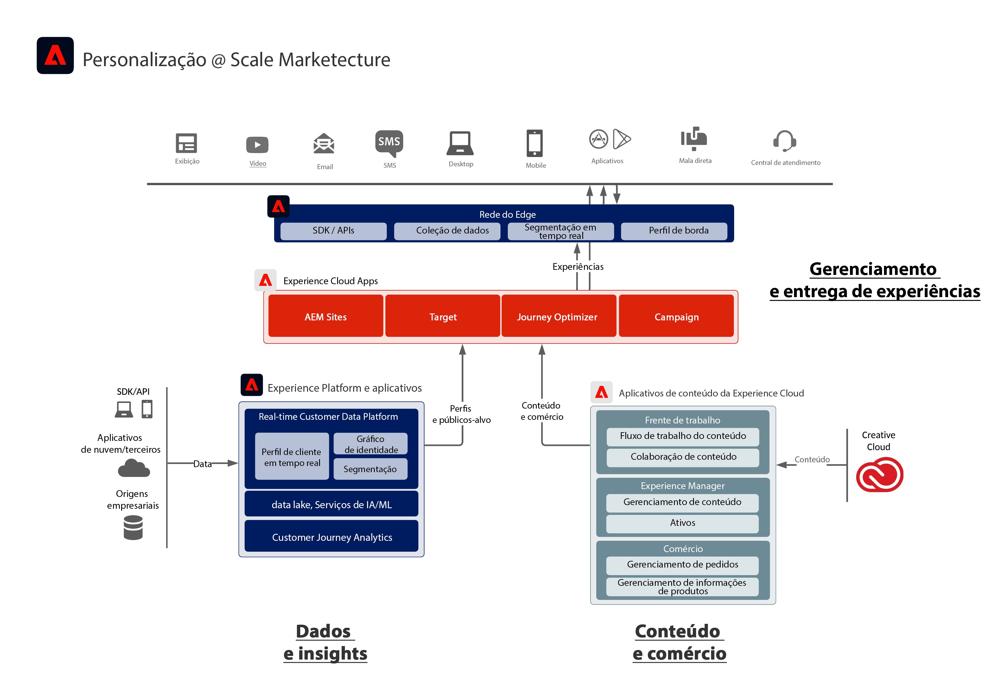

# Diagrama de arquitetura da Adobe Experience Cloud

O diagrama de arquitetura abaixo ilustra como a Adobe Experience Platform se conecta e se integra aos aplicativos da Adobe Experience Cloud para fornecer entrega de dados, conteúdo e experiência com personalização em grande escala.

 
O diagrama de arquitetura abaixo ilustra como os aplicativos da Adobe Experience Cloud e da Adobe Experience Platform encaixam-se em uma arquitetura de experiência de cliente empresarial.

