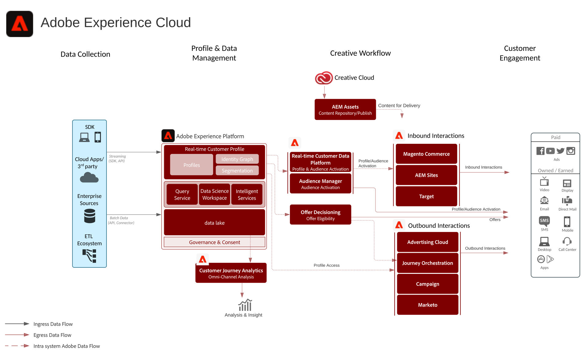

# Diagrama de arquitetura do Adobe Experience Cloud

Este diagrama de arquitetura mostra como aplicativos Adobe Experience Cloud, serviços de aplicativos e Adobe Experience Platform se encaixam em uma arquitetura de marketing empresarial.

