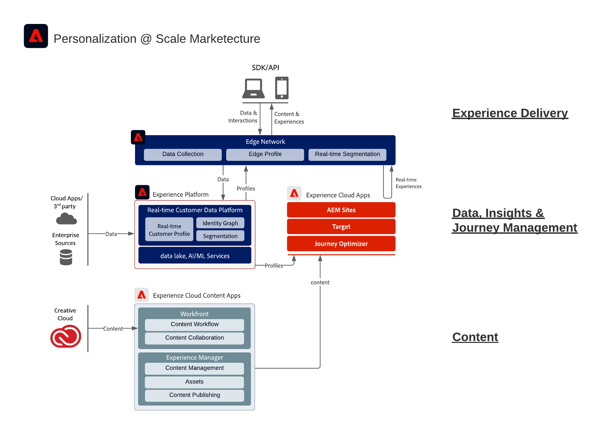

# Diagrama de arquitetura da Adobe Experience Cloud

O diagrama de arquitetura abaixo ilustra como os aplicativos da Adobe Experience Cloud e da Adobe Experience Platform encaixam-se em uma arquitetura de experiência de cliente empresarial.

 
 
O diagrama de arquitetura abaixo ilustra como o Adobe Experience Platform se conecta e se integra aos aplicativos do Adobe Experience Cloud para obter personalização em escala na entrega de dados, conteúdo e experiência.
 
 

 
 
O diagrama de arquitetura abaixo ilustra como a Adobe Experience Platform se conecta e se integra aos aplicativos do Adobe Experience Cloud.
  
 

