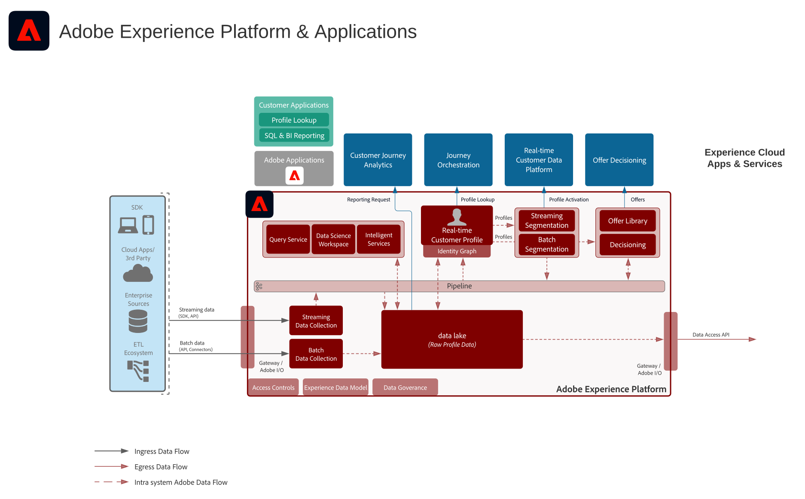
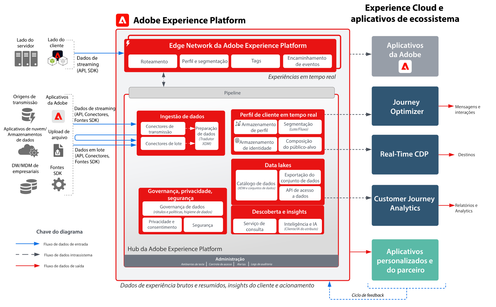

# Diagramas da arquitetura de aplicativos e Adobe Experience Platform

Esses diagramas de arquitetura mostram como o Experience Platform (AEP) está relacionado a outros aplicativos e serviços de aplicativos da Experience Cloud.

>[!MORELIKETHIS]
>
>[Configurações de Integração para Integrações de Aplicativos Experience Cloud](https://experienceleague.adobe.com/docs/integrations-learn/experience-cloud/overview.html?lang=pt-BR).

## Diagrama de arquitetura

Este diagrama de arquitetura apresenta como a Adobe Experience Platform se relaciona com aplicativos e serviços de aplicativos da Adobe Experience Cloud.

## Diagrama de visão geral

## Diagrama detalhado da arquitetura

>[!VIDEO](https://video.tv.adobe.com/v/3422785/?quality=12&learn=on&captions=por_br)

## Integrações de aplicativos AEP e Experience Cloud

| Aplicativo | Experience Platform para Aplicativo | Aplicativo para Experience Platform |
|------------------------------|-----------------------------------|-----------------------------------|
| **Ad Cloud** | - Os públicos-alvo definidos na Real-time Customer Data Platform podem ser compartilhados com a Ad Cloud para direcionamento por meio da Audience Manager. | - Nenhuma integração atual |
| **Analytics** | - Os dados coletados pela Web/SDK móvel podem ser encaminhados para a Adobe Analytics. | - Os dados coletados pelo Analytics podem ser enviados para o data lake e o armazenamento de perfis da Experience Platform. [Conector de dados do Analytics](https://experienceleague.adobe.com/docs/experience-platform/sources/connectors/adobe-applications/analytics.html?lang=pt-BR) |
| **Audience Manager** | - Os públicos-alvo definidos na Real-time Customer Data Platform podem ser compartilhados com a Audience Manager para ativação em destinos de cookies de terceiros. | - Os dados coletados e avaliados junto com a associação do público-alvo da Audience Manager podem ser compartilhados com o data lake e o armazenamento de perfis da Experience Platform. [Conector de origem do Audience Manager](https://experienceleague.adobe.com/docs/experience-platform/sources/connectors/adobe-applications/audience-manager.html?lang=pt-BR) |
| **Adobe Campaign** | - Os públicos-alvo definidos na Real-time Customer Data Platform podem ser compartilhados com a Campaign Classic para iniciar campanhas. | - Os dados de interação e campanha coletados pelo Campaign podem ser assimilados no Experience Platform para uso adicional na criação de público, no Customer Journey Analytics e no Serviço de consulta. |
| **Campaign Standard** | - Os públicos-alvo definidos na Real-time Customer Data Platform podem ser compartilhados com a Campaign Standard para iniciar campanhas. | - Os dados de interação e campanha coletados pelo Campaign podem ser assimilados no Experience Platform para uso adicional. |
| **Customer Journey Analytics** | - Os dados coletados e assimilados no data lake da Experience Platform estão disponíveis para processamento no Customer Journey Analytics.   - Os dados de perfil e público-alvo da Real-time Customer Data Platform podem ser assimilados na CJA. [Integração do RTCDP com o CJA](https://experienceleague.adobe.com/docs/analytics-platform/using/cja-usecases/ingest-aep-segments.html?lang=pt-BR) | : crie públicos-alvo no CJA e compartilhe os resultados de público-alvo na Real-time Customer Data Platform. [Publicação de público-alvo do CJA](https://experienceleague.adobe.com/docs/analytics-platform/using/cja-components/audiences/publish.html?lang=pt-BR) |
| **Experience Manager** | - O perfil do Experience Platform pode ser acessado no lado do servidor para potencializar experiências personalizadas no Experience Manager. | - Sem integração atual, as interações realizadas nos sites do Experience Manager são coletadas pela Experience Platform Web e pelo Mobile SDK. |
| **Journey Optimizer** | - Os eventos de dados e perfis assimilados na Experience Platform são disponibilizados na Journey Optimizer. | - Os dados de interação e campanha produzidos pelo Journey Optimizer são coletados no Experience Platform para uso adicional. |
| **Adobe Commerce** | - Perfis e públicos-alvo integrados à Plataforma de dados do cliente em tempo real podem ser usados para personalização no Adobe Commerce. | - Os dados nativos do Adobe Commerce podem ser enviados para a Experience Platform por meio de um conector de origem do Adobe Commerce. |
| **Marketo** | - Os públicos-alvo definidos na Real-time Customer Data Platform podem ser compartilhados com a Marketo para iniciar campanhas e atualizar objetos. | : contas, contatos e dados de campanha do Marketo são assimilados na Experience Platform para análise adicional. [Conector do Marketo Engage](https://experienceleague.adobe.com/docs/experience-platform/sources/connectors/adobe-applications/marketo/marketo.html?lang=pt-BR) |
| **Real-Time CDP** | : os dados assimilados na Experience Platform são a fonte de perfis de clientes em tempo real que potencializam a Real-time Customer Data Platform. | : as métricas de público-alvo e perfil são enviadas ao data lake da Experience Platform para obter insights. |
| **Target** | : públicos-alvo e atributos de perfil da Real-time Customer Data Platform podem ser compartilhados com o Target para personalização. | - Os dados coletados para experiências do Target podem ser enviados ao Experience Platform para a criação de público-alvo e análise. |
