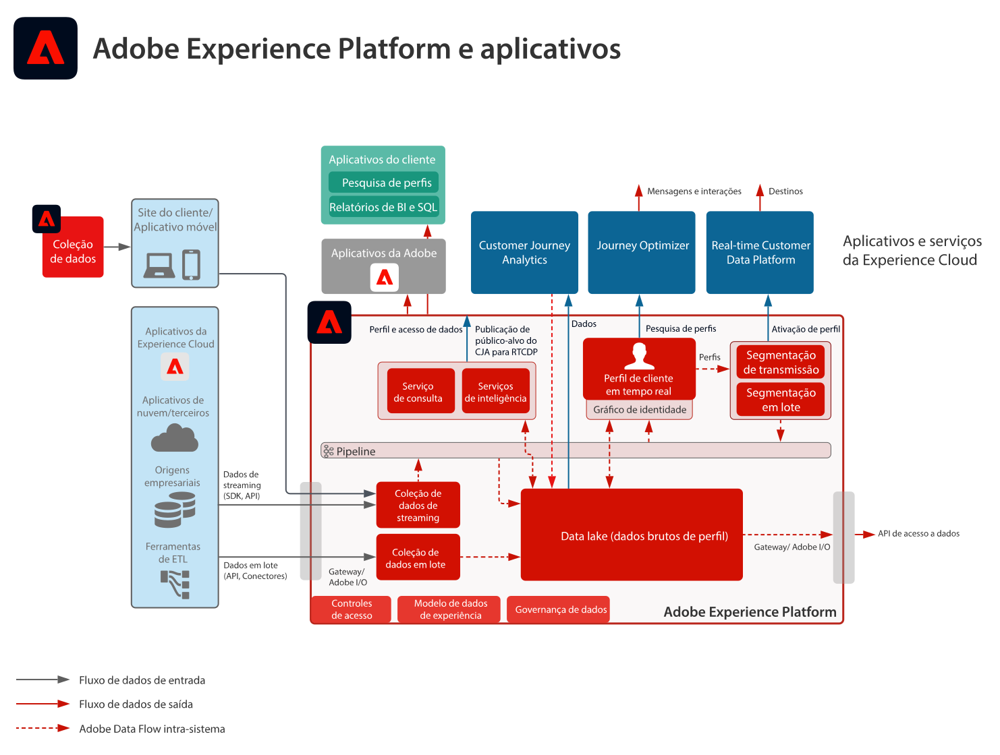

# Adobe Experience Platform e Aplicativos

## Adobe Experience Platform e Diagrama de arquitetura de aplicativos

Este diagrama de arquitetura apresenta como a Adobe Experience Platform se relaciona com aplicativos e serviços de aplicativos da Adobe Experience Cloud.

>[!VIDEO](https://video.tv.adobe.com/v/32456/?quality=12&learn=on)

## Adobe Experience Platform e diagrama detalhado de arquitetura de aplicativos

## Adobe Experience Platform e Integrações de aplicativos da Experience Cloud

<table class="relative-table wrapped" style="width: 100%;" >
   <colgroup>
    <col style="width: 16.0202%;"/>
    <col style="width: 29.3423%;"/>
    <col style="width: 33.5582%;"/>
    <col style="width: 21.0793%;"/>
  </colgroup>
  <tbody>
    <tr>
      <th>Aplicativo</th>
      <th>Experience Platform para Aplicativo</th>
      <th>Aplicativo para Experience Platform</th>
      <th>Blueprints relacionados</th>
    </tr>
    <tr>
      <td colspan="1">Ad Cloud</td>
      <td colspan="1">
        <ul>
          <li>Os públicos-alvos definidos na Plataforma de dados do cliente em tempo real podem ser compartilhados com a Ad Cloud para direcionamento por meio do Audience Manager.</li>
        </ul>
      </td>
      <td colspan="1">Sem integração atual</td>
      <td colspan="1">
        <ul>
          <li>
            <a href="https://experienceleague.adobe.com/docs/blueprints-learn/architecture/audience-activation/anonymous.html?lang=pt-BR">Ativação de público-alvo anônima</a>
          </li>
          <li>
            <a href="https://experienceleague.adobe.com/docs/blueprints-learn/architecture/audience-activation/online-offline.html?lang=pt-BR">Ativação de público-alvo online/offline</a>
          </li>
          <li>
            <a href="https://experienceleague.adobe.com/docs/blueprints-learn/architecture/audience-activation/platform-and-applications.html?lang=pt-BR">Ativação com a Experience Platform e aplicativos</a>
          </li>
        </ul>
      </td>
    </tr>
    <tr>
      <td>Analytics</td>
      <td>Sem integração atual</td>
      <td>
        <ul>
          <li>É possível enviar os dados coletados pelo Analytics para o data lake e para o armazenamento de perfis da Experience Platform. <a href="https://experienceleague.adobe.com/docs/experience-platform/sources/connectors/adobe-applications/analytics.html?lang=pt-BR">Conector de dados do Analytics</a>
          </li>
        </ul>
      </td>
      <td>
        <ul>
          <li>
            <a href="https://experienceleague.adobe.com/docs/blueprints-learn/architecture/architecture-overview/platform-data-flow.html?lang=pt-BR">Fluxos de dados da Experience Platform</a>
          </li>
        </ul>
        

           
        

      </td>
    </tr>
    <tr>
      <td>Audience Manager</td>
      <td>
        <ul>
          <li>Os públicos-alvos definidos na Plataforma de dados do cliente em tempo real podem ser compartilhados com o Audience Manager para ativação para destinos de cookies de terceiros.</li>
        </ul>
      </td>
      <td>
        <ul>
          <li>Os dados coletados e a associação de públicos-alvos avaliados podem ser compartilhados com o data lake e o armazenamento de perfis da Experience Platform. <a href="https://experienceleague.adobe.com/docs/experience-platform/sources/connectors/adobe-applications/audience-manager.html?lang=pt-BR">Conector de origem do Audience Manager</a>
          </li>
        </ul>
      </td>
      <td>
        <ul>
          <li>
            <a href="https://experienceleague.adobe.com/docs/blueprints-learn/architecture/audience-activation/anonymous.html?lang=en">Ativação de público-alvo anônima</a>
          </li>
          <li>
            <a href="https://experienceleague.adobe.com/docs/blueprints-learn/architecture/audience-activation/online-offline.html?lang=en">Ativação de público-alvo online/offline</a>
          </li>
          <li>
            <a href="https://experienceleague.adobe.com/docs/blueprints-learn/architecture/audience-activation/platform-and-applications.html?lang=en">Ativação com a Experience Platform e aplicativos</a>
          </li>
        </ul>
      </td>
    </tr>
    <tr>
      <td colspan="1">Campaign Classic</td>
      <td colspan="1">
        <ul>
          <li>Os públicos-alvos definidos na Plataforma de dados do cliente em tempo real podem ser compartilhados com o Campaign Classic como público-alvo a iniciar campanhas.</li>
        </ul>
      </td>
      <td colspan="1">
        <ul>
          <li>Os dados de interação e de campanhas coletados pelo Campaign podem ser assimilados na Experience Platform como uma fonte de dados para uso adicional na criação de públicos-alvos e na análise. A criação de públicos-alvos se dá por meio da Plataforma de dados do cliente em tempo real, e na análise, por meio do Customer Journey Analytics, do Serviço de consulta da Experience Platform e do Data Science Workspace.</li>
        </ul>
      </td>
      <td colspan="1">
        <ul>
          <li>
            <a href="https://experienceleague.adobe.com/docs/blueprints-learn/architecture/customer-journeys/batch-messaging.html?lang=pt-BR">Mensagens em lote</a>
          </li>
        </ul>
      </td>
    </tr>
    <tr>
      <td colspan="1">Campaign Standard</td>
      <td colspan="1">
        <ul>
          <li>Os públicos-alvos definidos na Plataforma de dados do cliente em tempo real podem ser compartilhados com o Campaign Standard como público-alvo a iniciar campanhas.</li>
        </ul>
      </td>
      <td colspan="1">
        <ul>
          <li>Os dados de interação e de campanhas coletados pelo Campaign podem ser assimilados na Experience Platform como uma fonte de dados para uso adicional na criação de públicos-alvos e na análise. A criação de públicos-alvos se dá por meio da Plataforma de dados do cliente em tempo real, e na análise, por meio do Customer Journey Analytics, do Serviço de consulta da Experience Platform e do Data Science Workspace.</li>
        </ul>
      </td>
      <td colspan="1">
        <ul>
          <li>
            <a href="https://experienceleague.adobe.com/docs/blueprints-learn/architecture/customer-journeys/batch-messaging.html?lang=en">Mensagens em lote</a>
          </li>
        </ul>
      </td>
    </tr>
    <tr>
      <td colspan="1">Customer Journey Analytics</td>
      <td colspan="1">
        <ul>
          <li>Os dados coletados e assimilados no data lake da Experience Platform são disponibilizados para processamento no Customer Journey Analytics. </li>
        </ul>
      </td>
      <td colspan="1">Não há integração atual disponível. A capacidade de compartilhar os resultados do público-alvo na Experience Platform diretamente do Customer Journey Analytics está no roteiro.</td>
      <td colspan="1">
        <ul>
          <li>
            <a href="https://experienceleague.adobe.com/docs/blueprints-learn/architecture/customer-journey-analytics/overview.html?lang=pt-BR">Customer Journey Analytics</a>
          </li>
        </ul>
      </td>
    </tr>
    <tr>
      <td colspan="1">Experience Manager</td>
      <td colspan="1">
        <ul>
          <li>O perfil da Experience Platform pode ser acessado diretamente do lado do servidor para potencializar experiências personalizadas fornecidas por meio do Experience Manager. Observe que as atividades de personalização são mais comumente fornecidas pelo Experience Manager por meio da integração do Target. </li>
        </ul>
      </td>
      <td colspan="1">Nenhuma integração, comportamento e interações atuais executados nos sites do Experience Manager são coletados diretamente pelo SDK móvel e da Web da Experience Platform.</td>
      <td colspan="1">
        <ul>
          <li>
            <a href="https://experienceleague.adobe.com/docs/blueprints-learn/architecture/audience-activation/online-offline.html?lang=en">Ativação de público-alvo online/offline</a>
          </li>
        </ul>
      </td>
    </tr>
    <tr>
      <td colspan="1">Journey Optimizer</td>
      <td colspan="1">
        <ul>
          <li>Os eventos de dados e os perfis assimilados na Experience Platform são disponibilizados para o Journey Optimizer para inicialização e potencialização de jornadas.</li>
        </ul>
      </td>
      <td colspan="1">
        <ul>
          <li>Os dados de interação e de campanhas produzidos pelo Journey Optimizer são coletados para a Experience Platform para uso adicional na criação de públicos-alvos e na análise. A criação de públicos-alvos se dá por meio da Plataforma de dados do cliente em tempo real, e na análise, por meio do Customer Journey Analytics, do Serviço de consulta da Experience Platform e do Data Science Workspace.</li>
        </ul>
      </td>
      <td colspan="1">
        <ul>
          <li>
            <a href="https://experienceleague.adobe.com/docs/blueprints-learn/architecture/customer-journeys/journey-optimizer.html?lang=en">Journey Optimizer</a>
          </li>
        </ul>
      </td>
    </tr>
    <tr>
      <td colspan="1">Magento</td>
      <td colspan="1">Sem integração atual</td>
      <td colspan="1">Sem integração atual</td>
      <td colspan="1">Sem integração atual</td>
    </tr>
    <tr>
      <td colspan="1">Marketo</td>
      <td colspan="1">
        <ul>
          <li>Os públicos-alvos definidos na Plataforma de dados do cliente em tempo real podem ser compartilhados com o Marketo como público-alvo a iniciar campanhas do Marketo e atualizar objetos do Marketo.</li>
        </ul>
      </td>
      <td colspan="1">
        <ul>
          <li>Contas, contatos e dados de oportunidade do Marketo, juntamente com dados de interação e de campanhas produzidos pelo Marketo são assimilados na Experience Platform para uso adicional na criação de público-alvo por meio de B2B-CDP. Também para uso na análise, por meio do Customer Journey Analytics, do Serviço de consulta da Experience Platform e do Data Science Workspace. <a href="https://experienceleague.adobe.com/docs/experience-platform/sources/connectors/adobe-applications/marketo/marketo.html?lang=pt-BR">Conector do Marketo Engage</a>
          </li>
        </ul>
      </td>
      <td colspan="1">
        <ul>
          <li>Ativação B2B - em desenvolvimento</li>
        </ul>
      </td>
    </tr>
    <tr>
      <td colspan="1">CDP em tempo real</td>
      <td colspan="1">
        <ul>
          <li>Os dados assimilados e coletados para a Experience Platform são a fonte de dados para a montagem de perfis de clientes em tempo real que alimentam a Plataforma de dados do cliente em tempo real.</li>
        </ul>
      </td>
      <td colspan="1">
        <ul>
          <li>As métricas de públicos-alvos e de perfis são enviadas para o data lake da Experience Platform para alimentar os painéis de relatórios de insights do perfil.</li>
          <li>É possível usar os dados de públicos-alvos e de perfis no data lake para obter insights adicionais por meio do Serviço de consulta, do Data Science Workspace e do Customer Journey Analytics.</li>
        </ul>
      </td>
      <td colspan="1">
        <ul>
          <li>
            <a href="https://experienceleague.adobe.com/docs/blueprints-learn/architecture/audience-activation/online-offline.html?lang=en">Ativação de público-alvo online/offline</a>
          </li>
          <li>
            <a href="https://experienceleague.adobe.com/docs/blueprints-learn/architecture/audience-activation/platform-and-applications.html?lang=en">Ativação com a Experience Platform e aplicativos</a>
          </li>
        </ul>
      </td>
    </tr>
    <tr>
      <td colspan="1">Target</td>
      <td colspan="1">
        <ul>
          <li>Os públicos-alvos definidos na Plataforma de dados do cliente em tempo real podem ser compartilhados com o Target e usados em experiências de personalização e direcionamento fornecidas pelo Target. </li>
          <li>A integração do Direct Experience Edge com o Target para associação de segmento em tempo real e acesso a atributos de perfil está no roteiro.</li>
        </ul>
      </td>
      <td colspan="1">
        <ul>
          <li>Os dados coletados para experiências e interações do Target podem ser coletados na Experience Platform por meio do SDK da Web da Experience Platform. É possível usar esses dados na criação de públicos-alvos por meio da Plataforma de dados do cliente em tempo real, e na análise, por meio do Customer Journey Analytics,  do Serviço de consulta da Experience Platform e do Data Science Workspace.</li>
        </ul>
      </td>
      <td colspan="1">
        <ul>
          <li>
            <a href="https://experienceleague.adobe.com/docs/blueprints-learn/architecture/audience-activation/online-offline.html?lang=en">Ativação de público-alvo online/offline</a>
          </li>
          <li>
            <a href="https://experienceleague.adobe.com/docs/blueprints-learn/architecture/audience-activation/platform-and-applications.html?lang=en">Ativação com a Experience Platform e aplicativos</a>
          </li>
        </ul>
      </td>
    </tr>
  </tbody>
</table>
